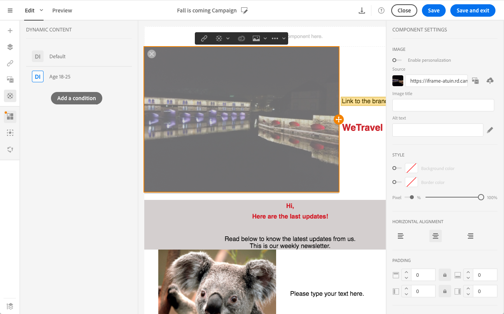
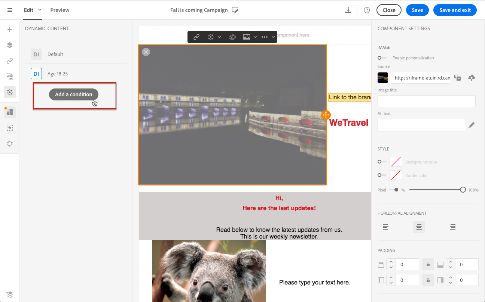

# Personalizzazione del contenuto delle e-mail {#personalization}

Il contenuto e la visualizzazione dei messaggi consegnati da Adobe Campaign possono essere personalizzati in diversi modi. Questi modi possono essere combinati in base ai criteri, a seconda dei profili. In generale, Adobe Campaign ti consente di:

* Inserire campi di personalizzazione dinamici. Consulta [Inserimento di un campo di personalizzazione](#inserting-a-personalization-field).
* Inserire blocchi di personalizzazione predefiniti. Consulta [Aggiunta di un blocco di contenuto](#adding-a-content-block).
* Personalizzare il mittente di un’e-mail. Vedi [Personalizzazione del mittente](#personalizing-the-sender).
* Personalizzare l’oggetto di un’e-mail. Consulta [Personalizzazione dell&#39;oggetto di un&#39;e-mail](../../designing/using/subject-line.md#subject-line).
* Creare contenuto condizionale. Vedi [Definizione del contenuto dinamico in un messaggio e-mail](#defining-dynamic-content-in-an-email).

## Personalizzazione del mittente {#personalizing-the-sender}

Per definire il nome del mittente che verrà visualizzato nell&#39;intestazione dei messaggi inviati, passare alla scheda **[!UICONTROL Properties]** della home page di E-mail Designer (accessibile tramite l&#39;icona Home). Per ulteriori informazioni, consulta [Definizione del mittente di un&#39;e-mail](../../designing/using/subject-line.md#email-sender).

Puoi modificare il nome del mittente facendo clic sul blocco **Nome mittente**. Il campo diventa quindi modificabile e puoi immettere il nome che desideri utilizzare.

Questo campo può essere personalizzato. A questo scopo, puoi aggiungere campi di personalizzazione, blocchi di contenuto e contenuti dinamici facendo clic sulle icone sotto il nome del mittente.

>[!NOTE]
>
>I parametri di intestazione non possono essere vuoti. L’indirizzo del mittente è obbligatorio per consentire l’invio di un’e-mail (standard RFC). Adobe Campaign controlla la sintassi degli indirizzi e-mail immessi.

## Personalizzazione degli URL {#personalizing-urls}

Adobe Campaign ti consente di personalizzare uno o più URL nel messaggio aggiungendo campi di personalizzazione, blocchi di contenuto o contenuti dinamici. Per eseguire questa operazione:

1. Inserisci un URL esterno e specifica i relativi parametri. Vedere [Inserimento di un collegamento](../../designing/using/links.md#inserting-a-link).
1. Se non viene visualizzata, fai clic sulla matita accanto all’URL selezionato nel riquadro Impostazioni per accedere alle opzioni di personalizzazione.
1. Aggiungi i campi di personalizzazione, i blocchi di contenuto e i contenuti dinamici che desideri utilizzare.

   

1. Salva le modifiche.

>[!NOTE]
>
>Quando il meccanismo di firma URL per i collegamenti di tracciamento è disabilitato, gli URL personalizzati non possono essere applicati al nome di dominio né all’estensione dell’URL. Se la personalizzazione non è corretta, durante l’analisi dei messaggi viene visualizzato un messaggio di errore.
>
>Quando selezioni un blocco di contenuto, non puoi selezionare elementi come **Collega a pagina mirror**. Questo tipo di blocchi non è consentito all’interno di un collegamento.

## Inserimento di un campo di personalizzazione{#inserting-a-personalization-field}

Adobe Campaign ti consente di inserire nella pagina un campo dal database, ad esempio il nome del profilo.

>[!NOTE]
>
>Le immagini seguenti mostrano come inserire un campo di personalizzazione utilizzando [E-mail Designer](../../designing/using/designing-content-in-adobe-campaign.md) per un messaggio e-mail.

Per aggiungere un campo di personalizzazione al contenuto:

1. Fare clic all&#39;interno di un blocco di testo, fare clic sull&#39;icona **[!UICONTROL Personalize]** nella barra degli strumenti contestuale e selezionare **[!UICONTROL Insert personalization field]**. Per ulteriori informazioni sull&#39;interfaccia di E-mail Designer, consulta [questa sezione](../../designing/using/designing-content-in-adobe-campaign.md#email-designer-interface).

   

1. Seleziona il campo da inserire nel contenuto della pagina.

   

1. Fai clic su **[!UICONTROL Confirm]**.

Il nome del campo viene visualizzato nell’editor ed evidenziato.

Una volta generata la personalizzazione (ad esempio durante l’anteprima e la preparazione dell’e-mail), questo campo verrà sostituito dal valore corrispondente al profilo di destinazione.

>[!NOTE]
>
>Se l’e-mail viene creata da un flusso di lavoro, i dati aggiuntivi calcolati nel flusso di lavoro sono disponibili anche nei campi di personalizzazione. Per ulteriori informazioni sull&#39;aggiunta di dati aggiuntivi da un flusso di lavoro, fare riferimento alla sezione [Arricchimento dei dati](../../automating/using/about-targeting-activities.md#enriching-data).

## Aggiunta di un blocco di contenuto {#adding-a-content-block}

Adobe Campaign offre un elenco di blocchi di contenuto preconfigurati. Questi blocchi di contenuto sono dinamici, personalizzati e hanno un rendering specifico. Ad esempio, puoi aggiungere un saluto o un collegamento alla pagina speculare.

>[!NOTE]
>
>Le immagini seguenti mostrano come inserire un blocco di contenuto utilizzando [E-mail Designer](../../designing/using/designing-content-in-adobe-campaign.md) per un messaggio e-mail.

Per aggiungere un blocco di contenuto:

1. Fare clic all&#39;interno di un blocco di testo, fare clic sull&#39;icona **[!UICONTROL Personalize]** nella barra degli strumenti contestuale e selezionare **[!UICONTROL Insert content block]**. Per ulteriori informazioni sull&#39;interfaccia di E-mail Designer, consulta [questa sezione](../../designing/using/designing-content-in-adobe-campaign.md#email-designer-interface).

   

1. Seleziona il blocco di contenuto da inserire. I blocchi disponibili variano a seconda del contesto (e-mail o pagina di destinazione).

   

1. Fai clic su **[!UICONTROL Save]**.

Il nome del blocco di contenuto viene visualizzato nell’editor ed è evidenziato in giallo. Si adatterà automaticamente al profilo quando viene generata la personalizzazione.

I blocchi di contenuto predefiniti sono:

* **[!UICONTROL Database URL in emails (EmailUrlBase)]**: questo blocco di contenuto può essere utilizzato solo in una **consegna**.
* **[!UICONTROL Mirror page URL (MirrorPageUrl)]**: questo blocco di contenuto può essere utilizzato solo in una **consegna**.
* **[!UICONTROL Link to mirror page (MirrorPage)]**: questo blocco di contenuto può essere utilizzato solo in una **consegna**.
* **[!UICONTROL Greetings (Greetings)]**
* **[!UICONTROL Unsubscription link (UnsubscriptionLink)]**: questo blocco di contenuto può essere utilizzato solo in una **consegna**.
* **[!UICONTROL Social network sharing links (LandingPageViralLinks)]**: questo blocco di contenuto può essere utilizzato solo in una **pagina di destinazione**.
* **[!UICONTROL Default sender name (DefaultSenderName)]**: questo blocco di contenuto può essere utilizzato solo in una **consegna**.
* **[!UICONTROL Name of default reply-to email address (DefaultReplyName)]**: questo blocco di contenuto può essere utilizzato solo in una **consegna**.
* **[!UICONTROL Email address of default sender (DefaultSenderAddress)]**: questo blocco di contenuto può essere utilizzato solo in una **consegna**.
* **[!UICONTROL Default error email address (DefaultErrorAddress)]**: questo blocco di contenuto può essere utilizzato solo in una **consegna**.
* **[!UICONTROL Default reply-to email address (DefaultReplyAddress)]**: questo blocco di contenuto può essere utilizzato solo in una **consegna**.
* **[!UICONTROL Brand name (BrandingUsualName)]**
* **[!UICONTROL Link to the brand website (BrandingWebSiteLink)]**
* **[!UICONTROL Brand logo (BrandingLogo)]**
* **[!UICONTROL Notification style (notificationStyle)]**

### Creazione di blocchi di contenuto personalizzati {#creating-custom-content-blocks}

Puoi definire nuovi blocchi di contenuto da inserire in un messaggio o in una pagina di destinazione.

Per creare un blocco di contenuto, effettua le seguenti operazioni:

1. Fare clic su **[!UICONTROL Resources > Content blocks]** dal menu avanzato per accedere all&#39;elenco dei blocchi di contenuto.
1. Fare clic sul pulsante **[!UICONTROL Create]** o duplicare un blocco di contenuto preesistente.

   

1. Immetti un’etichetta.
1. Seleziona il **[!UICONTROL Content type]** del blocco. Sono disponibili tre opzioni:

   * **[!UICONTROL Shared]**: il blocco di contenuto può essere utilizzato in una consegna o in una pagina di destinazione.
   * **[!UICONTROL Delivery]**: il blocco di contenuto può essere utilizzato solo in una consegna.
   * **[!UICONTROL Landing page]**: il blocco di contenuto può essere utilizzato solo in una pagina di destinazione.

   

1. È possibile selezionare **[!UICONTROL Targeting dimension]**. Per ulteriori informazioni, consulta [Informazioni sulla dimensione di targeting](#about-targeting-dimension).

   

1. È possibile selezionare l&#39;opzione **[!UICONTROL Depends on format]** per definire due blocchi diversi: uno per le e-mail HTML e uno per le e-mail in formato testo. Nell’editor (HTML e Testo) verranno quindi visualizzate due schede per definire il contenuto corrispondente.

   

1. Immettere il contenuto dei blocchi di contenuto e fare clic sul pulsante **[!UICONTROL Create]**.

Il blocco di contenuto ora può essere utilizzato nell’editor di contenuto di un messaggio o di una pagina di destinazione.

>[!CAUTION]
>
>Quando modifichi il contenuto di un blocco, accertati che non vi siano spazi vuoti aggiuntivi tra l&#39;inizio e la fine delle istruzioni *if*. In HTML gli spazi vuoti vengono visualizzati sullo schermo e hanno quindi un impatto sul layout del contenuto.

### Informazioni sulla dimensione di targeting {#about-targeting-dimension}

La dimensione di targeting ti consente di definire in quale tipo di messaggio puoi utilizzare il blocco di contenuto. In questo modo si evita l’utilizzo di blocchi inappropriati in un messaggio, che potrebbe causare errori.

In effetti, quando modifichi un messaggio, puoi selezionare solo blocchi di contenuto con una dimensione di targeting compatibile con la dimensione di targeting del messaggio.

Ad esempio, la dimensione di targeting del blocco **[!UICONTROL Unsubscription link]** è **[!UICONTROL Profiles]** perché contiene campi di personalizzazione specifici della risorsa **[!UICONTROL Profiles]**. Pertanto, non è possibile utilizzare un blocco **[!UICONTROL Unsubscription link]** in un messaggio transazionale [evento](../../channels/using/getting-started-with-transactional-msg.md#transactional-message-types), perché la dimensione di targeting di quel tipo di messaggio è **[!UICONTROL Real-time events]**. È tuttavia possibile utilizzare il blocco **Collegamento annullamento abbonamento** in un [messaggio transazionale di profilo](../../channels/using/getting-started-with-transactional-msg.md#transactional-message-types), perché la dimensione di targeting di quel tipo di messaggio è **Profili**. Infine, il blocco **[!UICONTROL Link to mirror page]** non ha una dimensione di targeting, quindi puoi utilizzarlo in qualsiasi messaggio.

Se lasci vuoto questo campo, il blocco di contenuto sarà compatibile con tutti i messaggi, indipendentemente dalla dimensione di targeting. Se imposti una dimensione di targeting, tale blocco sarà compatibile solo con i messaggi che hanno la stessa dimensione di targeting.

Per ulteriori informazioni, consulta [Dimensioni di targeting e risorse](../../automating/using/query.md#targeting-dimensions-and-resources).

**Argomenti correlati:**

* [Inserimento di un campo di personalizzazione](#inserting-a-personalization-field)
* [Aggiunta di un blocco di contenuto](#adding-a-content-block)
* [Definizione del contenuto dinamico in un messaggio e-mail](#defining-dynamic-content-in-an-email)

## Personalizzazione di un’origine immagine{#personalizing-an-image-source}

Adobe Campaign ti consente di personalizzare una o più immagini nel messaggio in base a un particolare criterio o di utilizzare il tracciamento. A tal fine, inserisci campi di personalizzazione, blocchi di contenuto o contenuto dinamico nell’origine dell’immagine. Per eseguire questa operazione:

1. Inserisci un’immagine nel contenuto del messaggio oppure seleziona un’immagine già presente.
1. Nella palette delle proprietà dell&#39;immagine, selezionare l&#39;opzione **[!UICONTROL Enable personalization]**.

   

   Il campo **[!UICONTROL Source]** viene visualizzato e l&#39;immagine selezionata viene visualizzata come **personalizzata** nell&#39;editor.

1. Fare clic sulla matita accanto al pulsante del campo **[!UICONTROL Source]** per accedere alle opzioni di personalizzazione.
1. Dopo aver aggiunto l’origine immagine, aggiungi i campi di personalizzazione, i blocchi di contenuto e i contenuti dinamici che ti piacciono.

   

   >[!NOTE]
   >
   >Il nome di dominio (http://mydomain.com) non può essere personalizzato, deve essere immesso manualmente. Il resto dell’URL può essere personalizzato. Esempio: http://mydomain.com/ `[Gender]` .jpg

1. Conferma le modifiche.

## Contenuto condizionale {#conditional-content}

### Definizione di una condizione di visibilità{#defining-a-visibility-condition}

È possibile specificare una condizione di visibilità su qualsiasi elemento. Sarà visibile solo se la condizione viene rispettata.

Per aggiungere una condizione di visibilità, selezionare un blocco e immettere la condizione da rispettare nel campo **[!UICONTROL Visibility condition]** delle relative impostazioni.

Questa opzione è disponibile solo per i seguenti elementi: ADDRESS, BLOCKQUOTE, CENTER, DIR, DIV, DL, FIELDSET, FORM, H1, H2, H3, H4, H5, H6, NOSCRIPT, OL, P, PRE, UL, TR, TD.

L&#39;editor espressioni è presentato nella sezione [Modifica avanzata espressioni](../../automating/using/editing-queries.md#about-query-editor).

Queste condizioni adottano la sintassi dell’espressione XTK (ad esempio **context.profile.email !=&#39;&#39;** o **context.profile.status=&#39;0&#39;**). Per impostazione predefinita, tutti i campi sono visibili.

>[!NOTE]
>
>Non è possibile definire una condizione per un blocco che contiene già un sottoelemento con un contenuto dinamico o un blocco che già costituisce un contenuto dinamico. Non è possibile modificare i blocchi dinamici non visibili come gli elenchi a discesa.

### Definizione del contenuto dinamico in un messaggio e-mail{#defining-dynamic-content-in-an-email}

>[!CONTEXTUALHELP]
>id="ac_dynamic_content"
>title="Definizione del contenuto dinamico"
>abstract="Definisci contenuti diversi che verranno visualizzati solo in alcuni profili in base alle condizioni che sarai tu a stabilire."

In un messaggio e-mail, puoi definire contenuti diversi che verranno visualizzati dinamicamente ai destinatari in base alle condizioni definite tramite l’editor di espressioni. Ad esempio, dalla stessa e-mail, puoi assicurarti che ogni profilo riceva un messaggio diverso in base alla sua fascia di età.

La definizione del contenuto dinamico è diversa dalla [definizione delle condizioni di visibilità](#defining-a-visibility-condition).

1. Seleziona un frammento, un componente o un elemento. In questo esempio, seleziona un’immagine.
1. Fare clic sull&#39;icona **[!UICONTROL Dynamic content]** nella barra degli strumenti contestuale.

   

   La sezione **[!UICONTROL Dynamic content]** viene visualizzata nella palette a sinistra.

   

   Per impostazione predefinita, questa sezione contiene due elementi: la variante di default e una nuova variante.

   >[!NOTE]
   >
   >Il contenuto deve sempre avere una variante predefinita. Non è possibile eliminarlo.

1. Fare clic sul pulsante **[!UICONTROL Edit]** per definire le condizioni di visualizzazione per la prima variante alternativa.

   

1. Specifica un’etichetta e seleziona i campi da impostare come condizioni. Ad esempio, dal nodo **[!UICONTROL General]**, selezionare il campo **[!UICONTROL Age]**

   

1. Imposta le condizioni di filtro. Ad esempio, desideri che le persone di età compresa tra i 18 e i 25 anni visualizzino contenuti diversi.

   

1. Una volta impostate tutte le condizioni, definisci l’ordine di priorità in cui applicare la condizione e salva le modifiche.

   

   Il contenuto viene visualizzato nella palette in ordine di priorità, dall’alto verso il basso. Per ulteriori informazioni sulle priorità, consulta [questa sezione](#defining-dynamic-content-in-an-email).

1. Carica una nuova immagine per la variante appena definita.

   

   I destinatari di età compresa tra i 18 e i 25 anni vedranno la nuova immagine.

   

1. Fare clic su **[!UICONTROL Add a condition]** per aggiungere un nuovo contenuto e la relativa regola collegata.

   

   Ad esempio, puoi aggiungere un’immagine diversa per le persone di età compresa tra i 26 e i 35 anni.

1. Procedi in modo simile per qualsiasi altro elemento dell’e-mail che desideri visualizzare in modo dinamico. Può essere testo, pulsante, frammento e così via. Salva le modifiche.

>[!CAUTION]
>
>Dopo aver preparato il messaggio e prima di inviarlo, testalo utilizzando una bozza. In caso contrario, alcuni errori potrebbero non essere rilevati e l’e-mail potrebbe non essere inviata.

**Argomenti correlati:**

* [Invio di bozze](../../sending/using/sending-proofs.md)
* [Modifica avanzata delle espressioni](../../automating/using/editing-queries.md#about-query-editor)

### Ordine di priorità {#order-of-priority}

Nell’editor di espressioni, quando definisci un contenuto dinamico, l’ordine di priorità è il seguente.

1. Si definiscono due diversi contenuti dinamici con **due condizioni diverse**, ad esempio:

   **Condizione 1:** il genere del profilo è maschile,

   **Condizione 2:** il profilo ha un&#39;età compresa tra 20 e 30 anni.

   

   Alcuni profili nel database corrispondono alle due condizioni, ma è possibile inviare una sola e-mail con un contenuto dinamico.

1. È quindi necessario definire la priorità per i contenuti dinamici. Una condizione con ordine di priorità **1** (e quindi il contenuto dinamico corrispondente) verrà inviata a un profilo anche se questo profilo soddisfa anche un&#39;altra condizione con ordine di priorità **2** o **3**.

   

Puoi definire un solo ordine di priorità per contenuto dinamico.

## Esempio: personalizzazione e-mail{#example-email-personalization}

In questo esempio, un membro del team del servizio di marketing ha creato un’e-mail per informare alcuni dei loro clienti che esiste un’offerta speciale solo per loro. Il membro del team ha deciso di personalizzare l’e-mail in base alle rispettive età dei clienti. I clienti di età compresa tra i 18 e i 27 anni riceveranno un’e-mail contenente un’immagine e uno slogan diversi da quelli che riceveranno i clienti di età superiore ai 27 anni.

L’e-mail viene creata come segue:

* I contenuti dinamici vengono applicati all’immagine e questi contenuti dinamici sono configurati in base all’intervallo di età.

  

  L&#39;aggiunta e la configurazione del contenuto dinamico sono descritte in dettaglio nella sezione [Definizione del contenuto dinamico in un messaggio e-mail](#defining-dynamic-content-in-an-email).

* Al testo vengono applicati i campi di personalizzazione e il contenuto dinamico. A seconda dell’intervallo di età del profilo, l’e-mail inizia con il nome del profilo o con il titolo e il cognome del profilo.

  

  L&#39;aggiunta e la configurazione dei campi di personalizzazione sono descritte in dettaglio nella sezione [Inserimento di un campo di personalizzazione](#inserting-a-personalization-field).

### Configurazione delle immagini {#configuring-images}

>[!CONTEXTUALHELP]
>id="ac_dynamic_image"
>title="Gestione delle immagini dinamiche"
>abstract="Personalizza l’e-mail con le immagini dinamiche in base alle condizioni che definirai."

In questo esempio, i contenuti dinamici applicati alle immagini sono configurati come segue:

**Per eseguire il targeting per i bambini di 18-27 anni:**

1. Selezionare il contenuto dinamico nella tavolozza **[!UICONTROL Properties]** e fare clic sul pulsante **[!UICONTROL Edit]**.

   

1. Modifica l&#39;etichetta, quindi seleziona il campo **[!UICONTROL Age]** dal nodo **[!UICONTROL Profile]**.

   

1. Seleziona l&#39;operatore **Maggiore o uguale a**, quindi immetti **18** per creare l&#39;espressione **più vecchia di 18**.

   

1. Aggiungi una nuova condizione **[!UICONTROL Age]**.

   Seleziona l&#39;operatore **Minore o uguale a** seguito da 27 nel campo del valore per creare l&#39;espressione **minore di 27**.

   

1. Conferma le modifiche.

**Per eseguire il targeting di profili di età pari o superiore a 27 anni:**

1. Seleziona il contenuto dinamico dalla palette e modificalo.
1. Modifica l&#39;etichetta, quindi seleziona il campo **[!UICONTROL Age]** dal nodo **[!UICONTROL Profile]**.
1. Aggiungi l&#39;operatore **Maggiore di** seguito da 27 nel campo del valore per creare l&#39;espressione **più vecchia di 27**.

   

1. Conferma le modifiche.

I contenuti dinamici sono configurati correttamente.

### Configurazione del testo {#configuring-text}

In questo esempio, i contenuti dinamici applicati ai testi sono configurati come segue:

**Per eseguire il targeting di profili di età compresa tra 18 e 27 anni:**

1. Seleziona il componente struttura desiderato e aggiungi un contenuto dinamico.
1. Modifica il contenuto dinamico e configura le espressioni di targeting. Consulta [Configurazione delle immagini](#configuring-images).
1. Nel componente struttura, nella posizione desiderata, fare clic sull&#39;icona **[!UICONTROL Personalize]** nella barra degli strumenti contestuale e selezionare **[!UICONTROL Insert personalization field]**.

   

1. Nell&#39;elenco visualizzato selezionare il campo **[!UICONTROL First name]** e confermare.

   

1. Il campo di personalizzazione viene quindi inserito perfettamente nel contenuto dinamico selezionato.

**Per eseguire il targeting di profili di età pari o superiore a 27 anni:**

1. Seleziona il componente struttura desiderato e aggiungi un contenuto dinamico.
1. Modifica il contenuto dinamico e configura le espressioni di targeting. Consulta [Configurazione delle immagini](#configuring-images).
1. Nel componente struttura, nella posizione desiderata, fare clic sull&#39;icona **[!UICONTROL Personalize]** nella barra degli strumenti contestuale e selezionare **[!UICONTROL Insert personalization field]**.
1. Selezionare **[!UICONTROL Title]** dall&#39;elenco a discesa.
1. Procedere in modo simile per aggiungere il campo **[!UICONTROL Last name]**.

   

I campi di personalizzazione dovrebbero ora essere inseriti perfettamente nel contenuto dinamico scelto.

### Anteprima delle e-mail {#previewing-emails}

La visualizzazione in anteprima consente di verificare che i campi di personalizzazione e il contenuto dinamico siano configurati correttamente prima di inviare **[!UICONTROL Proofs]**. Durante l’anteprima, puoi selezionare diversi profili di test corrispondenti alle destinazioni e-mail.

Senza profili di test, l’e-mail visualizzata per impostazione predefinita è:

L’e-mail non presenta campi di personalizzazione nello slogan e viene utilizzata l’immagine predefinita.

Il primo profilo di test corrisponde a un client di età compresa tra 18 e 27 anni. Selezionando questo profilo viene visualizzato il messaggio e-mail seguente:

Il campo di personalizzazione che corrisponde all’espressione di 18-27 anni, in particolare il nome del profilo, è configurato correttamente e anche l’immagine è stata modificata in base al profilo.

Il secondo profilo corrisponde a un client di età superiore a 27 anni e genera l’e-mail seguente:

L&#39;immagine è cambiata grazie al contenuto dinamico, e lo slogan che appare è quello più formale definito per questo pubblico di destinazione.

**Argomenti correlati:**

* [Creazione di tipi di pubblico](../../audiences/using/creating-audiences.md)
* [Preparazione dell’invio](../../sending/using/preparing-the-send.md)
