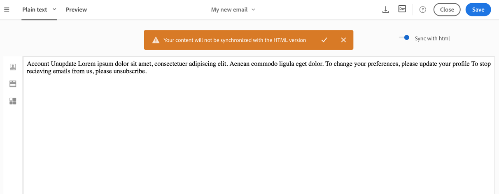
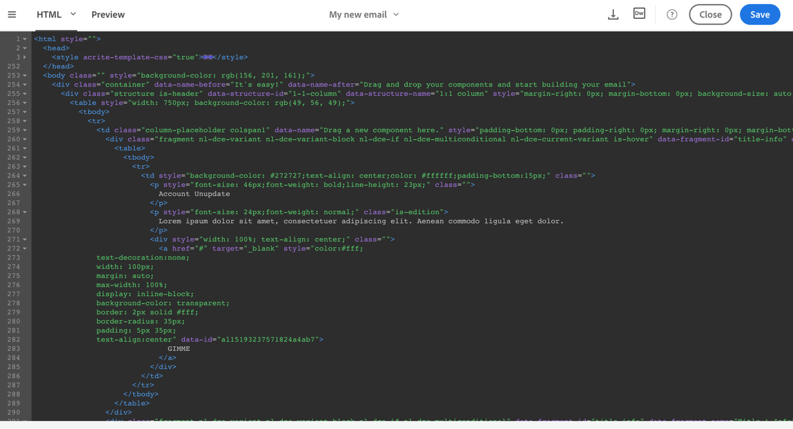

# Modalità testo normale e HTML {#plain-text-and-html-modes}

## Generazione di una versione di testo del messaggio e-mail {#generating-a-text-version-of-the-email}

Per impostazione predefinita, la **[!UICONTROL Plain text]** versione del messaggio e-mail viene generata automaticamente e sincronizzata con la **[!UICONTROL Edit]** versione.

I campi di personalizzazione e i blocchi di contenuto aggiunti alla versione HTML sono sincronizzati anche con la versione in testo normale.

>[!NOTE]
>
>Per utilizzare i blocchi di contenuto nella versione in testo normale, accertatevi che non contengano codice HTML.

Per avere una versione di testo normale diversa dalla versione HTML, potete disattivare la sincronizzazione facendo clic sul **[!UICONTROL Sync with HTML]** pulsante nella **[!UICONTROL Plain text]** vista del messaggio e-mail.

Potete quindi modificare la versione di testo normale come desiderato.

>[!NOTE]
>
>Se modificate la **[!UICONTROL Plain text]** versione mentre la sincronizzazione è disattivata, la successiva attivazione dell’ **[!UICONTROL Sync with HTML]** opzione tutte le modifiche apportate nella versione in testo normale verranno sostituite con la versione HTML. Le modifiche apportate nella **[!UICONTROL Plain text]** vista non possono essere riportate nella **[!UICONTROL HTML]** vista.

## Modifica di un'origine contenuto e-mail in HTML {#editing-an-email-content-source-in-html}

Per gli utenti più avanzati e il debug, potete visualizzare e modificare il contenuto dell'e-mail direttamente in HTML.

Potete modificare la versione HTML del messaggio e-mail in due modi:

* Selezionate **[!UICONTROL Edit]** &gt; **[!UICONTROL HTML]** per aprire la versione HTML dell’intero messaggio e-mail.

   

* Dall’interfaccia WYSIWYG, selezionate un elemento e fate clic sull’ **[!UICONTROL Source code]** icona .

   Viene visualizzata solo l'origine dell'elemento selezionato. Potete modificare il codice sorgente se l’elemento selezionato è un componente di **[!UICONTROL HTML]** contenuto. Altri componenti sono in modalità di sola lettura, ma possono essere modificati nella versione HTML completa del messaggio e-mail.

   

Se modificate il codice HTML, la reattività dell’e-mail potrebbe non essere corretta. Assicurarsi di verificarlo utilizzando il **[!UICONTROL Preview]** pulsante. Consultate [Anteprima dei messaggi](../../sending/using/previewing-messages.md).
