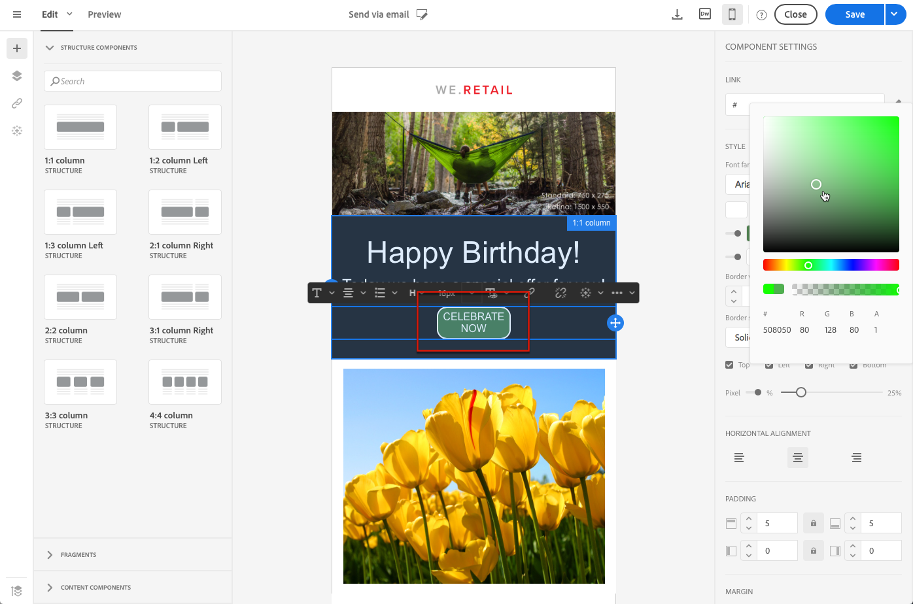

# Modifica dei formati di testo normale, HTML e e-mail per dispositivi mobili {#plain-text-and-html-modes}

E-mail Designer consente di modificare diversi rendering delle e-mail. Puoi generare una versione testuale del messaggio e-mail, modificare l’origine HTML di un messaggio e-mail e progettare e-mail per la visualizzazione mobile.

## Generazione di una versione testuale dell’e-mail {#generating-a-text-version-of-the-email}

Per impostazione predefinita, la **[!UICONTROL Plain text]** la versione dell’e-mail viene generata automaticamente e sincronizzata con **[!UICONTROL Edit]** versione.

Anche i campi di personalizzazione e i blocchi di contenuto aggiunti alla versione HTML vengono sincronizzati con la versione di testo normale.

>[!NOTE]
>
>Per utilizzare i blocchi di contenuto nella versione di testo normale, accertati che non contengano codice HTML.

Per avere una versione di testo normale diversa da quella di HTML, puoi disattivare la sincronizzazione facendo clic sul pulsante **[!UICONTROL Sync with HTML]** cambiare **[!UICONTROL Plain text]** visualizza il messaggio e-mail.

Puoi quindi modificare la versione di testo normale come desiderato.

>[!NOTE]
>
>Se modifichi la **[!UICONTROL Plain text]** quando la sincronizzazione è disabilitata, la prossima volta che abiliti la **[!UICONTROL Sync with HTML]** tutte le modifiche apportate nella versione di testo normale verranno sostituite con la versione di HTML. Le modifiche apportate **[!UICONTROL Plain text]** la visualizzazione non può essere riflessa in **[!UICONTROL HTML]** visualizza.

## Modifica di un’origine di contenuto e-mail in HTML {#editing-an-email-content-source-in-html}

Per gli utenti più avanzati e il debug, puoi visualizzare e modificare il contenuto dell’e-mail direttamente in HTML.

Puoi modificare la versione HTML dell’e-mail in due modi:

* Seleziona **[!UICONTROL Edit]** > **[!UICONTROL HTML]** per aprire la versione HTML dell’intero messaggio e-mail.

   

* Dall’interfaccia WYSIWYG, seleziona un elemento e fai clic sul pulsante **[!UICONTROL Source code]** icona.

   Viene visualizzata solo l’origine dell’elemento selezionato. Puoi modificare il codice sorgente se l’elemento selezionato è un **[!UICONTROL HTML]** componente di contenuto. Altri componenti sono in modalità di sola lettura, ma possono ancora essere modificati nella versione completa di HTML dell’e-mail.

   

Se modifichi il codice di HTML, la reattività dell’e-mail potrebbe non riuscire. Assicurati di testarlo utilizzando il **[!UICONTROL Preview]** pulsante . Consulta [Anteprima dei messaggi](../../sending/using/previewing-messages.md).

## Progettazione di e-mail per il rendering mobile {#switching-to-mobile-view}

Puoi ottimizzare il design reattivo di un’e-mail modificando separatamente tutte le opzioni di stile per la visualizzazione mobile. Ad esempio, puoi adattare i margini e la spaziatura, utilizzare font di dimensioni più piccole o più grandi, modificare i pulsanti o applicare colori di sfondo diversi che saranno specifici per la versione mobile del messaggio e-mail.

Tutte le opzioni di stile sono disponibili nella visualizzazione mobile. Le impostazioni dello stile di E-mail Designer sono precedentemente presentate in questa pagina.

1. Crea un’e-mail e inizia a modificare il contenuto. Per ulteriori informazioni, consulta [Progettazione di contenuti e-mail da zero](../../designing/using/designing-from-scratch.md#designing-an-email-content-from-scratch).
1. Per accedere alla visualizzazione mobile dedicata, seleziona la **[!UICONTROL Switch to mobile view]** pulsante .

   

   Viene visualizzata la versione mobile dell’e-mail. Contiene tutti i componenti e gli stili definiti nella visualizzazione desktop.

1. Modificare in modo indipendente tutte le impostazioni di stile, ad esempio il colore di sfondo, l’allineamento, la spaziatura, il margine, la famiglia di font, il colore del testo e così via.

   

1. Quando modifichi un’impostazione di stile in visualizzazione mobile, le modifiche vengono applicate solo alla visualizzazione mobile.

   Ad esempio, riduci le dimensioni di un’immagine, aggiungi uno sfondo verde e modifica la spaziatura nella visualizzazione mobile.

   

1. Puoi nascondere un componente quando viene visualizzato su un dispositivo mobile. A questo scopo, seleziona **[!UICONTROL Show only on desktop devices]** dal **[!UICONTROL Display options]**.

   Puoi anche scegliere di nascondere questo componente sui dispositivi desktop, il che significa che verrà visualizzato solo sui dispositivi mobili. A questo scopo, seleziona **[!UICONTROL Show only on mobile devices]**.

   Ad esempio, questa opzione consente di visualizzare un’immagine specifica sui dispositivi mobili e un’altra sui dispositivi desktop.

   Puoi impostare questa opzione dalla visualizzazione per dispositivi mobili o desktop.

   

1. Fai di nuovo clic su **[!UICONTROL Switch to mobile view]** per tornare alla visualizzazione desktop standard. Le modifiche allo stile appena apportate non vengono applicate.

   

   >[!NOTE]
   >
   >L&#39;unica eccezione è la **[!UICONTROL Style inline]** impostazioni. Qualsiasi modifica alle impostazioni in linea di stile viene applicata anche alla visualizzazione desktop standard.

1. Qualsiasi altra modifica alla struttura o al contenuto dell’e-mail, come modifiche al testo, caricamento di una nuova immagine, aggiunta di un nuovo componente, ecc. viene applicata anche alla visualizzazione standard.

   Ad esempio, torna alla visualizzazione mobile, modifica del testo e sostituisci un’immagine.

   

1. Fai di nuovo clic su **[!UICONTROL Switch to mobile view]** per tornare alla visualizzazione desktop standard. Le modifiche vengono applicate.

   

1. La rimozione di uno stile nella visualizzazione per dispositivi mobili riporta lo stile applicato in modalità desktop.

   Ad esempio, nella visualizzazione per dispositivi mobili, applica un colore di sfondo verde a un pulsante.

   

1. Passa alla visualizzazione desktop e applica uno sfondo grigio allo stesso pulsante.

   

1. Passa di nuovo alla visualizzazione mobile e ora disattiva il **[!UICONTROL Background color]** impostazione.

   

   Viene ora applicato il colore di sfondo definito nella visualizzazione desktop: diventa grigio (non vuoto).

   L&#39;unica eccezione è la **[!UICONTROL Border color]** impostazione. Quando è disabilitata nella visualizzazione mobile, non viene più applicato alcun bordo, anche se il colore del bordo è definito nella visualizzazione desktop.

>[!NOTE]
>
>La visualizzazione mobile non è disponibile in [frammenti](../../designing/using/using-reusable-content.md#about-fragments).
