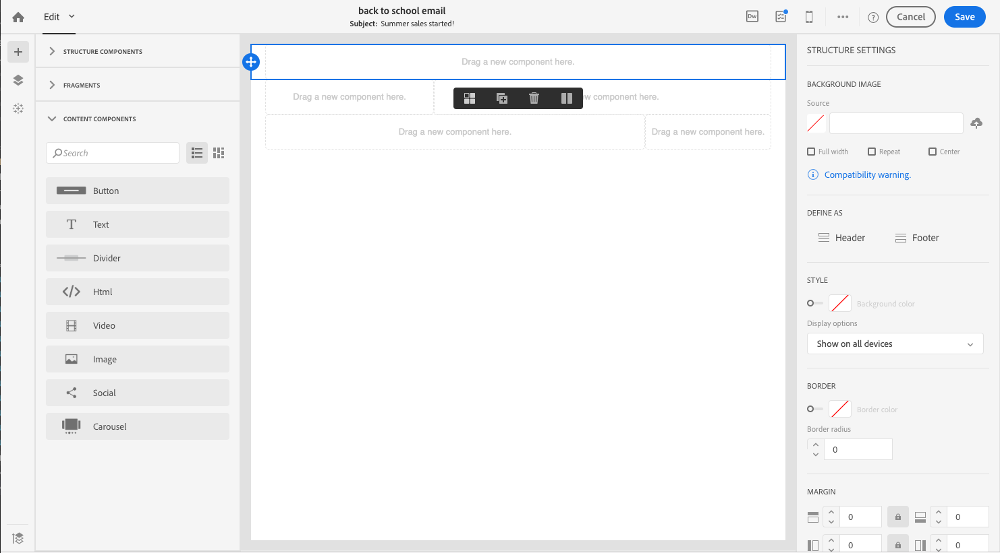

# Progettazione contenuto e-mail di avvio rapido{#quick-start}

Designer e-mail offre quattro modi per creare e-mail.

Potete creare un messaggio e-mail che inizia da nuovo:

* Potete creare un’e-mail da un quadro vuoto aggiungendo facilmente la struttura e i componenti di contenuto e personalizzarne il contenuto per inviarne rapidamente la distribuzione. È inoltre possibile gestire completamente gli elementi di stile. Per ulteriori informazioni, [inizia rapidamente](#from-scratch-email) o consulta la documentazione [](../../designing/using/designing-from-scratch.md#designing-an-email-content-from-scratch)completa.

* Per creare un’e-mail da modelli predefiniti, selezionate un modello e create il nuovo contenuto da qui. [Ulteriori informazioni](#building-content-from-an-out-of-the-box-template)

Potete anche creare un’e-mail con contenuto esistente:

* Potete convertire un contenuto HTML esistente (creato esternamente o nell’editor precedente). [Ulteriori informazioni](#converting-an-html-content)
* Potete importare immediatamente un contenuto HTML esistente in modalità compatibilità. [Ulteriori informazioni](#compatibility-mode)

## Senza contenuto esistente {#without-existing-content}

### Creazione di un'e-mail da zero {#from-scratch-email}

Puoi creare facilmente un'e-mail, aggiungere componenti e personalizzare i loro contenuti per inviarne rapidamente una e-mail. Se necessario, potete adattare le opzioni di stile al contenuto. Per ulteriori informazioni sulla gestione delle impostazioni di stile e degli attributi in linea, consultate [Modifica degli stili](../../designing/using/styles.md)e-mail.

### Aggiunta di una riga oggetto {#add-a-subject-line}

Le righe oggetto sono obbligatorie quando si invia un'e-mail. Per ulteriori informazioni, consultate [Definizione dell’oggetto di un messaggio e-mail](../../designing/using/subject-line.md).

1. Create un messaggio e-mail.
1. Chiudi la homepage.
1. Passare alla **[!UICONTROL Properties]** scheda della home page di Designer e-mail (accessibile tramite l'icona principale) e compilare la **[!UICONTROL Subject]** sezione.


### Aggiunta di componenti struttura {#add-structure-components}

I componenti struttura definiranno il layout dell’e-mail. Per ulteriori informazioni, consultate [Definizione della struttura di un messaggio e-mail](../../designing/using/designing-from-scratch.md#defining-the-email-structure).

Nei componenti Struttura, trascinate e rilasciate i componenti per il layout da usare.

>[!NOTE]
>
>Potete selezionare layout di contenuto diversi da aggiungere all’e-mail.



### Aggiunta di componenti di contenuto {#add-content-components}

Potete aggiungere diversi componenti di contenuto alle e-mail, ad esempio immagini, testo e pulsanti. Per ulteriori informazioni, vedete Componenti [](../../designing/using/designing-from-scratch.md#about-content-components)contenuto.

* Immagine

1. In Componenti **contenuto**, trascina l’immagine in uno dei componenti della struttura.
1. Fate clic su **Sfoglia**.
1. Selezionate il file immagine dal computer.


* Testo con personalizzazione

1. In Componenti **contenuto**, trascinate il testo in uno dei componenti della struttura.
1. Fate clic sul componente e inserite il testo.
1. Per aggiungere un campo di personalizzazione, fate clic su **Inserisci campo** di personalizzazione nella barra degli strumenti.
1. Selezionare il campo desiderato, ad esempio Nome.


* HTML

1. In Componenti **contenuto**, trascina e rilascia HTML in uno dei componenti della struttura.
1. Fate clic su **Mostra il codice** sorgente.
1. Inserite il contenuto HTML.
1. Fate clic su **Salva**.


Se avete familiarità con l’HTML, potete copiare e incollare il codice HTML dal piè di pagina originale utilizzando il componente **[!UICONTROL Html]** contenuto. Per ulteriori informazioni, consultate [Informazioni sui componenti](../../designing/using/designing-from-scratch.md#about-content-components)di contenuto.


### Formattazione del componente e-mail

Potete regolare lo stile delle e-mail, ad esempio modificando la spaziatura di un componente. Per ulteriori informazioni sulla gestione delle impostazioni di stile e degli attributi in linea, consultate [Modifica degli stili](../../designing/using/styles.md)e-mail.

1. Fate clic sul componente **** Testo.
1. Sulla destra, nella palette, passare a **Spaziatura**.
1. Fate clic sull'icona Blocca per interrompere la sincronizzazione tra i parametri superiore e inferiore o tra destra e sinistra.
1. Regolare la **spaziatura** in base alle esigenze.
1. Fate clic su **Salva**.


Ora puoi salvare e inviare il tuo messaggio e-mail.

### Creazione di contenuti da un modello integrato {#building-content-from-an-out-of-the-box-template}

Potete creare un'e-mail da modelli predefiniti, come messaggi di benvenuto ai clienti, newsletter ed e-mail di nuovo coinvolgimento e personalizzarle.

1. Create un’e-mail e apritene il contenuto. Per ulteriori informazioni, consultate [Creazione di un messaggio e-mail](../../channels/using/creating-an-email.md).
1. Fate clic sull’icona Home per accedere alla **[!UICONTROL Email Designer]** pagina principale.
1. Fate clic sulla **[!UICONTROL Templates]** scheda.
1. Scegliete un modello HTML integrato.
I diversi modelli presentano varie combinazioni di diversi tipi di elementi. Ad esempio, i modelli 'Feather' hanno margini, mentre i modelli 'Astro' non ne hanno uno. Per ulteriori informazioni, consulta Modelli [di](../../designing/using/using-reusable-content.md#content-templates)contenuto.
1. Passare alla **[!UICONTROL Properties]** scheda della home page di Designer e-mail (accessibile tramite l'icona principale) e compilare la **[!UICONTROL Subject]** sezione.
1. Potete combinare questi elementi per creare diverse varianti di e-mail. Ad esempio, potete duplicare una sezione e-mail selezionando un componente struttura e facendo clic **[!UICONTROL Duplicate]** sulla barra degli strumenti contestuale.
1. Potete spostare gli elementi utilizzando la freccia blu a sinistra per trascinare un componente struttura sotto o sopra un altro. Per ulteriori informazioni, consultate [Modifica della struttura](../../designing/using/designing-from-scratch.md#defining-the-email-structure)delle e-mail.
1. Potete anche spostare i componenti per cambiare l'organizzazione di ciascun elemento struttura. Per ulteriori informazioni, vedere [Aggiunta di frammenti e componenti](../../designing/using/designing-from-scratch.md#defining-the-email-structure).
1. Modificate il contenuto di ciascun elemento in base alle vostre esigenze: immagini, testo, collegamenti.
1. Se necessario, adattate le opzioni di stile al contenuto. Per ulteriori informazioni, consultate [Modifica degli stili](../../designing/using/styles.md)delle e-mail.

## Con contenuto esistente {#with-existing-content}

Se si desidera creare un framework di modelli e frammenti modulari che possano essere combinati per il riutilizzo in più e-mail, è consigliabile convertire l'HTML dell'e-mail in un modello di E-mail Designer.

### Conversione di un contenuto HTML {#converting-an-html-content}

Questo caso di utilizzo consente di convertire rapidamente un'e-mail HTML in componenti di E-mail Designer.

>[!CAUTION]
>
>Questa sezione è destinata agli utenti che hanno familiarità con il codice HTML.

>[!NOTE]
>
>Come la modalità di compatibilità, un componente HTML è modificabile con opzioni limitate: è possibile eseguire solo edizioni interne.

Al di fuori di Email Designer, assicurarsi che l'HTML originale sia diviso in sezioni riutilizzabili.

1. Aprite il Designer e-mail per creare un contenuto e-mail vuoto.
1. Impostate gli attributi a livello di corpo: colori di sfondo, larghezza, ecc. Per ulteriori informazioni, consultate [Modifica degli stili](../../designing/using/styles.md)delle e-mail.

In caso contrario, tagliare i diversi blocchi dal codice HTML. Ad esempio, di seguito è riportata una sezione chiaramente identificata:

```
<!-- 3 COLUMN w/CTA (SCALED) -->
<table width="100%" align="center" cellspacing="0" cellpadding="0" border="0" role="presentation" style="max-width:680px;">
<tbody>
<tr>
<td class="padh10" align="center" valign="top" style="padding:0 5px 20px 5px;">
<table width="100%" cellspacing="0" cellpadding="0" border="0" role="presentation">
<tbody>
<tr>
...
</tr>
</tbody>
</table>
</td>
</tr>
</tbody>
</table>
<!-- //3 COLUMN w/CTA (SCALED) -->
```

Dopo aver identificato tutti i blocchi, in Designer e-mail ripetere la seguente procedura per ciascuna sezione dell'e-mail esistente:

1. Aggiungere un componente struttura. Per ulteriori informazioni, consultate [Modifica della struttura](../../designing/using/designing-from-scratch.md#defining-the-email-structure)delle e-mail.
1. Aggiungete un componente HTML. Per ulteriori informazioni, vedere [Aggiunta di frammenti e componenti](../../designing/using/designing-from-scratch.md#defining-the-email-structure).
1. Copiate e incollate il codice HTML nel componente.
1. Passate alla visualizzazione mobile. Per ulteriori informazioni, consulta [questa sezione](../../designing/using/styles.md#switching-to-mobile-view).

   La vista reattiva non funziona perché il CSS non è presente.

1. Per risolvere il problema, passare alla modalità codice sorgente e copiare e incollare la sezione di stile in una nuova sezione di stile. Ad esempio:

   ```
   <style type="text/css">
   a {text-decoration:none;}
   body {min-width:100% !important; margin:0 auto !important; padding:0 !important;}
   img {line-height:100%; text-decoration:none; -ms-interpolation-mode:bicubic;}
   ...
   </style>
   ```

   >[!NOTE]
   >
   >Accertatevi di aggiungere lo stile dopo questo in un altro tag di stile personalizzato.
   >
   >Non modificate il CSS generato da Designer e-mail:
   >
   >* `<style data-name="default" type="text/css">(##)</style>`
   >* `<style data-name="supportIOS10" type="text/css">(##)</style>`
   >* `<style data-name="mediaIOS8" type="text/css">(##)</style>`
   >* `<style data-name="media-default-max-width-500px" type="text/css">(##)</style>`
   >* `<style data-name="media-default--webkit-min-device-pixel-ratio-0" type="text/css">(##)</style>`


1. Tornate alla visualizzazione mobile per verificare che il contenuto sia correttamente visualizzato e salvare le modifiche.

### Importazione e modifica di un messaggio e-mail HTML {#compatibility-mode}

Quando si carica un contenuto, questo deve contenere tag specifici per essere completamente conforme e modificabile con l'editor WYSIWYG di Designer e-mail.

Se tutto o parte dell’HTML caricato non è conforme ai tag previsti, il contenuto viene caricato in "modalità compatibilità", che limita le possibilità di edizione nell’interfaccia utente.

Quando un contenuto viene caricato in modalità di compatibilità, potete comunque eseguire le seguenti modifiche tramite l'interfaccia (le azioni non disponibili sono nascoste):

* Modifica del testo o modifica di un’immagine
* Inserimento di collegamenti e campi di personalizzazione
* Modificare alcune opzioni di stile per il blocco HTML selezionato
* Definizione del contenuto condizionale


Altre modifiche, come l’aggiunta di nuove sezioni al messaggio e-mail o lo stile avanzato, devono essere effettuate direttamente nel codice sorgente del messaggio e-mail tramite la modalità HTML.
Anche se la modalità di compatibilità non consente di utilizzare la funzione di trascinamento, garantisce lo stesso set di funzioni dell’editor legacy.

Per ulteriori informazioni sulla conversione di un'e-mail esistente in un'e-mail compatibile con e-mail Designer, consultare [questa sezione](../../designing/using/using-existing-content.md).
