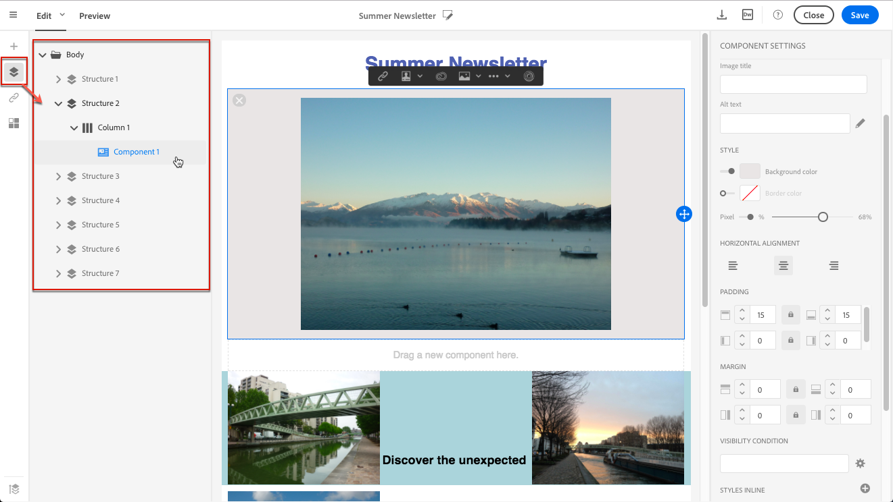

# Managing Styles {#managing-styles}

## Modifica di un elemento {#editing-an-element}

In Designer e-mail, quando si seleziona un elemento, nel **[!UICONTROL Settings]** riquadro vengono visualizzate diverse opzioni specifiche per il tipo di contenuto selezionato. Potete usare queste opzioni per cambiare facilmente lo stile dell’e-mail.

### Selezione di un elemento {#selecting-an-element}

Per selezionare un elemento nell'interfaccia di Designer e-mail, è possibile:

* fai clic direttamente nell’e-mail,
* oppure sfogliare la struttura ad albero disponibile dalle opzioni presenti nella **palette** sinistra.

La navigazione nella struttura ad albero consente di effettuare una selezione più accurata. Potete selezionare una delle seguenti opzioni:

* l’intero componente struttura,
* una delle colonne che compongono il componente struttura,
* o solo un componente che si trova all’interno di una colonna.

Per selezionare una colonna, potete anche effettuare le seguenti operazioni:

1. Selezionate un componente struttura (direttamente nel messaggio e-mail o utilizzando la struttura ad albero disponibile nella **palette** sinistra).
1. Dalla barra degli strumenti **** contestuale, fate clic **[!UICONTROL Select a column]** per scegliere la colonna desiderata.

Vedere un esempio in [questa sezione](#example--adjusting-vertical-alignment-and-padding).

## Regolazione delle impostazioni di stile {#adjusting-style-settings}

1. Selezionate un elemento nel messaggio e-mail. Per ulteriori informazioni, consultate [Selezione di un elemento](#selecting-an-element).
1. Regolate le impostazioni in base alle vostre esigenze. Ogni elemento selezionato offre un set di impostazioni diverso.

   Potete inserire sfondi, modificare le dimensioni, modificare l’allineamento orizzontale o verticale, gestire i colori, aggiungere [spaziatura o margini](#selecting-an-element)e così via.

   A tal fine, utilizzate le opzioni visualizzate nel **[!UICONTROL Settings]** riquadro o [aggiungete gli attributi](#adding-inline-styling-attributes)di stile in linea.

   

1. Salvate il contenuto.

## Informazioni su spaziatura e margini {#about-padding-and-margin}

L'interfaccia di Designer e-mail consente di regolare rapidamente le impostazioni di spaziatura e margini.

**[!UICONTROL Padding]**: questa impostazione consente di gestire lo spazio situato all'interno del bordo di un elemento.

Ad esempio:

* Usate la spaziatura per impostare i margini a sinistra e a destra di un’immagine.
* Usate la spaziatura superiore e inferiore per aggiungere più spaziatura a un **[!UICONTROL Text]** componente o a un **[!UICONTROL Divider]** componente.
* Per impostare i bordi tra le colonne all'interno di un elemento struttura, definire la spaziatura per ciascuna colonna.

**[!UICONTROL Margin]**: questa impostazione consente di gestire lo spazio tra il bordo dell'elemento e l'elemento successivo.

>[!NOTE]
>
>A seconda della selezione (componente struttura, colonna o componente contenuto), il risultato non sarà lo stesso. Adobe consiglia di impostare i parametri **[!UICONTROL Padding]** e **[!UICONTROL Margin]** a livello di colonna.

Per entrambe **[!UICONTROL Padding]** e **[!UICONTROL Margin]**, fate clic sull'icona Blocca per interrompere la sincronizzazione tra i parametri superiore e inferiore o destra e sinistra. Questo consente di regolare ciascun parametro separatamente.

## Allineamento stile {#about-alignment}

* **Allineamento** testo: posizionare il cursore del mouse su un testo e utilizzare la barra degli strumenti contestuale per allinearlo.

   

* **L'allineamento** orizzontale può essere applicato a testo, immagini e pulsanti, attualmente non ai **[!UICONTROL Divider]** componenti e **[!UICONTROL Social]** ai componenti.

   

* Per impostare l’allineamento **** verticale, selezionate una colonna all’interno di un componente struttura e scegliete un’opzione dal riquadro Impostazioni.

   

## Impostazione degli sfondi {#about-backgrounds}

Per impostare gli sfondi con Designer e-mail, Adobe consiglia quanto segue:

1. Se necessario, applicate un colore di sfondo al corpo del messaggio e-mail.
1. Nella maggior parte dei casi, impostate i colori di sfondo a livello di colonna.
1. Cercate di non utilizzare i colori di sfondo sui componenti immagine o testo, in quanto sono difficili da gestire.

Di seguito sono riportate le impostazioni di sfondo disponibili che potete usare.

* Impostate un valore **[!UICONTROL Background color]** per l’intero messaggio e-mail. Accertarsi di selezionare le impostazioni del corpo nella struttura di navigazione accessibile dalla palette a sinistra.

   

* Per impostare lo stesso colore di sfondo per tutti i componenti struttura, selezionare **[!UICONTROL Viewport background color]**. Questa opzione consente di selezionare un’impostazione diversa dal colore di sfondo.

   

* Impostare un colore di sfondo diverso per ciascun componente struttura. Selezionare una struttura nella struttura ad albero di navigazione accessibile dalla palette a sinistra per applicare un colore di sfondo specifico solo a tale struttura.

   

   Accertatevi di non impostare un colore di sfondo della finestra in quanto potrebbe nascondere i colori di sfondo della struttura.

* Impostare un **[!UICONTROL Background image]** valore per il contenuto di un componente struttura.

   

   >[!NOTE]
   >
   >Alcuni programmi e-mail non supportano le immagini di sfondo. Accertatevi di selezionare un colore di sfondo di fallback appropriato nel caso in cui l'immagine non possa essere visualizzata.

* Impostate un colore di sfondo a livello di colonna.

   

   >[!NOTE]
   >
   >Questo è il caso d'uso più comune. Adobe consiglia di impostare i colori di sfondo a livello di colonna, per una maggiore flessibilità nella modifica dell’intero contenuto delle e-mail.

   Potete anche impostare un'immagine di sfondo a livello di colonna, ma questa impostazione viene utilizzata raramente.

### Esempio: regolazione dell'allineamento verticale e della spaziatura {#example--adjusting-vertical-alignment-and-padding}

È necessario regolare la spaziatura e l'allineamento verticale all'interno di un componente struttura composto da tre colonne. A questo scopo, effettuate le seguenti operazioni:

1. Selezionate il componente struttura direttamente nel messaggio e-mail o utilizzando la struttura ad albero disponibile nella **palette** sinistra.
1. Dalla barra degli strumenti **** contestuale, fate clic su **[!UICONTROL Select a column]** e scegliete quello da modificare. È inoltre possibile selezionarlo dalla struttura ad albero.

   

   I parametri modificabili per quella colonna vengono visualizzati nel **[!UICONTROL Settings]** riquadro a destra.

1. In **[!UICONTROL Vertical alignment]**, selezionare **[!UICONTROL Up]**.

   

   Il componente contenuto viene visualizzato sopra la colonna.

1. In **[!UICONTROL Padding]**, definite la spaziatura superiore all'interno della colonna. Fate clic sull’icona Blocca per interrompere la sincronizzazione con la spaziatura inferiore.

   Definite la spaziatura sinistra e destra per la colonna.

   

1. Procedere in modo simile per regolare l'allineamento e la spaziatura delle altre colonne.

   

1. Salvare le modifiche.

## Collegamenti stile {#about-styling-links}

È possibile sottolineare un collegamento e selezionarne il colore e la destinazione in Designer e-mail.

1. In un componente in cui è inserito un collegamento, seleziona il testo dell’etichetta del collegamento.

1. Nelle impostazioni del componente, verificate **[!UICONTROL Underline link]** di sottolineare il testo dell’etichetta del collegamento.

   

1. Per selezionare il contesto di navigazione in cui verrà aperto il collegamento, seleziona una **[!UICONTROL Target]**.

   

1. Per cambiare il colore del collegamento, fai clic su **[!UICONTROL Link color]**.

   

1. Scegliete il colore desiderato.

   

1. Salvare le modifiche.

## Aggiunta di attributi di stile in linea {#adding-inline-styling-attributes}

Nell'interfaccia di Designer e-mail, quando si seleziona un elemento e ne vengono visualizzate le impostazioni nel pannello laterale, è possibile personalizzare gli attributi in linea e il relativo valore per tale elemento specifico.

1. Selezionate un elemento nel contenuto.
1. Nel pannello laterale, cercate le **[!UICONTROL Styles Inline]** impostazioni.

   

1. Modificate i valori degli attributi esistenti o aggiungetene di nuovi utilizzando il pulsante **+** . Potete aggiungere qualsiasi attributo e valore conforme con CSS.

Lo stile viene quindi applicato all'elemento selezionato. Se gli elementi secondari non dispongono di attributi di stile specifici definiti, lo stile dell'elemento padre viene ereditato.

## Passaggio alla visualizzazione mobile {#switching-to-mobile-view}

Potete regolare il design reattivo di un’e-mail modificando separatamente tutte le opzioni di stile per la visualizzazione mobile. Ad esempio, potete adattare margini e spaziatura, usare font di dimensioni più piccole o grandi, modificare i pulsanti o applicare colori di sfondo diversi, specifici per la versione mobile dell’e-mail.

Tutte le opzioni di stile sono disponibili nella visualizzazione mobile. Le impostazioni di stile di Designer e-mail sono precedentemente presentate in questa pagina.

1. Create un messaggio e-mail e iniziate a modificare il contenuto. Per ulteriori informazioni, consultate [Progettazione di contenuti e-mail da zero](../../designing/using/designing-from-scratch.md#designing-an-email-content-from-scratch).
1. Per accedere alla visualizzazione dedicata per dispositivi mobili, fate clic sul **[!UICONTROL Switch to mobile view]** pulsante .

   

   Viene visualizzata la versione mobile dell’e-mail. Contiene tutti i componenti e gli stili definiti nella visualizzazione desktop.

1. Modificate in modo indipendente tutte le impostazioni di stile come il colore di sfondo, l’allineamento, la spaziatura, il margine, la famiglia di font, il colore del testo e così via.

   

1. Quando modificate un’impostazione di stile in visualizzazione mobile, le modifiche vengono applicate solo al display del dispositivo mobile.

   Ad esempio, riducete le dimensioni di un’immagine, aggiungete uno sfondo verde e modificate la spaziatura nella visualizzazione mobile.

   

1. Potete nascondere un componente quando viene visualizzato su un dispositivo mobile. A tale scopo, selezionare **[!UICONTROL Show only on desktop devices]** dal **[!UICONTROL Display options]**.
Potete anche scegliere di nascondere il componente sui dispositivi desktop, il che significa che verrà visualizzato solo sui dispositivi mobili. A tale scopo, selezionare **[!UICONTROL Show only on mobile devices]**.
Ad esempio, questa opzione consente di visualizzare un’immagine specifica su dispositivi mobili e un’altra su dispositivi desktop.
Potete impostare questa opzione dalla visualizzazione mobile o desktop.

   

1. Fate nuovamente clic sul **[!UICONTROL Switch to mobile view]** pulsante per tornare alla visualizzazione desktop standard. Le modifiche apportate allo stile non vengono riportate.

   

   >[!NOTE]
   >
   >L'unica eccezione sono le **[!UICONTROL Style inline]** impostazioni. Qualsiasi modifica alle impostazioni di stile in linea viene applicata anche alla visualizzazione desktop standard.

1. Qualsiasi altra modifica alla struttura o al contenuto dell’e-mail, ad esempio modifiche di testo, caricamento di una nuova immagine, aggiunta di un nuovo componente e così via. viene applicata anche alla visualizzazione standard.

   Ad esempio, tornate alla visualizzazione mobile, modificate del testo e sostituite un’immagine.

   

   Fate nuovamente clic sul **[!UICONTROL Switch to mobile view]** pulsante per tornare alla visualizzazione desktop standard. Le modifiche vengono riportate.

   

1. Se rimuovete uno stile nella visualizzazione mobile, tornerete allo stile applicato in modalità desktop.

   Ad esempio, nella visualizzazione mobile, applicate un colore di sfondo verde a un pulsante.

   

1. Passate alla visualizzazione desktop e applicate uno sfondo grigio allo stesso pulsante.

   

1. Passate nuovamente alla visualizzazione mobile e disattivate l' **[!UICONTROL Background color]** impostazione.

   

   Viene ora applicato il colore di sfondo definito nella visualizzazione desktop: diventa grigio (non vuoto).

   L'unica eccezione è l' **[!UICONTROL Border color]** impostazione. Se disabilitato in visualizzazione mobile, non viene più applicato alcun bordo, anche se nella visualizzazione desktop è definito un colore per il bordo.

>[!NOTE]
>
>La visualizzazione mobile non è disponibile nei [frammenti](../../designing/using/using-reusable-content.md#about-fragments).
