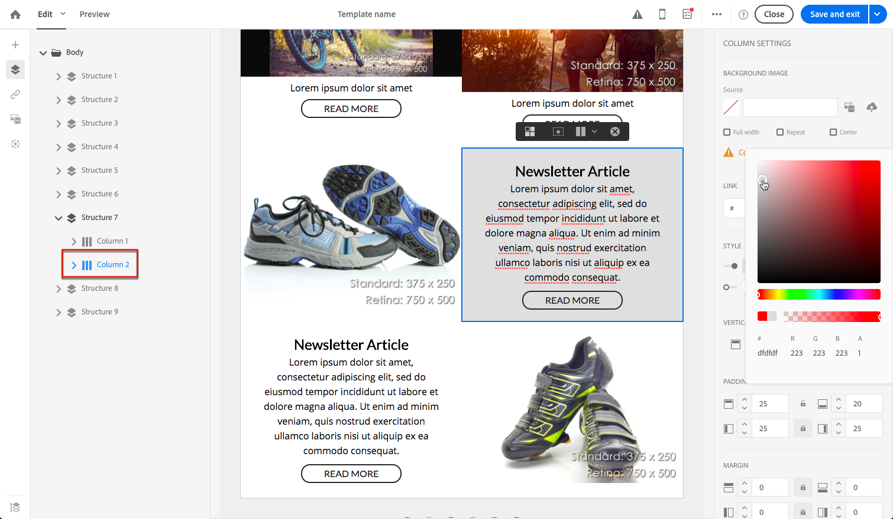

# Gestione degli stili delle e-mail {#managing-styles}

In E-mail Designer, quando selezioni un elemento, nel riquadro **[!UICONTROL Settings]** sono visualizzate diverse opzioni specifiche per il tipo di contenuto selezionato. Puoi utilizzare queste opzioni per modificare facilmente lo stile dell’e-mail.

## Selezione di un elemento {#selecting-an-element}

Per selezionare un elemento nell’interfaccia di E-mail Designer, puoi effettuare le seguenti operazioni:

* fai clic direttamente nell’e-mail,
* oppure sfogliare la struttura ad albero disponibile dalle opzioni disponibili nella sezione sinistra **Palette**.

La navigazione nella struttura ad albero consente di effettuare una selezione più accurata. Puoi selezionare una delle seguenti opzioni:

* l&#39;intera componente della struttura,
* una delle colonne che compongono il componente struttura,
* o solo un componente che si trova all’interno di una colonna.

Per selezionare una colonna, puoi anche effettuare le seguenti operazioni:

1. Seleziona un componente struttura (direttamente nel messaggio e-mail o utilizzando la struttura ad albero disponibile dalla **Palette** a sinistra).
1. Dalla **barra degli strumenti contestuale**, fai clic su **[!UICONTROL Select a column]** per scegliere la colonna desiderata.

Vedi un esempio in [questa sezione](#example--adjusting-vertical-alignment-and-padding).

## Regolazione delle impostazioni di stile {#adjusting-style-settings}

1. Seleziona un elemento nel messaggio e-mail. Per ulteriori informazioni, consulta [Selezione di un elemento](#selecting-an-element).
1. Regola le impostazioni in base alle tue esigenze. Ogni elemento selezionato offre un set di impostazioni diverso.

   È possibile inserire sfondi, modificare le dimensioni, modificare l&#39;allineamento orizzontale o verticale, gestire i colori, aggiungere [spaziatura o margine](#selecting-an-element) e così via.

   A questo scopo, utilizza le opzioni visualizzate nel riquadro **[!UICONTROL Settings]** o [aggiungi attributi di stile in linea](#adding-inline-styling-attributes).

   

1. Salva il contenuto.

## Regolazione della spaziatura e del margine {#about-padding-and-margin}

L’interfaccia di E-mail Designer consente di regolare rapidamente le impostazioni di spaziatura e margini.

**[!UICONTROL Padding]**: questa impostazione consente di gestire lo spazio che si trova all’interno del bordo di un elemento.

Ad esempio:

* Utilizza la spaziatura per impostare i margini a sinistra e a destra di un’immagine.
* Utilizza la spaziatura superiore e inferiore per aggiungere più spaziatura a un componente **[!UICONTROL Text]** o a un componente **[!UICONTROL Divider]**.
* Per impostare i bordi tra le colonne all’interno di un elemento struttura, definire la spaziatura per ciascuna colonna.

**[!UICONTROL Margin]**: questa impostazione consente di gestire lo spazio tra il bordo dell’elemento e l’elemento successivo.

>[!NOTE]
>
>A seconda della selezione (componente struttura, colonna o componente contenuto), il risultato non sarà lo stesso. Adobe consiglia di impostare i parametri **[!UICONTROL Padding]** e **[!UICONTROL Margin]** a livello di colonna.

Per entrambi i parametri **[!UICONTROL Padding]** e **[!UICONTROL Margin]**, fai clic sull’icona Blocca per interrompere la sincronizzazione tra i parametri superiore e inferiore o destro e sinistro. Questo consente di regolare separatamente ogni parametro.

## Allineamento dello stile {#about-alignment}

* **Allineamento** testo: posizionare il cursore del mouse su un testo e utilizzare la barra degli strumenti contestuale per allinearlo.

   

* **L’** allineamento orizzontale può essere applicato a testo, immagini e pulsanti, al momento non ai  **[!UICONTROL Divider]** e  **[!UICONTROL Social]** componenti.

   

* Per impostare l&#39; **allineamento verticale**, seleziona una colonna all&#39;interno di un componente struttura e scegli un&#39;opzione dal riquadro Impostazioni.

   

## Impostazione degli sfondi {#about-backgrounds}

>[!CONTEXTUALHELP]
>id="ac_edition_backgroundimage"
>title="Impostazioni di sfondo"
>abstract="E-mail Designer consente di personalizzare il colore di sfondo o l’immagine di sfondo per il contenuto. L’immagine di sfondo non è supportata da tutti i client e-mail."
>additional-url="https://docs.google.com/spreadsheets/d/1TLo62YKm3tThUWDOIliCQFWs3dpNjpDfw6DdTr1oGOw/edit#gid=0" text="Informazioni aggiuntive"

Quando si tratta di impostare gli sfondi con E-mail Designer, l’Adobe consiglia quanto segue:

1. Se richiesto dalla progettazione, applica un colore di sfondo al corpo dell’e-mail.
1. Nella maggior parte dei casi, imposta i colori di sfondo a livello di colonna.
1. Prova a non utilizzare i colori di sfondo su componenti immagine o testo in quanto sono difficili da gestire.

Di seguito sono riportate le impostazioni di sfondo disponibili che è possibile utilizzare.

* Imposta un **[!UICONTROL Background color]** per l’intera e-mail. Assicurati di selezionare le impostazioni del corpo nella struttura di navigazione accessibile dalla palette a sinistra.

   

* Imposta lo stesso colore di sfondo per tutti i componenti struttura selezionando **[!UICONTROL Viewport background color]**. Questa opzione consente di selezionare un’impostazione diversa dal colore di sfondo.

   

* Impostare un colore di sfondo diverso per ciascun componente struttura. Selezionare una struttura nell&#39;albero di navigazione accessibile dalla palette a sinistra per applicare un colore di sfondo specifico solo a tale struttura.

   

   Assicurati di non impostare un colore di sfondo del riquadro di visualizzazione in quanto potrebbe nascondere i colori di sfondo della struttura.

* Imposta un **[!UICONTROL Background image]** per il contenuto di un componente struttura.

   

   >[!NOTE]
   >
   >Alcuni programmi e-mail non supportano le immagini in background. Se non supportato, verrà utilizzato il colore di sfondo della riga. Assicurati di selezionare un colore di sfondo di fallback appropriato nel caso in cui l&#39;immagine non possa essere visualizzata.

* Imposta un colore di sfondo a livello di colonna.

   

   >[!NOTE]
   >
   >Questo è il caso d’uso più comune. Adobe consiglia di impostare i colori di sfondo a livello di colonna, in quanto ciò consente una maggiore flessibilità nella modifica dell’intero contenuto dell’e-mail.

   Puoi anche impostare un’immagine di sfondo a livello di colonna, ma questa viene utilizzata raramente.

### Esempio: regolazione dell&#39;allineamento verticale e della spaziatura {#example--adjusting-vertical-alignment-and-padding}

È necessario regolare la spaziatura e l’allineamento verticale all’interno di un componente struttura composto da tre colonne. Per farlo, segui la procedura indicata di seguito:

1. Seleziona il componente struttura direttamente nel messaggio e-mail o utilizza la struttura ad albero disponibile dalla **Palette** a sinistra.
1. Dalla **barra degli strumenti contestuale**, fai clic su **[!UICONTROL Select a column]** e scegli quello da modificare. È inoltre possibile selezionarlo dalla struttura ad albero.

   

   I parametri modificabili di quella colonna vengono visualizzati nel riquadro **[!UICONTROL Settings]** a destra.

1. In **[!UICONTROL Vertical alignment]**, selezionare **[!UICONTROL Up]**.

   

   Il componente contenuto viene visualizzato sopra la colonna .

1. Alla voce **[!UICONTROL Padding]**, definisci la spaziatura superiore all’interno della colonna. Fai clic sull’icona Blocca per interrompere la sincronizzazione con la spaziatura inferiore.

   Definisci la spaziatura sinistra e destra per la colonna.

   

1. Procedi in modo simile per regolare l’allineamento e la spaziatura delle altre colonne.

   

1. Salva le modifiche.

## Collegamenti di stile {#about-styling-links}

È possibile sottolineare un collegamento e selezionarne il colore e la destinazione in E-mail Designer.

1. In un componente in cui viene inserito un collegamento, seleziona il testo dell’etichetta del collegamento.

1. Nelle impostazioni del componente, seleziona **[!UICONTROL Underline link]** per sottolineare il testo dell’etichetta del collegamento.

   

1. Per selezionare il contesto di navigazione in cui verrà aperto il collegamento, seleziona un **[!UICONTROL Target]**.

   

1. Per modificare il colore del collegamento, fai clic su **[!UICONTROL Link color]**.

   

1. Scegli il colore di cui hai bisogno.

   

1. Salva le modifiche.

## Aggiunta di attributi di stile in linea {#adding-inline-styling-attributes}

Nell’interfaccia di E-mail Designer, quando selezioni un elemento e ne visualizzi le impostazioni nel pannello laterale, puoi personalizzare gli attributi in linea e il relativo valore per quell’elemento specifico.

1. Seleziona un elemento nel contenuto.
1. Nel pannello laterale, cerca le impostazioni **[!UICONTROL Styles Inline]** .

   

1. Modifica i valori degli attributi esistenti o aggiungi nuovi attributi utilizzando il pulsante **+** . Puoi aggiungere qualsiasi attributo e valore conforme a CSS.

Lo stile viene quindi applicato all’elemento selezionato. Se per gli elementi secondari non sono definiti attributi di stile specifici, viene ereditato lo stile dell’elemento padre.
