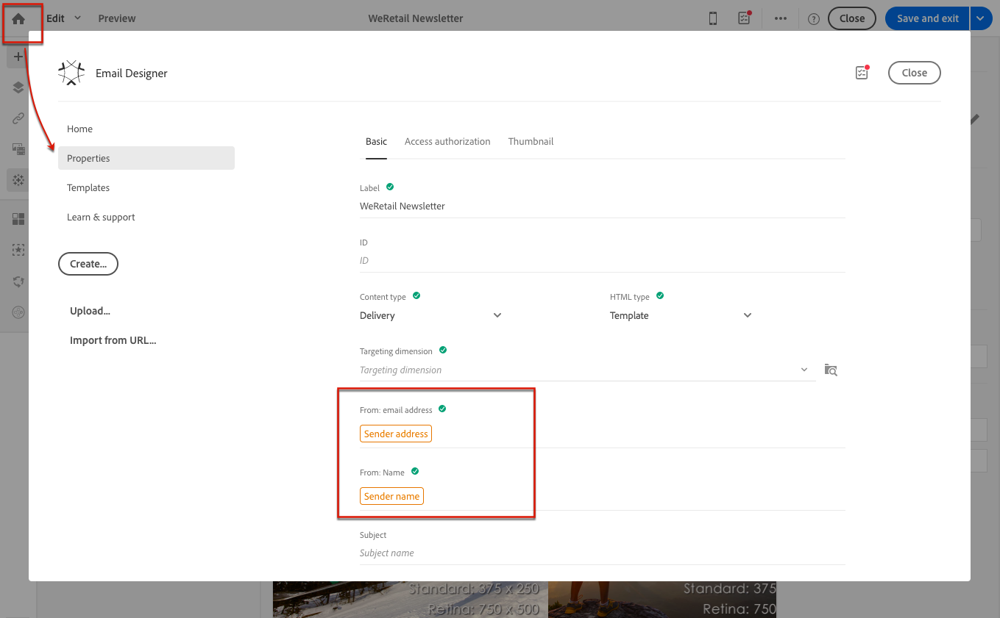

# Definizione dell’oggetto e del mittente di un’e-mail{#defining-the-subject-line-of-an-email}

## Definizione dell’oggetto di un’e-mail {#subject-line}

L’oggetto del messaggio è obbligatorio per preparare e inviare il messaggio.

>[!NOTE]
>
>Se l’oggetto è vuoto, viene visualizzato un avviso nel dashboard dei messaggi e nel Designer e-mail.

1. Creare un messaggio e-mail.
1. Passa alla scheda **[!UICONTROL Properties]** della home page di E-mail Designer (accessibile tramite l&#39;icona Home ).
1. Compila la sezione **[!UICONTROL Subject]**.

   

1. Puoi anche aggiungere campi di personalizzazione, blocchi di contenuto e contenuto dinamico alla riga dell’oggetto facendo clic sulle icone corrispondenti. Per ulteriori informazioni, vedere [Personalization](../../designing/using/personalization.md).

## Definizione del mittente dell’e-mail di un messaggio e-mail {#email-sender}

Per definire il nome del mittente che verrà visualizzato nell&#39;intestazione dei messaggi inviati, passare alla scheda **[!UICONTROL Properties]** della home page di E-mail Designer (accessibile tramite l&#39;icona Home).

* Il campo **[!UICONTROL From: name]** consente di immettere il nome del mittente. Per impostazione predefinita, il blocco predefinito **Nome mittente** viene immesso automaticamente nel campo. L&#39;indirizzo e-mail del mittente predefinito e il nome del mittente sono definiti in **[!UICONTROL Brands]** accessibile tramite il logo Adobe Campaign nel menu avanzato **[!UICONTROL Administration > Instance settings > Brand configuration]**.

  Puoi modificare il nome del mittente facendo clic sul blocco **Nome mittente**. Il campo diventa quindi modificabile e puoi immettere il nome che desideri utilizzare.

  Questo campo può essere personalizzato. A questo scopo, puoi aggiungere campi di personalizzazione, blocchi di contenuto e contenuti dinamici facendo clic sulle icone sotto il nome del mittente. Per ulteriori informazioni, vedere [Personalization](../../designing/using/personalization.md).

* Impossibile modificare il campo **[!UICONTROL From: email address]** da questa sezione. Puoi modificarlo modificando le proprietà dell’e-mail dal dashboard. Per ulteriori informazioni, vedere [Elenco dei parametri avanzati e-mail](../../administration/using/configuring-email-channel.md#advanced-parameters).

>[!NOTE]
>
>I parametri di intestazione non possono essere vuoti. L’indirizzo del mittente è obbligatorio per consentire l’invio di un’e-mail (standard RFC). Adobe Campaign controlla la sintassi degli indirizzi e-mail immessi.

**Argomenti correlati:**

* [Inserimento di un campo di personalizzazione](../../designing/using/personalization.md#inserting-a-personalization-field)
* [Aggiunta di un blocco di contenuto](../../designing/using/personalization.md#adding-a-content-block)
* [Definizione del contenuto dinamico in un messaggio e-mail](../../designing/using/personalization.md#defining-dynamic-content-in-an-email)
