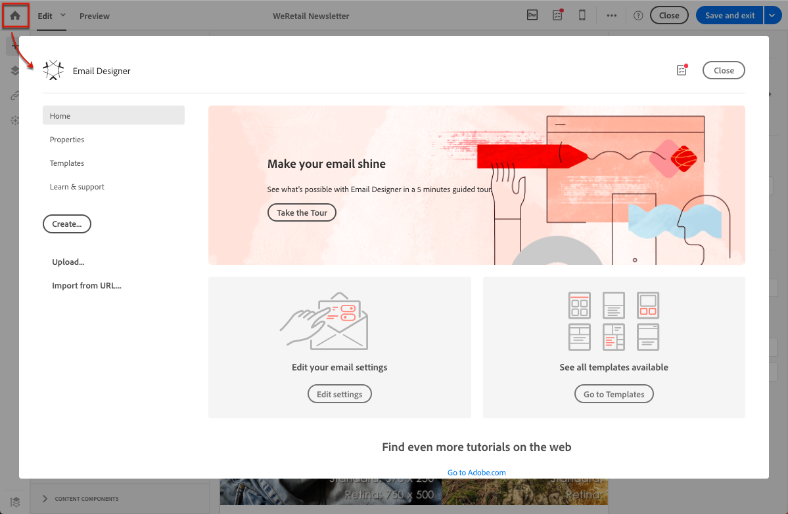
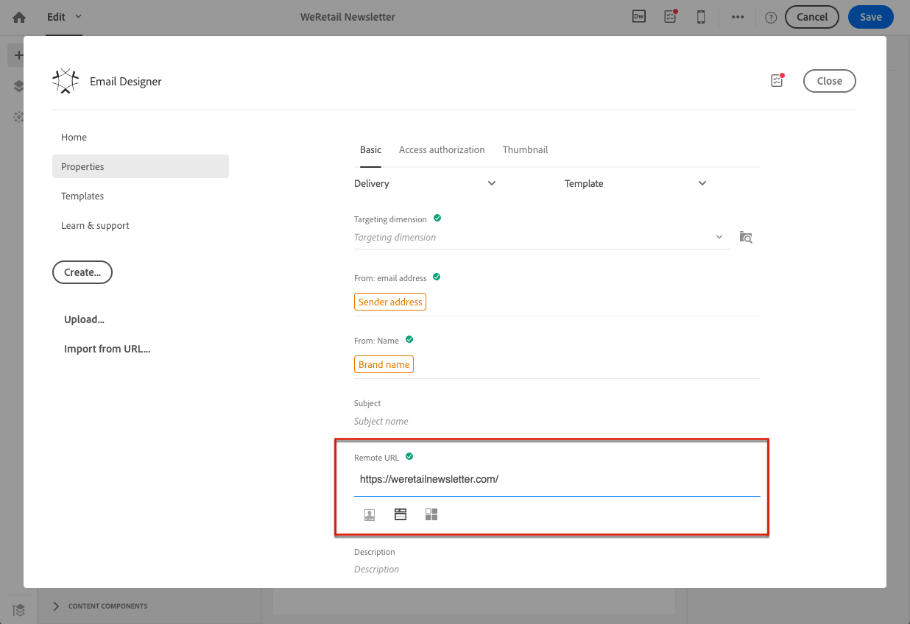

# Designing using existing content {#designing-using-existing-content}

## Selecting an existing content{#selecting-an-existing-content}

 Adobe Campaign viene fornito con un set di contenuti predefiniti per aiutarti a iniziare. Potete utilizzare uno di questi oppure, se il contenuto del messaggio da inviare è in fase di preparazione all&#39;esterno  Adobe Campaign, potete importarlo dal computer o da un URL.

Quando create un’e-mail o una pagina di destinazione, potete scegliere di caricare un contenuto esistente da un’altra origine.

>[!NOTE]
>
>Le immagini seguenti mostrano come caricare un contenuto esistente utilizzando [Email Designer](../../designing/using/designing-content-in-adobe-campaign.md).

1. Dopo aver creato l’e-mail o la pagina di destinazione, apritene il contenuto.
1. Fate clic sull’icona Home per accedere alla **[!UICONTROL Email Designer]** pagina principale.

   

1. Selezionate l’origine del contenuto da caricare:

   * [Modelli](../../designing/using/using-reusable-content.md#content-templates)di contenuto: fare clic sulla **[!UICONTROL Templates]** scheda.
   * [Contenuto da zero](../../designing/using/designing-from-scratch.md#designing-an-email-content-from-scratch), per iniziare nuovo: fare clic sul **[!UICONTROL Create]** pulsante.
   * [Contenuto del computer come file](#importing-content-from-a-file)ZIP o HTML: fare clic sul **[!UICONTROL Upload]** pulsante.
   * [Contenuto da un URL](#importing-content-from-a-url) esistente (solo per le e-mail): fare clic sul **[!UICONTROL Import from URL]** pulsante.

   

1. Caricate il contenuto. Il contenuto selezionato sostituisce quello corrente.

   Una volta importati, i contenuti possono essere modificati e personalizzati.

   >[!NOTE]
   >
   >Designer [e-](../../designing/using/designing-content-in-adobe-campaign.md) mail utilizza tag specifici. Il contenuto HTML standard caricato in Campaign deve corrispondere al tag previsto per essere completamente compatibile e modificabile da Email Designer. Se non corrisponde, il contenuto viene caricato in modalità [](#compatibility-mode)compatibilità. Per rendere compatibili i contenuti esistenti, consulta [questa sezione](#editing-existing-contents-with-the-email-designer).

**Argomenti correlati:**

* [Creazione di un messaggio e-mail](../../channels/using/creating-an-email.md)
* [Gestione delle pagine di destinazione](../../channels/using/getting-started-with-landing-pages.md)

## Modifica di contenuti esistenti con Designer e-mail{#editing-existing-contents-with-the-email-designer}

Per sfruttare appieno le possibilità di edizione di [Email Designer](../../designing/using/designing-content-in-adobe-campaign.md), l&#39;HTML caricato deve contenere tag specifici che lo rendono conforme con l&#39;editor WYSIWYG.

Se tutto o parte dell’HTML non dispone di questo tag, il contenuto viene caricato in modalità [compatibilità](#compatibility-mode).

Per rendere un contenuto esterno esistente completamente modificabile in Designer e-mail, consultare la sezione [Progettazione di un&#39;e-mail utilizzando il contenuto](../../designing/using/using-existing-content.md) esistente.

## Importazione di un contenuto e-mail esistente {#importing}

### Importing content from a file {#importing-content-from-a-file}

Dalla home page di Designer e-mail, fare clic sul **[!UICONTROL Upload]** pulsante per caricare un file dal computer, quindi confermare.

Non esistono vincoli per la struttura del file zip. Tuttavia, il riferimento ai file HTML deve essere relativo e rispettare la struttura ad albero della cartella zip.

Sono supportati i seguenti formati per l’importazione:

* Un file HTML con un foglio di stile incorporato
* Una cartella .zip contenente il file HTML, il foglio di stile (.CSS) e le immagini

>[!NOTE]
>
>Per i contenuti e-mail, è consigliabile importare singoli file HTML con un foglio di stile incorporato.

#### Importing content from a URL {#importing-content-from-a-url}

Prima di importare contenuto da un URL, accertatevi che sia conforme ai seguenti requisiti:

* Il contenuto deve essere disponibile al pubblico tramite questo URL.
* Per motivi di sicurezza, **[!UICONTROL https]** sono consentiti solo gli URL che iniziano con.
* Accertatevi che tutte le risorse (immagini, CSS) siano impostate in collegamenti assoluti e in HTTPS. In caso contrario, dopo l’invio dell’e-mail, la pagina mirror viene visualizzata senza le relative risorse. Esempio di definizione di collegamento assoluto:

   ```
   <a href="https://www.mywebsite.com/images/myimage.png">
   ```

>[!NOTE]
>
>Il caricamento di contenuti da un URL è disponibile solo per il canale e-mail.

Per recuperare contenuto esistente da un URL, effettuate le seguenti operazioni:

1. Dalla home page di Designer e-mail, selezionare il **[!UICONTROL Import from URL]** pulsante.

   

1. Definite l’URL dal quale verrà recuperato il contenuto.
1. Fai clic su **[!UICONTROL Confirm]**.

**Argomento correlato:**

[Importazione di contenuti da un video URL](https://docs.adobe.com/content/help/en/campaign-learn/campaign-standard-tutorials/designing-content/email-designer/email-designer-overview.html#Workingwithexistingcontent)

### Recupero automatico del contenuto da un URL al momento della preparazione {#retrieving-content-from-a-url-automatically-at-preparation-time}

L’importazione di contenuto da un URL durante la preparazione dei messaggi consente di recuperare il contenuto HTML più recente ogni volta che l’e-mail viene preparata. In questo modo, il contenuto delle e-mail ricorrenti è sempre aggiornato al momento dell&#39;invio. Questa funzione consente inoltre di creare un messaggio pianificato in una data specifica, anche se il contenuto non è ancora pronto.

Per recuperare i contenuti in fase di preparazione, effettuate le seguenti operazioni:

1. Selezionate l’ **[!UICONTROL Content imported during preparation]** opzione.

   

1. Il contenuto dell&#39;URL viene visualizzato nell&#39;editor come contenuto di sola lettura.

   >[!CAUTION]
   >
   >A questo punto, la visualizzazione HTML nell&#39;editor del contenuto non dovrebbe essere presa in considerazione. Sarà recuperato nella fase di preparazione.

1. Per visualizzare l’anteprima del contenuto dell’URL recuperato, aprire il messaggio dopo averlo creato e fare clic sul **[!UICONTROL Preview]** pulsante.

È possibile personalizzare l&#39;URL remoto da cui verrà recuperato il contenuto. Per farlo, segui la procedura indicata di seguito:

1. Fare clic sull&#39;etichetta e-mail nella parte superiore dello schermo per accedere alla **[!UICONTROL Properties]** scheda Email Designer.
1. Trova il **[!UICONTROL Remote URL]** campo.

   

1. Inserite il campo di personalizzazione desiderato, il blocco di contenuto o il testo dinamico.

   Il blocco **[!UICONTROL Current date - YYYYMMDD]** di contenuto, ad esempio, consente di inserire la data del giorno.

   >[!NOTE]
   >
   >I campi di personalizzazione disponibili sono collegati solo agli attributi **di consegna** (data di creazione e-mail, stato, etichetta della campagna...).

### Modalità compatibilità {#compatibility-mode}

Quando si carica un contenuto, questo deve contenere tag specifici per essere completamente conforme e modificabile con l&#39;editor WYSIWYG di Designer e-mail.

Se tutto o parte dell’HTML caricato non è conforme ai tag previsti, il contenuto viene caricato in &quot;modalità compatibilità&quot;, che limita le possibilità di edizione nell’interfaccia utente.

Quando un contenuto viene caricato in modalità di compatibilità, è comunque possibile eseguire le seguenti modifiche tramite l&#39;interfaccia (le azioni non disponibili sono nascoste):

* Modifica del testo o modifica di un’immagine
* Inserimento di collegamenti e campi di personalizzazione
* Modificare alcune opzioni di stile per il blocco HTML selezionato
* Definizione del contenuto condizionale


Altre modifiche, come l’aggiunta di nuove sezioni al messaggio e-mail o lo stile avanzato, devono essere effettuate direttamente nel codice sorgente del messaggio e-mail tramite la modalità HTML.

Per ulteriori informazioni sulla conversione di un&#39;e-mail esistente in un&#39;e-mail compatibile con e-mail Designer, consultare [questa sezione](../../designing/using/using-existing-content.md).

**Argomento correlato**:

* [Creazione di un messaggio e-mail](../../channels/using/creating-an-email.md)
* [Video introduttivo su Email Designer](https://video.tv.adobe.com/v/22771/?autoplay=true&hidetitle=true&captions=ita)
* [Progettazione di un contenuto e-mail da zero](../../designing/using/designing-from-scratch.md#designing-an-email-content-from-scratch)

## Conversione del contenuto HTML {#converting-an-html-content}

Se si desidera creare un framework di modelli e frammenti modulari che possano essere combinati per il riutilizzo in più e-mail, è consigliabile convertire l&#39;HTML dell&#39;e-mail in un modello di E-mail Designer.

Questo caso di utilizzo offre un modo rapido per convertire le e-mail HTML in componenti di E-mail Designer.

>[!CAUTION]
>
>Questa sezione è destinata agli utenti esperti che hanno familiarità con il codice HTML.

>[!NOTE]
>
>Come la modalità di compatibilità, un componente HTML è modificabile con opzioni limitate: è possibile eseguire solo edizioni interne.

Al di fuori di Designer e-mail, assicurarsi che l&#39;HTML originale sia diviso in sezioni riutilizzabili.

In caso contrario, tagliare i diversi blocchi dal codice HTML. Ad esempio:

```
<!-- 3 COLUMN w/CTA (SCALED) -->
<table width="100%" align="center" cellspacing="0" cellpadding="0" border="0" role="presentation" style="max-width:680px;">
<tbody>
<tr>
<td class="padh10" align="center" valign="top" style="padding:0 5px 20px 5px;">
<table width="100%" cellspacing="0" cellpadding="0" border="0" role="presentation">
<tbody>
<tr>
...
</tr>
</tbody>
</table>
</td>
</tr>
</tbody>
</table>
<!-- //3 COLUMN w/CTA (SCALED) -->
```

Dopo aver identificato tutti i blocchi, in Designer e-mail ripetere la seguente procedura per ciascuna sezione dell&#39;e-mail esistente:

1. Aprite il Designer e-mail per creare un contenuto e-mail vuoto.
1. Impostate gli attributi a livello di corpo: colori di sfondo, larghezza, ecc. Per ulteriori informazioni, consulta [Modifica degli stili delle e-mail](../../designing/using/styles.md).
1. Aggiungere un componente struttura. Per ulteriori informazioni, consulta [Modifica della struttura delle e-mail](../../designing/using/designing-from-scratch.md#defining-the-email-structure).
1. Aggiungete un componente HTML. Per ulteriori informazioni, consulta [Aggiunta di frammenti e componenti](../../designing/using/designing-from-scratch.md#defining-the-email-structure).
1. Copiate e incollate il codice HTML nel componente.
1. Passate alla visualizzazione mobile. Per ulteriori informazioni, consulta [questa sezione](../../designing/using/plain-text-html-modes.md#switching-to-mobile-view).

   La vista reattiva non funziona perché il CSS non è presente.

1. Per risolvere il problema, passare alla modalità codice sorgente e copiare e incollare la sezione di stile in una nuova sezione di stile. Ad esempio:

   ```
   <style type="text/css">
   a {text-decoration:none;}
   body {min-width:100% !important; margin:0 auto !important; padding:0 !important;}
   img {line-height:100%; text-decoration:none; -ms-interpolation-mode:bicubic;}
   ...
   </style>
   ```

   >[!NOTE]
   >
   >Accertatevi di aggiungere lo stile dopo questo in un altro tag di stile personalizzato.
   >
   >Non modificate il CSS generato da Designer e-mail:
   >
   >* `<style data-name="default" type="text/css">(##)</style>`
   >* `<style data-name="supportIOS10" type="text/css">(##)</style>`
   >* `<style data-name="mediaIOS8" type="text/css">(##)</style>`
   >* `<style data-name="media-default-max-width-500px" type="text/css">(##)</style>`
   >* `<style data-name="media-default--webkit-min-device-pixel-ratio-0" type="text/css">(##)</style>`


1. Tornate alla visualizzazione mobile per verificare che il contenuto sia correttamente visualizzato e salvare le modifiche.
