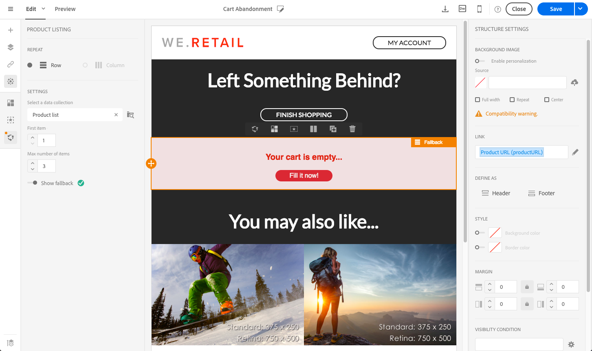

# Utilizzo degli elenchi di prodotti in un messaggio sulle transazioni {#using-product-listings}

>[!IMPORTANT]
>
>Gli elenchi dei prodotti sono disponibili solo per i **messaggi e-mail transazionali** tramite l&#39;interfaccia [E-mail Designer](../../designing/using/designing-content-in-adobe-campaign.md#email-designer-interface).

Quando modifichi il contenuto di un’e-mail sulle transazioni, puoi creare elenchi di prodotti che fanno riferimento a una o più raccolte di dati. Ad esempio, in un’e-mail di abbandono del carrello, puoi includere un elenco di tutti i prodotti presenti nei carrelli degli utenti al momento dell’uscita dal sito web, con un’immagine, il prezzo e un collegamento a ciascun prodotto.

Per aggiungere un elenco di prodotti abbandonati in un messaggio sulle transazioni, segui i passaggi indicati di seguito.

Puoi anche guardare [questo set di video](https://experienceleague.adobe.com/docs/campaign-standard-learn/tutorials/designing-content/product-listings-in-transactional-email.html?lang=en#configure-product-listings-in-transactional-emails) per spiegare i passaggi necessari per configurare gli elenchi di prodotti in un’e-mail sulle transazioni.

>[!NOTE]
>
>Adobe Campaign non supporta elenchi di prodotti nidificati, il che significa che non puoi includere un elenco di prodotti all’interno di un altro.

## Definizione di un elenco di prodotti {#defining-a-product-listing}

Prima di poter utilizzare un elenco di prodotti in un messaggio sulle transazioni, è necessario definire a livello di evento l’elenco dei prodotti e i campi per ciascun prodotto da visualizzare. Per ulteriori informazioni, consulta [Definizione delle raccolte di dati](../../channels/using/configuring-transactional-event.md#defining-data-collections).

1. Nel messaggio sulle transazioni, fai clic sul blocco **[!UICONTROL Content]** per modificare il contenuto dell’e-mail.
1. Trascina e rilascia un componente struttura all’interno dell’area di lavoro. Per ulteriori informazioni, consulta [Definizione della struttura delle e-mail](../../designing/using/designing-from-scratch.md#defining-the-email-structure).

   Ad esempio, seleziona un componente struttura a una colonna e aggiungi un componente testo, un componente immagine e un componente pulsante. Per ulteriori informazioni, consulta [Uso dei componenti di contenuto](../../designing/using/designing-from-scratch.md#about-content-components).

1. Seleziona il componente struttura appena creato, quindi fai clic sull’icona **[!UICONTROL Enable product listing]** nella barra degli strumenti contestuale.

   

   Il componente struttura viene evidenziato con una cornice arancione e le impostazioni **[!UICONTROL Product listing]** sono visualizzate nella palette a sinistra.

   

1. Seleziona la modalità di visualizzazione degli elementi della raccolta:

   * **[!UICONTROL Row]**: orizzontale, ovvero ogni elemento posto sulla riga inferiore al precedente.
   * **[!UICONTROL Column]**: verticale, ovvero ciascun elemento posto accanto all’altro sulla medesima riga.

   >[!NOTE]
   >
   >L’opzione **[!UICONTROL Column]** è disponibile solo quando è in uso un componente struttura a più colonne ( **[!UICONTROL 2:2 column]**, **[!UICONTROL 3:3 column]** e **[!UICONTROL 4:4 column]** ). Quando modifichi l’elenco dei prodotti, compila solo la prima colonna: le altre non saranno prese in considerazione. Per ulteriori informazioni sulla selezione dei componenti struttura, consulta [Definizione della struttura delle e-mail](../../designing/using/designing-from-scratch.md#defining-the-email-structure).

1. Seleziona la raccolta dati creata durante la configurazione dell’evento correlato al messaggio sulle transazioni, disponibile nel nodo **[!UICONTROL Context]** > **[!UICONTROL Real-time event]** > **[!UICONTROL Event context]**.

   

   Per ulteriori informazioni sulla configurazione dell’evento, consulta [Definizione delle raccolte di dati](../../channels/using/configuring-transactional-event.md#defining-data-collections).

1. Utilizza l’elenco a discesa **[!UICONTROL First item]** per selezionare l’elemento che avvierà l’elenco visualizzato nel messaggio e-mail.

   Ad esempio, se scegli 2, il primo elemento della raccolta non verrà visualizzato nell’e-mail. L’elenco dei prodotti partirà dal secondo elemento.

1. Seleziona il numero massimo di elementi da visualizzare nell’elenco.

   >[!NOTE]
   >
   >Se desideri che gli elementi dell’elenco siano visualizzati in verticale ( **[!UICONTROL Column]** ), il numero massimo è limitato in base al componente struttura selezionato (2, 3 o 4 colonne). Per ulteriori informazioni sulla selezione dei componenti struttura, consulta [Modifica della struttura delle e-mail](../../designing/using/designing-from-scratch.md#defining-the-email-structure).

## Popolamento dell’elenco dei prodotti {#populating-the-product-listing}

Per visualizzare un elenco dei prodotti provenienti dall’evento collegato al messaggio e-mail sulle transazioni, attieniti alla procedura seguente.

Per ulteriori informazioni sulla creazione di una raccolta e dei campi correlati durante la configurazione dell’evento, consulta [Definizione delle raccolte di dati](../../channels/using/configuring-transactional-event.md#defining-data-collections).

1. Seleziona il componente immagine inserito, fai clic su **[!UICONTROL Enable personalization]** e sulla matita nel riquadro Impostazioni.

   

1. Seleziona **[!UICONTROL Add personalization field]** nella finestra **[!UICONTROL Image source URL]** che si apre.

   Dal nodo **[!UICONTROL Context]** > **[!UICONTROL Real-time event]** > **[!UICONTROL Event context]**, apri il nodo corrispondente alla raccolta creata, in questo caso **[!UICONTROL Product list]**, quindi fai clic sul campo immagine definito (qui **[!UICONTROL Product image]**). Fai clic su **[!UICONTROL Save]**.

   

   Il campo di personalizzazione selezionato viene ora visualizzato nel riquadro Impostazioni.

1. Nella posizione desiderata, seleziona **[!UICONTROL Insert personalization field]** dalla barra degli strumenti contestuale.

   

1. Dal nodo **[!UICONTROL Context]** > **[!UICONTROL Real-time event]** > **[!UICONTROL Event context]**, apri il nodo corrispondente alla raccolta creata (qui **[!UICONTROL Product list]**) e seleziona il campo creato (qui **[!UICONTROL Product name]**). Fai clic su **[!UICONTROL Confirm]**.

   

   Il campo di personalizzazione selezionato viene ora visualizzato nella posizione desiderata all’interno del contenuto dell’e-mail.

1. Procedi similmente per l’inserimento del prezzo.
1. Seleziona una parte di testo e fai clic su **[!UICONTROL Insert link]** nella barra degli strumenti contestuale.

   

1. Seleziona **[!UICONTROL Add personalization field]** nella finestra **[!UICONTROL Insert link]** che si apre.

   Dal nodo **[!UICONTROL Context]** > **[!UICONTROL Real-time event]** > **[!UICONTROL Event context]**, apri il nodo corrispondente alla raccolta creata, in questo caso **[!UICONTROL Product list]**, quindi fai clic sul campo URL (qui **[!UICONTROL Product URL]**). Fai clic su **[!UICONTROL Save]**.

   >[!IMPORTANT]
   >
   >Per motivi di sicurezza, accertati di inserire il campo di personalizzazione all’interno di un collegamento che inizia con un nome di dominio statico appropriato.

   

   Il campo di personalizzazione selezionato viene ora visualizzato nel riquadro Impostazioni.

1. Scegli il componente struttura sul quale viene applicato l’elenco di prodotti, quindi fai clic su **[!UICONTROL Show fallback]** per definire un contenuto predefinito.

   

1. Trascina uno o più componenti di contenuto e modificali in base alle tue esigenze.

   

   Il contenuto di fallback verrà visualizzato se la raccolta è vuota al momento di attivare l’evento, ad esempio se un cliente ha il carrello vuoto.

1. Nel riquadro Impostazioni, modifica gli stili per l’elenco dei prodotti. Per ulteriori informazioni, consulta [Gestione degli stili delle e-mail](../../designing/using/styles.md).
1. Visualizza l’anteprima del messaggio e-mail utilizzando un profilo di prova collegato all’evento sulle transazioni rilevante per il quale hai definito i dati della raccolta. Ad esempio, aggiungi le seguenti informazioni nella sezione **[!UICONTROL Event data]** relativa al profilo di test da utilizzare:

   

   Per approfondimenti sulla definizione di un profilo di test in un messaggio sulle transazioni, consulta [questa sezione](../../channels/using/testing-transactional-message.md#defining-specific-test-profile).
