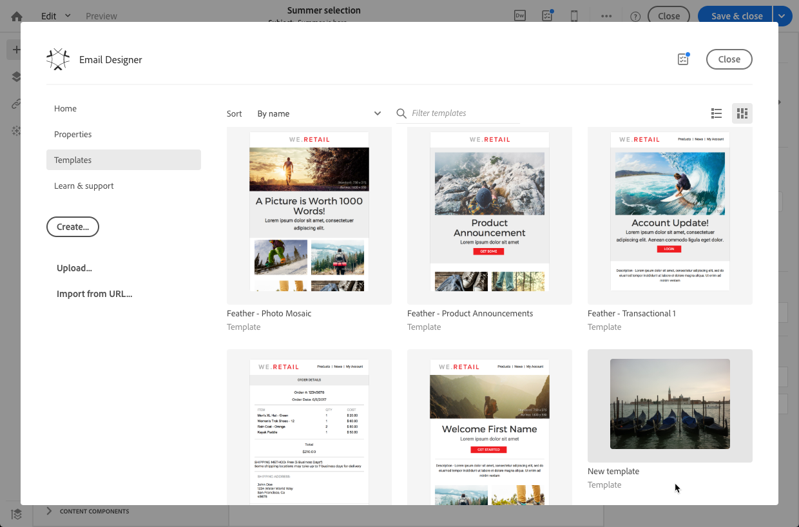

# Creazione e utilizzo di contenuti riutilizzabili {#using-reusable-content}

Scopri come gestire l’edizione del contenuto delle e-mail. Con E-mail Designer è possibile creare modelli e frammenti con contenuti predefiniti personalizzati e riutilizzarli per le seguenti consegne.

## Progettazione di e-mail tramite modelli {#designing-templates}

>[!NOTE]
>
> In Adobe Campaign Standard, puoi creare diversi tipi di modelli accessibili dal **Risorse** > **Modelli** menu. I modelli utilizzati in E-mail Designer sono modelli di contenuto. Per ulteriori informazioni, consulta [Informazioni sui modelli](../../start/using/marketing-activity-templates.md).

 [Scopri come creare modelli in un video](#video)

### Informazioni sui modelli di contenuto {#content-templates}

Puoi gestire i contenuti di HTML offerti nel **[!UICONTROL Templates]** della scheda [E-mail Designer](../../designing/using/designing-content-in-adobe-campaign.md) home page.

I modelli di contenuti e-mail preconfigurati includono diciotto layout ottimizzati per dispositivi mobili e quattro modelli reattivi all’avanguardia progettati da artisti Behance. Corrispondono, tra l’altro, agli utilizzi più recenti, come messaggi di benvenuto dei clienti, newsletter ed e-mail di nuovo coinvolgimento. Possono essere facilmente personalizzati con i contenuti dei tuoi marchi per facilitare il processo di progettazione delle e-mail da zero.

I modelli di contenuto di HTML sono accessibili dal **[!UICONTROL Resources]** > **[!UICONTROL Content templates & fragments]** dello schermo [Menu avanzato](../../start/using/interface-description.md#advanced-menu). Da qui puoi gestire i modelli di contenuto della pagina di destinazione, i modelli di contenuto e-mail e anche i frammenti.

I modelli di contenuto predefiniti sono di sola lettura. Per modificarne uno, devi prima duplicare il modello desiderato.

È possibile creare nuovi modelli o frammenti e definire contenuti personalizzati. Per ulteriori informazioni, consulta [Creazione di un modello di contenuto](#creating-a-content-template) e [Creazione di un frammento di contenuto](#creating-a-content-fragment).

Durante la modifica del contenuto tramite E-mail Designer, è inoltre possibile creare modelli di contenuto salvando il contenuto come frammento o modello. Per ulteriori informazioni, consulta [Salvataggio del contenuto come modello](#saving-content-as-template) e [Salvataggio del contenuto come frammento](../../designing/using/using-reusable-content.md#saving-content-as-a-fragment).

**Argomenti correlati:**

* Per ulteriori informazioni sulla modifica dei contenuti, consulta [Informazioni sulla progettazione del contenuto e-mail](../../designing/using/designing-content-in-adobe-campaign.md).

### Creazione di un modello di contenuto {#creating-a-content-template}

Puoi creare modelli di contenuto personalizzati per utilizzarli il numero di volte necessario.

L’esempio seguente mostra come creare un modello di contenuto e-mail.

1. Vai a **[!UICONTROL Resources]** > **[!UICONTROL Content templates & fragments]** e fai clic su **[!UICONTROL Create]**.
1. Fai clic sull’etichetta e-mail per accedere al **[!UICONTROL Properties]** della scheda E-mail Designer.
1. Specifica un’etichetta riconoscibile e seleziona i seguenti parametri per poter utilizzare questo modello nelle e-mail:

   * Seleziona **[!UICONTROL Shared]** o **[!UICONTROL Delivery]** dal **[!UICONTROL Content type]** elenco a discesa.
   * Seleziona **[!UICONTROL Template]** dal **[!UICONTROL HTML type]** elenco a discesa.

   

1. Se necessario, puoi impostare un’immagine che verrà utilizzata come miniatura per il modello. Selezionala dal menu **[!UICONTROL Thumbnail]** scheda delle proprietà del modello.

   

   Questa miniatura verrà visualizzata nella **[!UICONTROL Templates]** della scheda [E-mail Designer](../../designing/using/designing-content-in-adobe-campaign.md) home page.

1. Chiudi **[!UICONTROL Properties]** per tornare all’area di lavoro principale.
1. Aggiungi i componenti struttura e contenuti personalizzabili in base alle esigenze.
   >[!NOTE]
   >
   > Non puoi inserire campi di personalizzazione o contenuto condizionale all’interno di un modello di contenuto.
1. Una volta modificato, salva il modello.

Questo modello può ora essere utilizzato in qualsiasi e-mail creata con E-mail Designer. Selezionala dal menu **[!UICONTROL Templates]** della scheda [E-mail Designer](../../designing/using/designing-content-in-adobe-campaign.md) home page.

### Salvataggio del contenuto come modello {#saving-content-as-template}

Quando modifichi un’e-mail con E-mail Designer, puoi salvare direttamente il contenuto di tale e-mail come modello.

<!--[!CAUTION]
>
>You cannot save as template a structure containing personalization fields or dynamic content.-->

1. Seleziona **[!UICONTROL Save as template]** dalla barra degli strumenti principale di E-mail Designer.

   

1. Aggiungi un’etichetta e una descrizione, se necessario, quindi fai clic su **[!UICONTROL Save]**.

   

1. Per trovare il modello appena creato, vai a **[!UICONTROL Resources]** > **[!UICONTROL Content templates & fragments]**.

1. Per utilizzare il nuovo modello, selezionalo dal **[!UICONTROL Templates]** della scheda [E-mail Designer](../../designing/using/designing-content-in-adobe-campaign.md) home page.

   

### Creazione di un modello con frammenti e componenti {#template-fragments-components}

È ora possibile creare un modello e-mail con E-mail Designer. Utilizza i componenti di contenuto per riflettere le diverse sezioni dell’e-mail e regola le impostazioni in modo che siano il più possibile simili alla newsletter originale. Infine, inserire i frammenti appena creati.

1. Utilizzando E-mail Designer, crea un modello. Per ulteriori informazioni, consulta [Modelli di contenuto](#content-templates).
1. Inserisci diversi componenti struttura nel modello, corrispondenti all’intestazione, al piè di pagina e al corpo del messaggio e-mail. Per ulteriori informazioni sull’aggiunta dei componenti struttura, consulta [Modifica della struttura delle e-mail con E-mail Designer](../../designing/using/designing-from-scratch.md#defining-the-email-structure).
1. Inserisci tutti i componenti di contenuto necessari per creare il corpo della newsletter. Questo sarà il contenuto modificabile della tua e-mail che aggiornerai ogni mese.

   

   Se hai familiarità con il codice HTML, Adobe consiglia di utilizzare **[!UICONTROL Html]** componenti in cui puoi copiare e incollare gli elementi più complessi dell’e-mail originale. Utilizza altri componenti come **[!UICONTROL Button]**, **[!UICONTROL Image]** o **[!UICONTROL Text]** per il resto del contenuto. Per ulteriori informazioni, consulta [Informazioni sui componenti di contenuto](../../designing/using/designing-from-scratch.md#about-content-components).

   >[!NOTE]
   >
   >Utilizzo della **[!UICONTROL Html]** i componenti vengono creati con componenti modificabili con opzioni limitate. Assicurati di sapere come gestire il codice HTML prima di selezionare questo componente.

1. Regola i componenti di contenuto in modo che corrispondano il più possibile all’e-mail originale.

   

   Per ulteriori informazioni sulla gestione delle impostazioni di stile e degli attributi in linea, consulta [Modifica degli stili e-mail](../../designing/using/styles.md).

1. Inserire i due frammenti (intestazione e piè di pagina) creati in precedenza nei componenti struttura desiderati.

   

1. Salva il modello.

Ora puoi gestire completamente questo modello all’interno di E-mail Designer per creare e aggiornare la newsletter che invierai ogni mese ai destinatari.

Per utilizzarlo, crea un’e-mail e seleziona il modello di contenuto appena creato.

**Argomento correlato**:

* [Creazione di un messaggio e-mail](../../channels/using/creating-an-email.md)
* [Video introduttivo su E-mail Designer](../../designing/using/designing-content-in-adobe-campaign.md#video)
* [Progettazione di contenuti e-mail da zero](../../designing/using/designing-from-scratch.md#designing-an-email-content-from-scratch)

### Video tutorial {#video}

In questi video viene illustrato come creare un modello personalizzato.

>[!VIDEO](https://video.tv.adobe.com/v/23106?quality=12)

Sono disponibili ulteriori video dimostrativi su Campaign Standard [qui](https://experienceleague.adobe.com/docs/campaign-standard-learn/tutorials/overview.html?lang=it).

## Informazioni sui frammenti {#about-fragments}

>[!CONTEXTUALHELP]
>id="ac_fragments"
>title="Informazioni sui frammenti"
>abstract="Un frammento è un blocco di contenuto riutilizzabile a cui è possibile fare riferimento in una o più e-mail."

Un frammento è un componente riutilizzabile a cui è possibile fare riferimento in una o più e-mail.
Si trovano nell&#39;interfaccia in **Risorse** > **Frammenti di contenuto e modelli**.

Per utilizzare al meglio i frammenti in E-mail Designer:

* Crea i tuoi frammenti. Vedi [Creazione di un frammento di contenuto](#creating-a-content-fragment) e [Salvataggio del contenuto come frammento](#saving-content-as-a-fragment).
* Utilizzali il numero di volte necessario nelle tue e-mail. Vedi [Inserimento di elementi in un messaggio e-mail](#inserting-elements-into-an-email).
* Quando si modifica un frammento, le modifiche vengono sincronizzate: vengono propagati automaticamente a tutte le e-mail (purché non siano state preparate o inviate) contenenti tale frammento.

Quando viene aggiunto a un messaggio e-mail, i frammenti vengono bloccati per impostazione predefinita. Se desideri modificare un frammento per un’e-mail specifica, puoi interrompere la sincronizzazione con il frammento originale sbloccandolo nell’e-mail in cui viene utilizzato. Le modifiche non verranno più sincronizzate.

Per sbloccare un frammento all’interno di un messaggio e-mail, selezionalo e fai clic sull’icona Blocca nella barra degli strumenti contestuale.

Il frammento diventa un componente autonomo non più collegato al frammento originale. Può quindi essere modificato come qualsiasi altro componente di contenuto. Vedi [Informazioni sui componenti di contenuto](../../designing/using/designing-from-scratch.md#about-content-components).

### Inserimento di frammenti in un messaggio e-mail {#inserting-elements-into-an-email}

Per definire il contenuto dell’e-mail, puoi aggiungere elementi di contenuto nei componenti struttura precedentemente inseriti. Vedi [Modifica della struttura delle e-mail](../../designing/using/designing-from-scratch.md#defining-the-email-structure).

1. Accedere agli elementi di contenuto selezionando la **+** a sinistra. Seleziona [Frammenti](#about-fragments) o [Componenti contenuto](../../designing/using/designing-from-scratch.md#about-content-components).
1. Se si conosce già l’etichetta o parte dell’etichetta del frammento che si desidera aggiungere, è possibile cercarla.

   

1. Trascina un frammento o un componente di contenuto dalla palette a un componente struttura dell’e-mail.

   

   Una volta aggiunto un elemento all’e-mail, può essere spostato all’interno del componente struttura o in un altro componente struttura nell’e-mail.

   

1. Modifica l’elemento in modo che corrisponda alle esigenze esatte di questo messaggio e-mail. È possibile aggiungere testo, collegamenti, immagini e così via.

   >[!NOTE]
   >
   >I frammenti vengono bloccati per impostazione predefinita quando vengono aggiunti a un messaggio e-mail. È possibile interrompere la sincronizzazione con il frammento originale se si desidera modificare il frammento per un’e-mail specifica o apportare le modifiche direttamente nel frammento. Vedi [Informazioni sui frammenti](#about-fragments).

1. Ripeti questa procedura per tutti gli elementi da aggiungere all’e-mail.
1. Salva l’e-mail.

Una volta compilata la struttura dell’e-mail, puoi modificare lo stile di ogni elemento di contenuto. Vedi [Modifica di un elemento](../../designing/using/styles.md).

>[!NOTE]
>
>Se un frammento viene modificato, le modifiche vengono propagate automaticamente nelle e-mail in cui viene utilizzato. Per ulteriori informazioni, consulta [Informazioni sui frammenti](#about-fragments).

### Creazione di un frammento di contenuto {#creating-a-content-fragment}

Puoi creare frammenti di contenuto personalizzati da utilizzare in una o più e-mail in base alle esigenze.

1. Vai a **[!UICONTROL Resources]** > **[!UICONTROL Content templates & fragments]** e fai clic su **[!UICONTROL Create]**.
1. Fai clic sull’etichetta e-mail per accedere al **[!UICONTROL Properties]** della scheda E-mail Designer.
1. Specifica un’etichetta riconoscibile e seleziona i seguenti parametri per trovare il frammento durante la modifica del contenuto dell’e-mail:

   * Poiché i frammenti sono compatibili solo con le e-mail, seleziona **[!UICONTROL Delivery]** dal **[!UICONTROL Content type]** elenco a discesa.
   * Seleziona **[!UICONTROL Fragment]** dal **[!UICONTROL HTML type]** elenco a discesa per poter utilizzare il contenuto come frammento.

   

1. Se necessario, è possibile impostare un’immagine che verrà utilizzata come miniatura per il frammento. Selezionala dal menu **[!UICONTROL Thumbnail]** scheda delle proprietà del modello.

   

   Questa miniatura verrà visualizzata accanto all’etichetta del frammento durante la modifica di un’e-mail.

1. Chiudi **[!UICONTROL Properties]** per tornare all’area di lavoro principale.
1. Aggiungi i componenti struttura e contenuti personalizzabili in base alle esigenze.

   >[!CAUTION]
   >
   >I frammenti non possono includere campi di personalizzazione, contenuto dinamico o un altro frammento.
   >
   >Evita di salvare come contenuto di frammento con componenti struttura vuoti. Una volta inserito il frammento > , non sarà più possibile modificarlo.
   >
   >La [visualizzazione mobile](../../designing/using/plain-text-html-modes.md#switching-to-mobile-view) non è disponibile nei frammenti.

1. Dopo la modifica, salvare il frammento.

Questo frammento può ora essere utilizzato in qualsiasi e-mail creata con E-mail Designer. Appare sotto il **[!UICONTROL Fragments]** sezione della Palette.

>[!NOTE]
>
>Non puoi inserire campi di personalizzazione all’interno di un frammento a meno che non sia utilizzato in un messaggio e-mail e non sia sbloccato. Vedi [Informazioni sui frammenti](#about-fragments).

### Salvataggio del contenuto come frammento {#saving-content-as-a-fragment}

Quando modifichi un’e-mail con E-mail Designer, puoi salvare direttamente parte di tale e-mail come frammento.

* Non è possibile salvare come frammento una struttura contenente campi di personalizzazione, contenuto dinamico o un altro frammento.
* È possibile selezionare solo le strutture adiacenti.
<!-- - You cannot select an empty structure.-->

1. Durante la modifica di un messaggio e-mail in E-mail Designer, seleziona **[!UICONTROL Save as fragment]** dalla barra degli strumenti principale.

   

1. Dall’area di lavoro, selezionare le strutture che comporranno il frammento.

   

   >[!NOTE]
   >
   >Assicurati di selezionare le strutture adiacenti e che non includono campi di personalizzazione, contenuto dinamico o un altro frammento.
   <!--You cannot select an empty structure.-->

1. Fai clic su **[!UICONTROL Create]**.

1. Aggiungi un’etichetta e una descrizione, se necessario, quindi fai clic su **[!UICONTROL Save]**.

   

1. Per trovare il frammento appena creato, vai a **[!UICONTROL Resources]** > **[!UICONTROL Content templates & fragments]**.

   

1. Per utilizzare il nuovo frammento, apri qualsiasi contenuto e-mail e selezionalo dall’elenco dei frammenti.

>[!NOTE]
>La [visualizzazione mobile](../../designing/using/plain-text-html-modes.md#switching-to-mobile-view) non è disponibile nei frammenti. Se desideri modificare una visualizzazione mobile di e-mail, fallo prima di salvare il contenuto come frammento.

<!--You need to copy-paste the HTML corresponding to the section that you want to save into a new fragment.

>[!NOTE]
>
>To do this, you need to be familiar with HTML code.

To save as a fragment some email content that you created, follow the steps below.

1. When editing an email in the Email Designer, select **[!UICONTROL Edit]** > **[!UICONTROL HTML]** to open the HTML version of that email.
1. Select and copy the HTML corresponding to the part that you want to save.
1. Go to **[!UICONTROL Resources]** > **[!UICONTROL Content templates & fragments]** and click **[!UICONTROL Create]**.
1. Click the email label to access the **[!UICONTROL Properties]** tab of the Email Designer and select **[!UICONTROL Fragment]** from the **[!UICONTROL HTML type]** drop-down list.
1. Select **[!UICONTROL Edit]** > **[!UICONTROL HTML]** to open the HTML version of the fragment.
1. Paste the HTML that you copied where appropriate.
1. Switch back to the **[!UICONTROL Edit]** view to check the result and save the new fragment.-->

## Creazione di intestazioni e piè di pagina riutilizzabili tramite frammenti {#header-footer-fragments}

Utilizzando E-mail Designer, crea un frammento per ogni sezione riutilizzabile. In questo esempio vengono creati due frammenti: uno per l’intestazione e uno per il piè di pagina. Puoi quindi copiare le parti rilevanti dal contenuto esistente in questi frammenti.

A tale scopo, segui la procedura indicata di seguito:

1. In Adobe Campaign, vai a **[!UICONTROL Resources]** > **[!UICONTROL Content templates & fragments]** e creare un frammento per l’intestazione. Per ulteriori informazioni, consulta [Creazione di un frammento di contenuto](#creating-a-content-fragment).
1. Aggiungi al frammento tutti i componenti struttura necessari.

   

1. Inserisci componenti immagine e testo nella struttura.

   

1. Carica l&#39;immagine corrispondente, immetti il testo e regola le impostazioni.

   

1. Salvare il frammento.
1. Procedere in modo simile per creare il piè di pagina e salvarlo.

   

I frammenti sono ora pronti per essere utilizzati in un modello.
