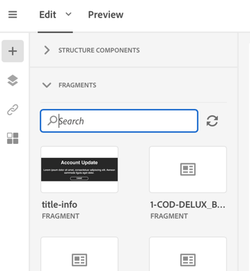

# Creazione e utilizzo di contenuti riutilizzabili {#using-reusable-content}

Scopri come gestire l’edizione del contenuto delle e-mail. Designer e-mail consente di creare modelli e frammenti con contenuti predefiniti personalizzati e di riutilizzarli per le seguenti consegne.

## Progettazione di e-mail utilizzando i modelli {#designing-templates}

>[!NOTE]
>
> In Adobe Campaign Standard, puoi creare diversi tipi di modelli accessibili dal menu **Risorse** &gt; **Modelli** . I modelli utilizzati in Designer e-mail sono modelli di contenuto. Per ulteriori informazioni, vedere [Informazioni sui modelli](../../start/using/about-templates.md).

### Modelli di contenuto {#content-templates}

È possibile gestire il contenuto HTML che verrà offerto nella **[!UICONTROL Templates]** scheda della home page di [Email Designer](../../designing/using/overview.md) . I diversi modelli presentano varie combinazioni di diversi tipi di elementi. Ad esempio, i modelli 'Feather' hanno margini, mentre i modelli 'Astro' non ne hanno uno. Per ulteriori informazioni, consulta Modelli [di](#content-templates)contenuto.

Per ulteriori informazioni su come creare un'e-mail da un modello predefinito, vedere Progettazione [e-](../../designing/using/quick-start.md#building-content-from-an-out-of-the-box-template)mail.

### Creating a content template {#creating-a-content-template}

Potete creare modelli di contenuto personalizzati da usare il maggior numero di volte necessario.

L’esempio seguente mostra come creare un modello di contenuto per e-mail.

1. Vai a **[!UICONTROL Resources]** &gt; **[!UICONTROL Content templates & fragments]** e fai clic su **[!UICONTROL Create]**.
1. Fare clic sull'etichetta e-mail per accedere alla **[!UICONTROL Properties]** scheda di Designer e-mail.
1. Specificate un'etichetta riconoscibile e selezionate i seguenti parametri per poter utilizzare questo modello nelle e-mail:

   * Selezionate **[!UICONTROL Shared]** o **[!UICONTROL Delivery]** dall'elenco a **[!UICONTROL Content type]** discesa.
   * Selezionate **[!UICONTROL Template]** dall’elenco a **[!UICONTROL HTML type]** discesa.
   

1. Se necessario, potete impostare un’immagine che verrà utilizzata come miniatura per il modello. Selezionatela dalla **[!UICONTROL Thumbnail]** scheda delle proprietà del modello.

   

   Questa miniatura verrà visualizzata nella **[!UICONTROL Templates]** scheda della home page di [Email Designer](../../designing/using/overview.md#about-the-email-designer) .

1. Chiudete la **[!UICONTROL Properties]** scheda per tornare all'area di lavoro principale.
1. Aggiungere componenti di struttura e contenuti personalizzabili in base alle esigenze.
   >[!NOTE]
   >
   > Non potete inserire campi di personalizzazione o contenuto condizionale all'interno di un modello di contenuto.
1. Dopo aver modificato il modello, salvatelo.

Questo modello può essere utilizzato in qualsiasi e-mail creata con Designer e-mail. Selezionatela dalla **[!UICONTROL Templates]** scheda della home page di [Email Designer](../../designing/using/overview.md#about-the-email-designer) .

### Salvataggio del contenuto come modello {#saving-content-as-template}

Quando modificate un'e-mail con Designer e-mail, potete salvare direttamente il contenuto di tale e-mail come modello.

<!--[!CAUTION]
>
>You cannot save as template a structure containing personalization fields or dynamic content.-->

1. Selezionare **[!UICONTROL Save as template]** dalla barra degli strumenti principale di Designer e-mail.

   

1. Aggiungi un'etichetta e una descrizione, se necessario, quindi fai clic su **[!UICONTROL Save]**.

   

1. Per trovare il modello appena creato, passate a **[!UICONTROL Resources]** &gt; **[!UICONTROL Content templates & fragments]**.

1. Per utilizzare il nuovo modello, selezionarlo dalla **[!UICONTROL Templates]** scheda della home page di [Email Designer](../../designing/using/overview.md#about-the-email-designer) .

   

### Creazione di un modello con frammenti e componenti {#template-fragments-components}

È ora possibile creare un modello e-mail con Designer e-mail. Utilizzate i componenti di contenuto per riflettere le diverse sezioni dell’e-mail e regolate le impostazioni in modo da avvicinarli il più possibile alla newsletter originale. Infine, inserire i frammenti appena creati.

1. Utilizzando e-mail Designer, create un modello. Per ulteriori informazioni, consulta Modelli [di](#content-templates)contenuto.
1. Inserite diversi componenti struttura nel modello, corrispondenti all’intestazione, al piè di pagina e al corpo dell’e-mail. Per ulteriori informazioni sull'aggiunta di componenti struttura, vedere [Modifica della struttura delle e-mail con Progettazione](../../designing/using/designing-from-scratch.md#defining-the-email-structure)e-mail.
1. Inserite tutti i componenti di contenuto necessari per creare il corpo della newsletter. Questo sarà il contenuto modificabile del messaggio e-mail che verrà aggiornato ogni mese.

   

   Se avete familiarità con il codice HTML, Adobe consiglia di utilizzare **[!UICONTROL Html]** i componenti per copiare e incollare gli elementi più complessi dell’e-mail originale. Utilizzate altri componenti come **[!UICONTROL Button]**, **[!UICONTROL Image]** o **[!UICONTROL Text]** per il resto del contenuto. Per ulteriori informazioni, consultate [Informazioni sui componenti](../../designing/using/designing-from-scratch.md#about-content-components)di contenuto.

   >[!NOTE]
   >
   >L’utilizzo del **[!UICONTROL Html]** componente consente di creare componenti modificabili con opzioni limitate. Prima di selezionare questo componente, accertatevi di sapere come gestire il codice HTML.

1. Regolate i componenti di contenuto in modo che corrispondano il più possibile all’e-mail originale.

   

   Per ulteriori informazioni sulla gestione delle impostazioni di stile e degli attributi in linea, consultate [Modifica degli stili](../../designing/using/styles.md)e-mail.

1. Inserire i due frammenti (intestazione e piè di pagina) precedentemente creati nei componenti struttura desiderati.

   

1. Salvate il modello.

Ora è possibile gestire completamente questo modello all'interno di Email Designer per creare e aggiornare la newsletter che si invierà ogni mese ai destinatari.

Per utilizzarlo, create un messaggio e-mail e selezionate il modello di contenuto appena creato.

**Argomento** correlato:

* [Creazione di un messaggio e-mail](../../channels/using/creating-an-email.md)
* [Video introduttivo su Email Designer](https://video.tv.adobe.com/v/22771/?autoplay=true&hidetitle=true&captions=ita)
* [Progettazione di un contenuto e-mail da zero](../../designing/using/designing-from-scratch.md#designing-an-email-content-from-scratch)

## Informazioni sui frammenti {#about-fragments}

 Un frammento è un componente riutilizzabile a cui è possibile fare riferimento in una o più e-mail.
Sono disponibili nell’interfaccia in **Risorse** &gt; Frammenti di **contenuto e modelli**.

Per utilizzare al meglio i frammenti in Designer e-mail:

* Creare frammenti personalizzati. Consultate [Creazione di un frammento](#creating-a-content-fragment) di contenuto e [Salvataggio del contenuto come frammento](#saving-content-as-a-fragment).
* Utilizzateli il numero di volte necessario nelle e-mail. Consultate [Inserimento di elementi in un messaggio e-mail](#inserting-elements-into-an-email).
* Quando si modifica un frammento, le modifiche vengono sincronizzate: vengono propagati automaticamente a tutte le e-mail (purché non siano ancora state preparate o inviate) contenenti tale frammento.

Se aggiunti a un messaggio e-mail, per impostazione predefinita i frammenti sono bloccati. Se si desidera modificare un frammento per un messaggio e-mail specifico, è possibile interrompere la sincronizzazione con il frammento originale sbloccandolo nel messaggio e-mail in cui è utilizzato. Le modifiche non verranno più sincronizzate.

Per sbloccare un frammento all’interno di un messaggio e-mail, selezionatelo e fate clic sull’icona Blocca nella barra degli strumenti contestuale.

Il frammento diventa un componente standalone che non è più collegato al frammento originale. Può quindi essere modificato come qualsiasi altro componente di contenuto. Consultate [I componenti](../../designing/using/designing-from-scratch.md#about-content-components)di contenuto.

### Inserimento di frammenti in un messaggio e-mail {#inserting-elements-into-an-email}

Per definire il contenuto del messaggio e-mail, potete aggiungere elementi di contenuto nei componenti struttura precedentemente inseriti. Consultate [Modifica della struttura](../../designing/using/designing-from-scratch.md#defining-the-email-structure)delle e-mail.

1. Per accedere agli elementi di contenuto, fate clic sull'icona **+** a sinistra. Selezionare [Frammenti](#about-fragments) o componenti contenuto.
1. Se si conosce già l'etichetta o parte dell'etichetta del frammento da aggiungere, è possibile cercarlo.

   

1. Trascinare un frammento o un componente di contenuto dalla palette a un componente struttura dell’e-mail.

   

   Una volta aggiunto un elemento al messaggio e-mail, può essere spostato all’interno del componente struttura o in un altro componente struttura del messaggio e-mail.

   

1. Modificate l'elemento in modo che corrisponda alle esigenze esatte di questo messaggio e-mail. Potete aggiungere testo, collegamenti, immagini e così via.

   >[!NOTE]
   >
   >I frammenti vengono bloccati per impostazione predefinita quando vengono aggiunti a un messaggio e-mail. È possibile interrompere la sincronizzazione con il frammento originale se si desidera modificare il frammento per un messaggio e-mail specifico o apportare le modifiche direttamente nel frammento. Vedere [Informazioni sui frammenti](#about-fragments).

1. Ripetete questa procedura per tutti gli elementi da aggiungere all’e-mail.
1. Salva l’e-mail.

Ora che la struttura delle e-mail è compilata, potete modificare lo stile di ogni elemento di contenuto. Consultate [Modifica di un elemento](../../designing/using/styles.md#editing-an-element).

>[!NOTE]
>
>Se un frammento viene modificato, le modifiche vengono propagate automaticamente nelle e-mail in cui è utilizzato. Per ulteriori informazioni, vedere [Informazioni sui frammenti](#about-fragments).

### Creazione di un frammento di contenuto {#creating-a-content-fragment}

È possibile creare frammenti di contenuto personalizzati da utilizzare in uno o più messaggi e-mail in base alle esigenze.

1. Vai a **[!UICONTROL Resources]** &gt; **[!UICONTROL Content templates & fragments]** e fai clic su **[!UICONTROL Create]**.
1. Fare clic sull'etichetta e-mail per accedere alla **[!UICONTROL Properties]** scheda di Designer e-mail.
1. Specificate un'etichetta riconoscibile e selezionate i seguenti parametri per individuare il frammento durante la modifica del contenuto dell'e-mail:

   * Poiché i frammenti sono compatibili solo con le e-mail, selezionare **[!UICONTROL Delivery]** dall'elenco a **[!UICONTROL Content type]** discesa.
   * Selezionare **[!UICONTROL Fragment]** dall'elenco a **[!UICONTROL HTML type]** discesa per utilizzare il contenuto come frammento.
   

1. Se necessario, è possibile impostare un'immagine che verrà utilizzata come miniatura per il frammento. Selezionatela dalla **[!UICONTROL Thumbnail]** scheda delle proprietà del modello.

   

   Questa miniatura verrà visualizzata accanto all’etichetta del frammento durante la modifica di un messaggio e-mail.

1. Chiudete la **[!UICONTROL Properties]** scheda per tornare all'area di lavoro principale.
1. Aggiungere componenti di struttura e contenuti personalizzabili in base alle esigenze.

   >[!CAUTION]
   >
   >I frammenti non possono includere campi di personalizzazione, contenuti dinamici o altri frammenti.
   >
   >Evitare di salvare come contenuto di frammento con componenti struttura vuoti. Una volta inserito il frammento &gt;non sarà più possibile modificarlo.
   >
   >La visualizzazione  mobile non è disponibile nei frammenti.

1. Una volta modificato, salvare il frammento.

Questo frammento può essere utilizzato in qualsiasi e-mail creata con Designer e-mail. Viene visualizzata sotto la **[!UICONTROL Fragments]** sezione della palette.

>[!NOTE]
>
>Non è possibile inserire campi di personalizzazione all'interno di un frammento a meno che non siano utilizzati in un messaggio e-mail e sbloccati. Vedere [Informazioni sui frammenti](#about-fragments).

### Salvataggio del contenuto come frammento {#saving-content-as-a-fragment}

Quando si modifica un'e-mail con Designer e-mail, è possibile salvare direttamente parte di tale e-mail come frammento.

* Non è possibile salvare come frammento una struttura contenente campi di personalizzazione, contenuti dinamici o un altro frammento.
* È possibile selezionare solo strutture adiacenti.
<!-- - You cannot select an empty structure.-->

1. Durante la modifica di un'e-mail in Designer e-mail, selezionare **[!UICONTROL Save as fragment]** dalla barra degli strumenti principale.

   

1. Nell'area di lavoro, selezionare le strutture che comporranno il frammento.

   

   >[!NOTE]
   >
   >Accertarsi di selezionare strutture adiacenti che non includano campi di personalizzazione, contenuti dinamici o altri frammenti.
   <!--You cannot select an empty structure.-->

1. Click **[!UICONTROL Create]**.

1. Aggiungi un'etichetta e una descrizione, se necessario, quindi fai clic su **[!UICONTROL Save]**.

   

1. Per trovare il frammento appena creato, passare a **[!UICONTROL Resources]** &gt; **[!UICONTROL Content templates & fragments]**.

   

1. Per utilizzare il nuovo frammento, aprire qualsiasi contenuto e-mail e selezionarlo dall’elenco dei frammenti.

>[!NOTE]
>La visualizzazione  mobile non è disponibile nei frammenti. Se desiderate modificare la visualizzazione di un'e-mail mobile, fatela prima di salvare il contenuto come un frammento.

<!--You need to copy-paste the HTML corresponding to the section that you want to save into a new fragment.

>[!NOTE]
>
>To do this, you need to be familiar with HTML code.

To save as a fragment some email content that you created, follow the steps below.

1. When editing an email in the Email Designer, select **[!UICONTROL Edit]** > **[!UICONTROL HTML]** to open the HTML version of that email.
1. Select and copy the HTML corresponding to the part that you want to save.
1. Go to **[!UICONTROL Resources]** > **[!UICONTROL Content templates & fragments]** and click **[!UICONTROL Create]**.
1. Click the email label to access the **[!UICONTROL Properties]** tab of the Email Designer and select **[!UICONTROL Fragment]** from the **[!UICONTROL HTML type]** drop-down list.
1. Select **[!UICONTROL Edit]** > **[!UICONTROL HTML]** to open the HTML version of the fragment.
1. Paste the HTML that you copied where appropriate.
1. Switch back to the **[!UICONTROL Edit]** view to check the result and save the new fragment.-->

## Creazione di intestazioni e piè di pagina riutilizzabili tramite frammenti {#header-footer-fragments}

Utilizzando e-mail Designer, creare un frammento per ciascuna sezione riutilizzabile. In questo esempio vengono creati due frammenti: uno per l’intestazione e uno per il piè di pagina. È quindi possibile copiare le parti pertinenti dal contenuto esistente in questi frammenti.

A questo scopo, effettuate le seguenti operazioni:

1. In Adobe Campaign, vai a **[!UICONTROL Resources]** &gt; **[!UICONTROL Content templates & fragments]** e crea un frammento per la tua intestazione. Per ulteriori informazioni, vedere [Creazione di un frammento](#creating-a-content-fragment)di contenuto.
1. Aggiungere al frammento tutti i componenti di struttura necessari.

1. Inserite componenti di immagine e testo nella struttura.

1. Caricate l'immagine corrispondente, inserite il testo e regolate le impostazioni.

1. Salvare il frammento.
1. Procedere in modo simile per creare il piè di pagina e salvarlo.

I frammenti sono ora pronti per essere utilizzati in un modello.
