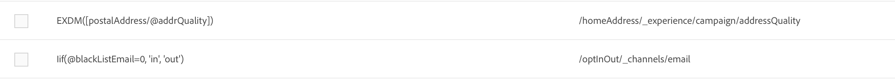

# Definizione mappature {#mapping-definition}

>[!IMPORTANT]
>
>Adobe Experience Platform Data Connector è attualmente in fase beta, che potrebbe essere soggetto a frequenti aggiornamenti senza preavviso. I clienti devono essere ospitati in Azure (attualmente nella versione beta solo per il Nord America) per accedere a tali funzionalità. Per accedere, contatta  Assistenza clienti di Adobe.

In questa sezione scoprirai come mappare un campo Campaign Standard con un campo Experience Data Model (XDM).

Per eseguire questa attività, i prerequisiti sono:

* una definizione dello schema XDM tramite l&#39;interfaccia o utilizzando l&#39;API REST associata a XDM
* creazione di set di dati in base alla definizione dello schema XDM

1. Andate a **[!UICONTROL Administration]** > **[!UICONTROL Development]** > **[!UICONTROL Platform]** e scegliete la voce **[!UICONTROL Data mappings]**.

1. Fare clic su **[!UICONTROL Create]** per avviare una nuova mappatura XDM.

   

1. Completa i campi obbligatori e seleziona:

   * una **dimensione di targeting**: schema Campaign Standard da mappare
   * a **dataset**: si tratta del pacchetto di dati associato a uno schema XDM in Adobe Experience Platform.

>[!NOTE]
>
>Affinché un batch venga assimilato in Real-time Customer Profile o Identity Service, il set di dati deve essere [abilitato per Real-time Customer Profile](https://docs.adobe.com/content/help/en/experience-platform/rtcdp/intro/get-started.html).
>
>Se il set di dati selezionato è già utilizzato in una mappatura dati esistente, viene visualizzato un avviso per informare l&#39;utente che i dati potrebbero essere sovrascritti in Adobe Experience Platform. Ciò può accadere quando alcuni destinatari comuni nelle mappature dati utilizzano lo stesso set di dati.

Nella schermata seguente viene visualizzata la sezione **[!UICONTROL Field mappings]** in cui è possibile creare una nuova mappatura per ciascun campo nello schema dei Campaign Standard.

Il pulsante **[!UICONTROL Create new field mapping]** consente di selezionare il campo Campaign Standard e l&#39;espressione del percorso del campo corrispondente nello schema XDM.

Se non è possibile trovare un campo Adobe Campaign Standard , è possibile utilizzare il campo di ricerca per cercare il campo. Attualmente, la ricerca funziona solo per i campi aperti nella gerarchia.

Le risorse estese definite in Campaign Standard sono mappate come tutti i campi nativi. Sono definiti nell&#39;estensione _customer/default in XDM.

Potete personalizzare l&#39;estensione XDM tramite l&#39;API e definire la vostra estensione per un migliore controllo sulla mappatura.

Per ulteriori informazioni sull&#39;API XDM, vedere [Esercitazione sulle API del Registro di sistema dello schema](https://docs.adobe.com/content/help/it-IT/experience-platform/xdm/api/getting-started.html).

Per mappare un campo di enumerazione, è necessario utilizzare l&#39;editor di espressioni per definire ogni valore di enumerazione corrispondente al valore XDM. Ad esempio, postalAdressfield deve essere definito come:

Se il valore XDM è definito come enumerazione nello schema XDM, è possibile utilizzare la funzione EXDM nativa che sostituirà automaticamente la sintassi **lif**.

Per modificare una mappatura XDM, apritela, modificate le informazioni desiderate e salvatela.

>[!IMPORTANT]
>
>Per il momento, se si modifica un valore nella sezione **[!UICONTROL Field mappings]** e si fa clic all&#39;esterno del campo, la modifica non viene visualizzata nell&#39;interfaccia finché non si fa clic sul pulsante **[!UICONTROL Save]**. Questo comportamento si verifica solo una volta, quando la modifica su **[!UICONTROL Field Mappings]** è la prima modifica sulla pagina.
