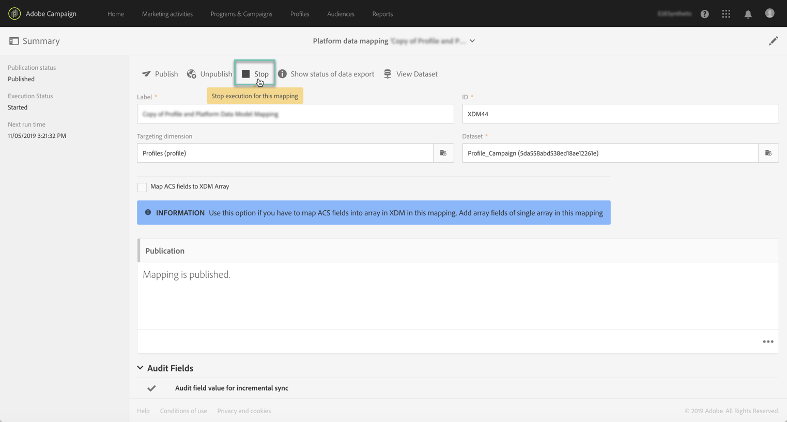

# Attivazione dell’assimilazione dei dati tramite API {#triggering-data-ingestion-apis}

>[!IMPORTANT]
>
>Adobe Experience Platform Data Connector è attualmente in versione beta, che potrebbe essere soggetta a frequenti aggiornamenti senza preavviso. I clienti devono essere ospitati in Azure (attualmente nella versione beta solo per il Nord America) per accedere a tali funzionalità. Per accedere, contatta l&#39;Assistenza clienti Adobe.

Adobe Campaign Standard consente di attivare l’assimilazione immediata delle mappature dati tramite API e di recuperare lo stato delle richieste di assimilazione.

Questa pagina descrive come attivare e recuperare lo stato di inserimento delle mappature dati. Per informazioni globali sulle API Campaign Standard, consulta [questa sezione](../../api/using/get-started-apis.md).

## Prerequisiti {#prerequisites}

Prima di utilizzare le API, la mappatura dei dati deve essere stata configurata e pubblicata all&#39;interno dell&#39;interfaccia di Campaign Standard. Per ulteriori informazioni, consulta le sezioni seguenti:

* [Definizione mappature](../../developing/using/aep-mapping-definition.md)
* [Attivazione mappature](../../developing/using/aep-mapping-activation.md)

Una volta creata la mappatura dei dati, devi impedirne l&#39;esecuzione in modo da poterla attivare dalle API ogni volta che vuoi. A questo scopo, effettuate le seguenti operazioni:

1. In Campaign Standard, andate al **[!UICONTROL Administration]** > **[!UICONTROL Development]** > **[!UICONTROL Platform]** > **[!UICONTROL Status of data export to platform]** menu.

1. Fare doppio clic sulla mappatura dati per aprirla, quindi fare clic sul **[!UICONTROL Stop]** pulsante.

   

1. Salvare le modifiche

L&#39;esecuzione del mapping dei dati ora è interrotta. Puoi utilizzare le API Campaign Standard per attivarle manualmente.

## Avvio dell&#39;assimilazione immediata della mappatura dei dati {#starting-immediate-ingestion}

L&#39;assimilazione immediata di una mappatura XDM in Adobe Experience Platform viene attivata con un&#39;operazione POST:

`POST https://mc.adobe.io/<ORGANIZATION>/campaign/dataIngestion/xdmIngestion/<XDM Mapping ID>/ingest`

>[!NOTE]
>
>Per eseguire la chiamata API POST di acquisizione, l&#39;utente deve avere un ruolo di esecuzione **della funzione** SQL, che può essere fornito da un amministratore di Campaign Standard eseguendo sotto lo script JS:
>
>`var sqlRoleObj = REST.head.roleBase.sql.get();
REST.head.securityGroup.Administrators.roles.post(sqlRoleObj);`

L&#39;operazione POST restituisce informazioni sullo stato della richiesta creata:

* Richiesta inviata correttamente per il mapping XDM:

```
{
"requestId": <value>,
"info": "Ingestion request submitted successfully for the Mapping ID: <value>",
"status":"Success"
}
```

* Richiesta già in corso per il mapping XDM:

```
{
"requestId": <value>,
"info": "Ingestion request already in progress for the Mapping ID: <value>",
"status":"In Progress"
}
```

* Richiesta non riuscita perché il mapping XDM non è pubblicato o è arrestato:

```
{
"info": "Unable to submit data ingestion request, XDM Mapping ID: <value> is not stopped",
"status": "Failed"
}
{
"info": "Unable to submit data ingestion request, XDM Mapping ID: <value> is not published",
"status": "Failed"
}
```

## Recupero dello stato di una richiesta di assimilazione {#retrieving-status}

Lo stato di una richiesta di assimilazione può essere recuperato con un&#39;operazione GET e l&#39;ID richiesta desiderato nei parametri:

```
GET https://mc.adobe.io/<ORGANIZATION>/campaign/dataIngestion/xdmIngestion/<XDM Mapping ID>/ingest
{"requestId"="<value>"}
```

>[!NOTE]
Informazioni dettagliate sullo stato della richiesta di mappatura XDM e i processi correlati sono disponibili nell&#39;interfaccia di Campaign Standard, nel menu **!UICONTROL [Stato dell&#39;esportazione dei dati nella piattaforma ]**(consultate Attivazione[](../../developing/using/aep-mapping-activation.md)mappatura).

L&#39;operazione GET restituisce le informazioni seguenti:

* **batchId**: questo campo viene popolato solo se si è verificato un errore dopo la preparazione e il caricamento del batch,
* **info**: l’ID mappatura XDM,
* **numRecords**: il numero di record che sono stati acquisiti (solo stato di successo),
* **status**: stato della richiesta di caricamento (success/fail/progress)

Le possibili risposte all&#39;operazione GET sono:

* Richiesta di assimilazione completata:

   ```
   {
   "batchId": "",
   "info": "Mapping Id: <value>. ",
   "numRecords": 15,
   "requestId": 3520,
   "status": "Success"
   }
   ```

* Richiesta di acquisizione non riuscita con l&#39;acquisizione di 0 record:

   ```
   {
   "batchId": "",
   "info": "Mapping Id: <value>. ACP-880056 Failed to fetch the record from the database.",
   "numRecords": 0,
   "requestId": 3520,
   "status": "Failed"
   }
   ```

* Richiesta di acquisizione non riuscita, con alcuni record caricati in un batch:

   ```
   {
   "batchId": "<value>",
   "info": "Mapping Id: <value>. ACP-880096 Sync Job failed to upload. Please check the error in the Platform UI.",
   "numRecords": 0,
   "requestId": <value>,
   "status": "Failed"
   }
   ```

* Richiesta di acquisizione interrotta dopo l’acquisizione di alcuni record (potrebbe verificarsi in scenari di arresto anomalo):

   ```
   {
   "batchId": "",
   "info": "Mapping Id: <value>. Ingestion request aborted due to some issue with data ingestion service. Please submit a new request",
   "numRecords": 0,
   "requestId": <value>,
   "status": "Aborted"
   }
   ```

* Richiesta di assimilazione in corso (quando la richiesta caricava i dati in un batch o quando il batch viene preparato per la richiesta):

   ```
   {
   "batchId": "",
   "info": "Mapping Id: <value>.",
   "numRecords": 0,
   "requestId": <value>,
   "status": "In Progress"
   }
   ```
