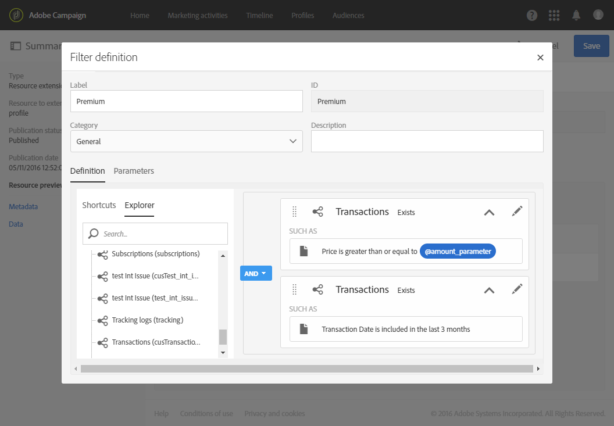

# Configuring filter definition{#configuring-filter-definition}

In the **[!UICONTROL Filter definition]** tab, you can create advanced filters that users can directly access when creating complex queries, such as when defining an audience.

Questo passaggio non è obbligatorio in quanto sarà ancora in grado di compilare la risorsa e di accedere ai dati tramite flussi di lavoro, audience e REST API.

Questi filtri vengono utilizzati nell'editor query sotto forma di regole pre-configurate. Consentono di limitare il numero di passaggi necessari per ottenere la configurazione desiderata, che può essere particolarmente utile per le segmentazioni ripetitive.

Ad esempio, potete creare un filtro che consente di selezionare tutte le transazioni più grandi di una certa quantità negli ultimi tre mesi.

To do this, you need to extend the **[!UICONTROL Profiles]** resource and define a filter linking to a transaction table (that you have previously created) with a rule indicating that the transaction price must be greater than or equal to a given parameter and that the transaction date must fall within a range corresponding to the last three months.

1. Assicurati di creare e pubblicare una tabella delle transazioni. See [Creating or extending the resource](../../developing/using/creating-or-extending-the-resource.md).

   >[!NOTE]
   >
   >Questa procedura utilizza l'esempio di una tabella delle transazioni personalizzata. Per la vostra pratica, regolatela in base alle vostre esigenze aziendali.

1. Before defining a filter related to the transaction table in the **[!UICONTROL Profiles]** resource, make sure you define the link to this table and publish your changes. See [Defining links with other resources](../../developing/using/configuring-the-resource-s-data-structure.md#defining-links-with-other-resources) and [Updating the database structure](../../developing/using/updating-the-database-structure.md).
1. In the **[!UICONTROL Definition]** tab of your new filter's definition screen, select the transaction table.

   

1. In the **[!UICONTROL Add a rule - Profiles/Transactions]** window, drag and drop the transaction table into the workspace. Nella finestra successiva visualizzata, selezionate il campo da utilizzare.

   

1. In the **[!UICONTROL Optional parameter settings]** of the **[!UICONTROL Add a rule - Transactions]** window, check the **[!UICONTROL Switch to parameters]** box.

   In the **[!UICONTROL Filter conditions]**, select the **[!UICONTROL Greater than or equal to]** operator. In the **[!UICONTROL Parameters]** field, enter a name and click the plus sign to create the new parameter.

   

1. Confermate le modifiche. Questa definizione corrisponde a un campo configurabile che l'utente deve compilare successivamente per eseguire la query.

   

1. Combinate questa regola con un'altra regola che specifica che la data della transazione deve rientrare in un intervallo corrispondente agli ultimi tre mesi.

   

1. Scegliete la categoria in cui verrà visualizzato il filtro.

   

1. In the **[!UICONTROL Parameters]** tab of the filter definition screen, modify the description and the label to clearly indicate the subject of your filter to the users. Queste informazioni vengono visualizzate nell'editor query.

   

   Se definite più campi configurabili, potete modificare l'ordine in cui compaiono nell'interfaccia.

1. Salvate le modifiche e pubblicate le risorse. For more on this, refer to the [Updating the database structure](../../developing/using/updating-the-database-structure.md) section.

Once the **[!UICONTROL Profiles]** resource extension is published, the users will see this filter under the shortcuts tab in the [query editor](../../automating/using/editing-queries.md) interface.

Questo consentirà all'utente di definire facilmente il pubblico quando si crea un messaggio e-mail da inviare a tutti i client che hanno speso più di una certa quantità negli ultimi tre mesi.

Anziché configurare autonomamente il modulo, è sufficiente immettere l'importo desiderato nella finestra di dialogo visualizzata.

