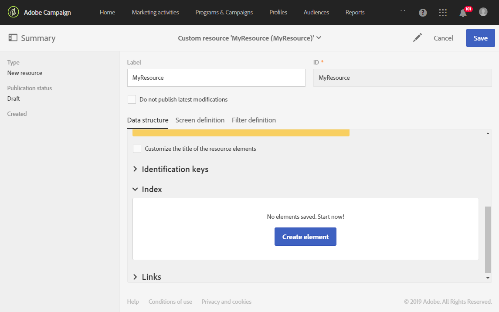
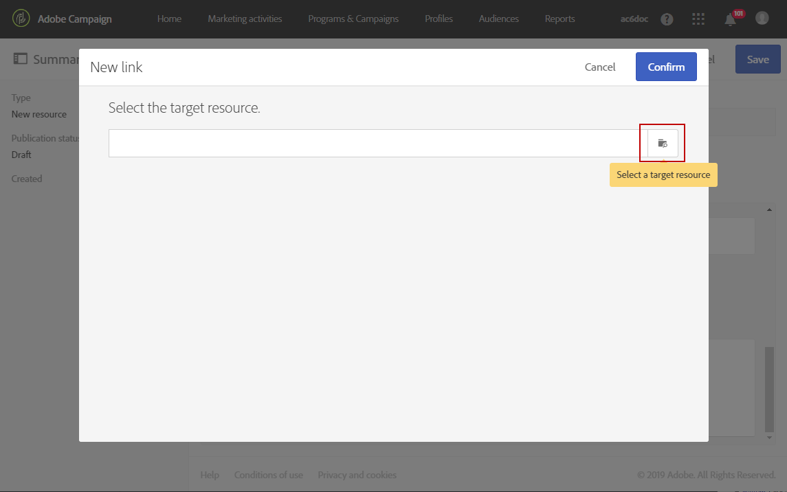
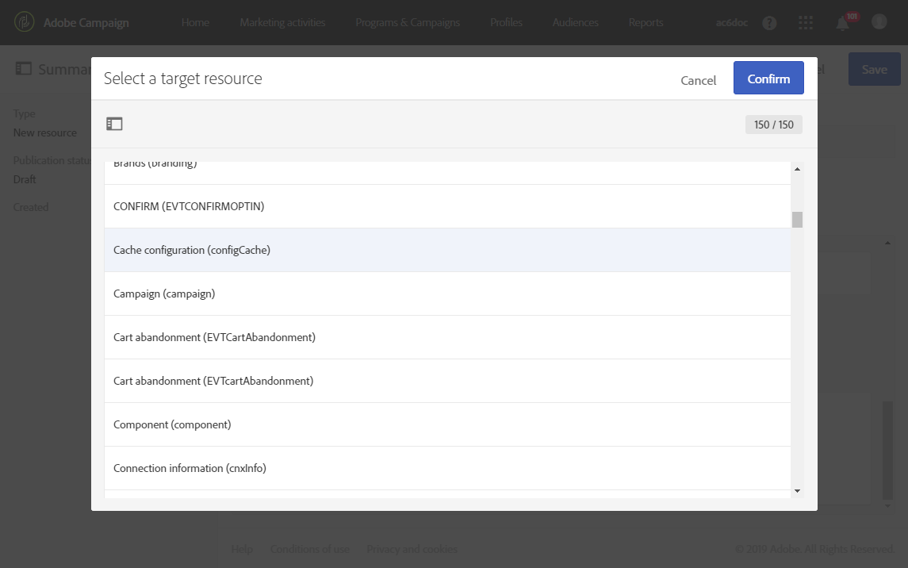
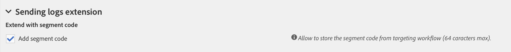
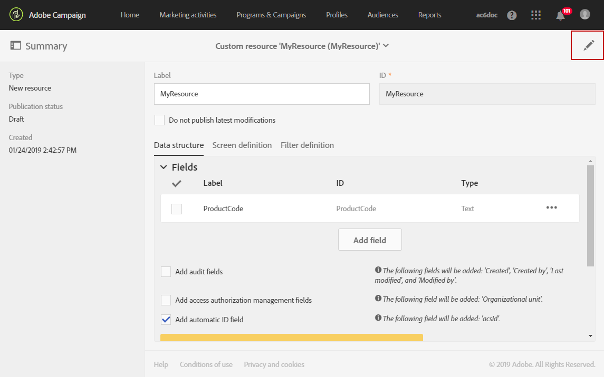
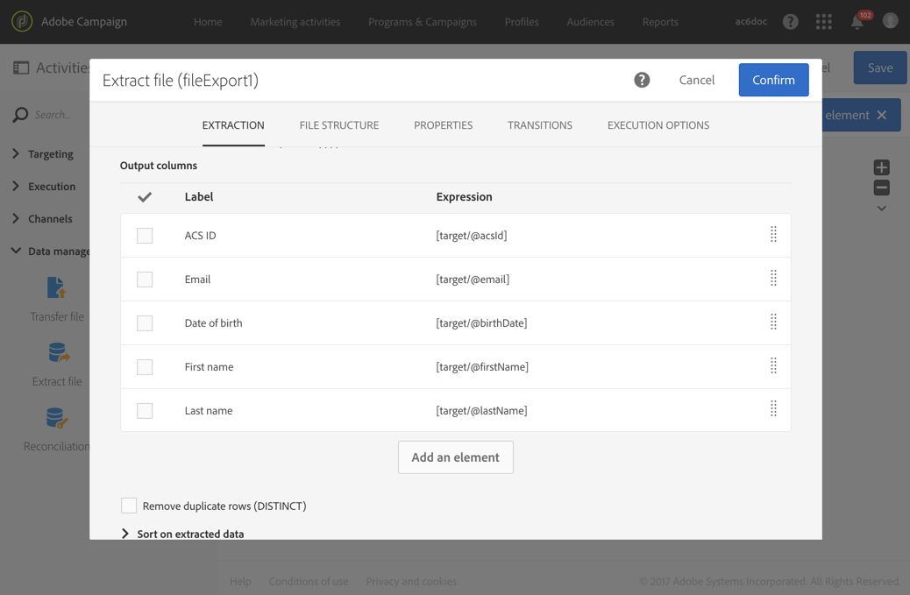

# Configurazione della struttura dati della risorsa{#configuring-the-resource-s-data-structure}

Dopo aver creato una nuova risorsa personalizzata, devi configurare la struttura dati.

Quando modifichi la risorsa, nella scheda **[!UICONTROL Data structure]** puoi aggiungere:

* [Campi](#adding-fields-to-a-resource)
* [Chiavi di identificazione](#defining-identification-keys)
* [Indici](#defining-indexes)
* [Collegamenti](#defining-links-with-other-resources)
* [Registri di invio](#defining-sending-logs-extension)

## Aggiunta di campi a una risorsa {#adding-fields-to-a-resource}

Puoi aggiungere nuovi campi a una risorsa per memorizzare dati che non fanno parte del modello dati preconfigurato.

1. Utilizza il pulsante **[!UICONTROL Create element]** per creare un campo.
1. Specifica un’etichetta, un ID, un tipo di campo e definisci la lunghezza massima consentita per questo campo.

   Il campo **[!UICONTROL ID]** è obbligatorio e deve essere univoco per ciascun campo aggiunto.

   >[!NOTE]
   >
   >Utilizza un massimo di 30 caratteri.

   

1. Per modificare uno dei campi, seleziona il pulsante **[!UICONTROL Edit Properties]**.

   

1. Nella schermata **[!UICONTROL Field definition]**, puoi definire una categoria che verrà utilizzata per il tipo di pubblico e il targeting o anche aggiungere una descrizione.

   

1. Se devi definire i valori che verranno offerti all’utente (valori di enumerazione), seleziona l’opzione **[!UICONTROL Specify a list of authorized values]**.

   Quindi, fai clic su **[!UICONTROL Create element]** e specifica un’**[!UICONTROL Label]** e un **[!UICONTROL Value]**. Aggiungi tutti i valori necessari.

1. Dopo aver aggiunto i campi, seleziona la casella **[!UICONTROL Add audit fields]** per includere campi che definiscono la data di creazione, l’utente che ha creato la risorsa, la data e l’autore dell’ultima modifica.
1. Seleziona la casella **[!UICONTROL Add access authorization management fields]** per includere i campi in cui sono indicati gli utenti con diritti di accesso a tale risorsa.

   Questi campi sono visualizzati nei dati e nei metadati che possono essere visualizzati una volta eseguito l’aggiornamento del database. Per ulteriori informazioni, consulta la sezione [Aggiornamento della struttura del database](../../developing/using/updating-the-database-structure.md).

1. Seleziona il campo **[!UICONTROL Add automatic ID]** per generare automaticamente un ID. Tieni presente che le entità esistenti rimarranno vuote. Per ulteriori informazioni, consulta [Generazione di un ID univoco per profili e risorse personalizzate](../../developing/using/configuring-the-resource-s-data-structure.md#generating-a-unique-id-for-profiles-and-custom-resources).
1. Per modificare il modo in cui il nome degli elementi della risorsa verrà visualizzato negli elenchi e nei passaggi della creazione, seleziona la casella **[!UICONTROL Customize the title of the resource elements]**. Seleziona un campo tra quelli creati per questa risorsa.

   

   >[!NOTE]
   >
   >Se non selezioni questa opzione, la chiave primaria automatica (che viene creata automaticamente ogni volta che un’entità viene aggiunta alla tabella) verrà utilizzata quando elenchi tutte le entità di questa tabella.

I campi della risorsa sono ora definiti.

## Definizione delle chiavi di identificazione {#defining-identification-keys}

Ciascuna risorsa deve avere almeno una chiave univoca. Ad esempio, puoi specificare una chiave in modo tale che due prodotti non possano avere lo stesso ID in una tabella di acquisto.

1. Se desideri che una chiave tecnica sia generata in modo automatico e incrementale, specifica le dimensioni per lo spazio di archiviazione nella sezione **[!UICONTROL Automatic primary key]**.

   

1. Utilizza il pulsante **[!UICONTROL Create element]** per creare una chiave.

   I campi **[!UICONTROL Label]** e **[!UICONTROL ID]** sono completati per impostazione predefinita, ma puoi modificarli.

   >[!NOTE]
   >
   >Utilizza un massimo di 30 caratteri.

1. Per definire gli elementi che compongono la chiave, fai clic su **[!UICONTROL Create element]** e seleziona i campi creati per questa risorsa.

   

   Le chiavi create sono visualizzate nella sezione **[!UICONTROL Custom keys]**.

Vengono ora create le chiavi di identificazione per la risorsa.

>[!NOTE]
>
>Per informazioni sulle best practice per la creazione delle chiavi di identificazione, consulta questa [sezione](../../developing/using/data-model-best-practices.md#keys).

## Definizione degli indici {#defining-indexes}

Un indice può fare riferimento a uno o più campi di risorse. Gli indici consentono al database di ordinare i record in modo da poterli recuperare più facilmente. Essi ottimizzano le prestazioni delle query SQL.

La definizione degli indici è consigliata ma non obbligatoria.

1. Utilizza il pulsante **[!UICONTROL Create element]** per creare un indice.

   

1. I campi **[!UICONTROL Label]** e **[!UICONTROL ID]** sono completati per impostazione predefinita, ma puoi modificarli.

   >[!NOTE]
   >
   >Utilizza un massimo di 30 caratteri.

1. Per definire gli elementi che compongono questo indice, seleziona i campi tra quelli creati per questa risorsa.

   

1. Fai clic su **[!UICONTROL Confirm]**.

Gli indici creati vengono visualizzati nell’elenco nella sezione **[!UICONTROL Index]**.

>[!NOTE]
>
>Per informazioni sulle best practice per la creazione degli indici, consulta questa [sezione](../../developing/using/data-model-best-practices.md#indexes).

## Definizione di collegamenti con altre risorse {#defining-links-with-other-resources}

Un collegamento descrive l’associazione di una tabella con altre tabelle.

1. Utilizza il pulsante **[!UICONTROL Create element]** per creare un collegamento a una risorsa di destinazione.
1. Fai clic su **[!UICONTROL Select a target resource]**.

   

1. Le risorse sono visualizzate in ordine alfabetico e possono essere filtrate per nome. Il nome tecnico viene visualizzato tra parentesi.

   Seleziona un elemento dall’elenco e fai clic su **[!UICONTROL Confirm]**.

   

1. Seleziona il **[!UICONTROL Link type]** in base alla cardinalità. A seconda del tipo di cardinalità selezionato, il comportamento può variare se i record vengono eliminati o duplicati.

   I vari tipi di collegamento sono i seguenti:

   * **[!UICONTROL 1 cardinality simple link]**: una occorrenza della tabella sorgente può avere al massimo una occorrenza corrispondente della tabella di destinazione.
   * **[!UICONTROL N cardinality collection link]**: una occorrenza della tabella sorgente può avere diverse occorrenze corrispondenti della tabella di destinazione, ma una occorrenza della tabella di destinazione può avere al massimo una occorrenza corrispondente della tabella sorgente.
   * **[!UICONTROL 0 or 1 cardinality simple link]**: una occorrenza della tabella sorgente può avere al massimo una occorrenza corrispondente della tabella di destinazione o nessuna. Tieni presente che questo **[!UICONTROL Link type]** può provocare problemi di prestazioni.

   

1. Nella schermata **[!UICONTROL New link]**, i campi **[!UICONTROL Label]** e **[!UICONTROL ID]** sono completati per impostazione predefinita, ma puoi modificarli.

   >[!NOTE]
   >
   >Utilizza un massimo di 30 caratteri.
   >
   >Non è possibile rinominare un collegamento dopo la creazione. Per rinominare un collegamento, devi eliminarlo e crearlo di nuovo.

1. L’elenco **[!UICONTROL Category for the audience and targeting]** ti consente di assegnare il collegamento a una categoria per renderlo più visibile nello strumento editor delle query.
1. Se necessario, la sezione **[!UICONTROL Reverse link definition]** ti consente di visualizzare l’etichetta e l’ID della risorsa nella risorsa di destinazione.
1. Definisci il comportamento dei record a cui fa riferimento il collegamento nella sezione **[!UICONTROL Behavior if deleted/duplicated]**.

   Per impostazione predefinita, il record di destinazione viene eliminato una volta che il collegamento non vi fa più riferimento.

   

1. Nella sezione **[!UICONTROL Join definition]** è selezionata l’opzione predefinita **[!UICONTROL Use the primary keys to make the join]**, ma puoi scegliere tra due opzioni:

   * **[!UICONTROL Use the primary key to make the join]**: questa definizione di unione ti consente di utilizzare la chiave primaria dei profili per effettuare la riconciliazione con la chiave primaria degli acquisti.
   * **[!UICONTROL Define specific join conditions]**: questa definizione di unione ti consente di selezionare manualmente i campi che verranno uniti a entrambe le risorse. Tieni presente che se i dati non sono configurati correttamente, il record **Acquisto** non sarà visibile.

   

I collegamenti creati vengono visualizzati nell’elenco della sezione **[!UICONTROL Links]**.

>[!NOTE]
>
>Per informazioni sulle best practice per la creazione degli indici, consulta questa [sezione](../../developing/using/data-model-best-practices.md#links).

**Esempio: collegare una risorsa creata con la risorsa “Profili”**

In questo esempio, vogliamo collegare una nuova risorsa **Acquisto** con la risorsa personalizzata **Profili**:

1. Crea la nuova risorsa **Acquisto**.
1. Per collegarla alla risorsa personalizzata **Profiles**, apri la sezione **[!UICONTROL Links]** nella scheda **[!UICONTROL Data structure]** e fai clic su **[!UICONTROL Create element]**.
1. Seleziona la risorsa di destinazione qui **[!UICONTROL Profiles (profile)]**.
1. In questo esempio, mantieni selezionato il tipo di collegamento **[!UICONTROL 1 cardinality simple link]** predefinito.

   

1. Scegli una definizione di unione, mantenendo il valore predefinito **[!UICONTROL Use the primary key to make the join]**.

   

1. Se necessario, puoi definire una schermata di dettaglio per poter modificare **Acquisto** e collegarla a un profilo.

   Apri la sezione **[!UICONTROL Detail screen configuration]** e seleziona **[!UICONTROL Define a detail screen]** per configurare la schermata corrispondente a ciascun elemento della risorsa. Se non selezioni questa casella, la visualizzazione dei dettagli degli elementi di questa risorsa non sarà accessibile.

1. Fai clic su **[!UICONTROL Create element]**.
1. Seleziona la risorsa collegata e fai clic su **[!UICONTROL Add]**.

   La nuova risorsa sarà quindi disponibile nel menu avanzato selezionando **[!UICONTROL Client data]** > **[!UICONTROL Purchase]**.

   

1. Al termine della configurazione, fai clic su **[!UICONTROL Confirm]**.

   Ora puoi pubblicare la nuova risorsa.

Aggiungendo questo collegamento, una scheda **Purchase** viene aggiunta alla schermata di dettaglio dei profili dal menu **[!UICONTROL Profiles & audiences]** > **[!UICONTROL Profiles]**. Tieni presente che ciò è specifico per la risorsa **[!UICONTROL Profile]**.

## Definizione dell’estensione dei registri di invio {#defining-sending-logs-extension}

L’estensione del registro di invio ti consente di:

* estendere le funzionalità dei report dinamici mediante l’**aggiunta di campi personalizzati del profilo**
* estendere i dati dei registri di invio con **codice di segmento e dati di profilo**

**Estendere con un codice di segmento**

L’utente può estendere i registri con il codice di segmento proveniente dal motore del flusso di lavoro.

Il codice di segmento deve essere definito nel flusso di lavoro.

Per attivare questa estensione, seleziona l’opzione **[!UICONTROL Add segment code]**.

Per ulteriori informazioni sul codice di segmento, consulta la sezione [Segmentazione](../../automating/using/segmentation.md).

**Estendere con un campo del profilo**

>[!NOTE]
>
>L’amministratore avrebbe dovuto estendere la risorsa Profilo con un campo personalizzato.

Fai clic su **[!UICONTROL Add field]** e seleziona un campo personalizzato dalla risorsa del profilo.

Per generare una nuova dimensione secondaria collegata alla dimensione Profilo, seleziona l’opzione **[!UICONTROL Add this field in Dynamic reporting as a new dimension]**.

Da Reporting dinamico, puoi trascinare e rilasciare la dimensione del campo personalizzato in una tabella a forma libera.

Per ulteriori informazioni sul Reporting dinamico, consulta l’[Elenco dei componenti](../../reporting/using/list-of-components-.md).

>[!IMPORTANT]
>
>Il numero di campi inviati a Reporting dinamico è limitato a 20.

## Modifica delle proprietà di una risorsa {#editing-resource-properties}

Nella schermata delle risorse personalizzate, il riquadro **[!UICONTROL Summary]** indica lo stato della risorsa appena creata. Puoi gestirne l’accesso e le proprietà generali.

1. Fai clic sul pulsante **[!UICONTROL Edit properties]** per aggiungere una descrizione.

   

1. Se necessario, modifica l’etichetta e l’ID della risorsa.

   >[!NOTE]
   >
   >Utilizza un massimo di 30 caratteri.

1. Se devi limitare l’accesso a questa risorsa a determinate unità organizzative, specificale qui. Solo gli utenti di unità autorizzate potranno lavorare con questa risorsa nell’applicazione.
1. Salva le modifiche.

Le modifiche vengono salvate. Per applicarle, devi pubblicare di nuovo la risorsa.

## Generazione di un ID univoco per profili e risorse personalizzate {#generating-a-unique-id-for-profiles-and-custom-resources}

Per impostazione predefinita, i profili e le risorse personalizzate non dispongono di un ID aziendale al momento della creazione. Puoi abilitare un’opzione che genera automaticamente un ID univoco al momento della creazione degli elementi. Questo ID può essere utilizzato per:

* Identificare facilmente i record esportati in uno strumento esterno.
* Riconciliare i record durante l’importazione di dati aggiornati elaborati in un’altra applicazione.

Può essere abilitato solo per profili e risorse personalizzate.

1. Creare un’estensione alla risorsa dei profili o creare una nuova risorsa.
1. Nella definizione della struttura dati, seleziona l’opzione **[!UICONTROL Add automatic ID field]**, nella sezione **[!UICONTROL Fields]**.

   

   >[!NOTE]
   >
   >Solo i nuovi record avranno un ID ACS. Il campo **[!UICONTROL ACS ID]** rimarrà vuoto per i profili o gli elementi creati prima dell’attivazione di questa opzione.

1. Salva e pubblica le modifiche apportate alla risorsa. Se desideri che questo meccanismo venga applicato agli elementi creati tramite l’API, seleziona l’opzione per estendere l’API.

Il campo **[!UICONTROL ACS ID]** è ora disponibile e compilato automaticamente quando nuovi elementi vengono creati manualmente, dall’API o inseriti da un flusso di lavoro di importazione. Il campo ID ACS è un campo UUID ed è indicizzato.

Durante l’esportazione di profili o risorse personalizzate, puoi ora aggiungere la colonna **[!UICONTROL ACS ID]** se è stata abilitata per tale risorsa. Puoi riutilizzare questo ID nei tuoi strumenti esterni per identificare i record.

Durante la reimportazione di dati elaborati/aggiornati in un’altra applicazione (ad esempio un sistema di gestione delle relazioni con i clienti), puoi facilmente riconciliarli con questo ID univoco.

>[!NOTE]
>
>Il campo **[!UICONTROL ACS ID]** non viene aggiornato per i profili o gli elementi creati prima dell’abilitazione dell’opzione. Solo i nuovi record avranno un ID ACS.
>
>Questo campo è in modalità di sola lettura. Non puoi modificarlo.
