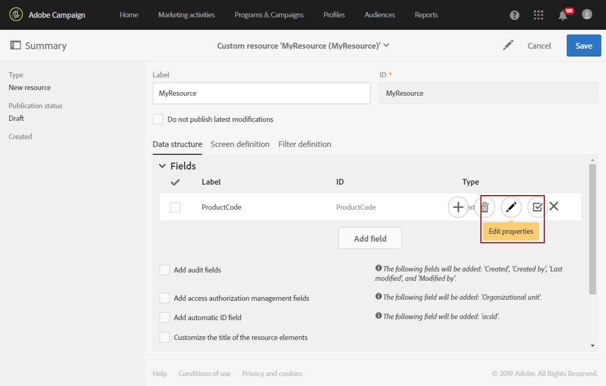
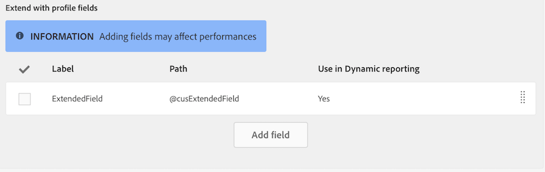

# Configurazione della struttura dati della risorsa{#configuring-the-resource-s-data-structure}

Dopo aver creato una nuova risorsa personalizzata, è necessario configurare la struttura dati.

Quando si modifica la risorsa, nella **[!UICONTROL Data structure]** scheda è possibile aggiungere:

* [Campi](../../developing/using/configuring-the-resource-s-data-structure.md#adding-fields-to-a-resource)
* [Tasti di identificazione](../../developing/using/configuring-the-resource-s-data-structure.md#defining-identification-keys)
* [Indici](../../developing/using/configuring-the-resource-s-data-structure.md#defining-indexes)
* [Collegamenti](../../developing/using/configuring-the-resource-s-data-structure.md#defining-links-with-other-resources)
* [Invio di registri](../../developing/using/configuring-the-resource-s-data-structure.md#defining-sending-logs-extension)

## Aggiunta di campi a una risorsa {#adding-fields-to-a-resource}

È possibile aggiungere nuovi campi a una risorsa per memorizzare dati che non fanno parte del modello dati della casella.

1. Utilizzare **[!UICONTROL Create element]** il pulsante per creare un campo.
1. Specificate un'etichetta, un ID, un tipo di campo e definite la lunghezza massima consentita per questo campo.

   **[!UICONTROL ID]** Il campo è obbligatorio e deve essere univoco per ogni campo aggiunto.

   >[!NOTE]
   >
   >Se lasciate vuoto **[!UICONTROL Label]** il campo, questo verrà automaticamente completato dall'ID.
   >È consigliabile utilizzare il massimo di 30 caratteri.

   

1. Per modificare uno dei campi, controllare il **[!UICONTROL Edit Properties]** pulsante.

   

1. Nella **[!UICONTROL Field definition]** schermata, puoi definire una categoria che verrà utilizzata per l'audience e il targeting o anche aggiungere una descrizione.

   

1. Controllare **[!UICONTROL Specify a list of authorized values]** l'opzione se è necessario definire i valori che verranno offerti all'utente (valori di enumerazione).

   Quindi, fate clic **[!UICONTROL Create element]** su e specificate un e **[!UICONTROL Label]****[!UICONTROL Value]**. Aggiungere tutti i valori necessari.

1. Dopo aver aggiunto i campi, controllate la **[!UICONTROL Add audit fields]** casella per includere i campi che contengono la data di creazione, l'utente che ha creato la risorsa, la data e l'autore dell'ultima modifica.
1. Selezionate **[!UICONTROL Add access authorization management fields]** la casella per includere i campi che contengono i diritti di accesso a quella particolare risorsa.

   Questi campi vengono visualizzati nei dati e nei metadati che possono essere visualizzati una volta che l'aggiornamento del database è stato eseguito. Per ulteriori informazioni, consultate [la sezione Aggiornamento della struttura del](../../developing/using/updating-the-database-structure.md) database.

1. Selezionate **[!UICONTROL Add automatic ID]** il campo per generare automaticamente un ID. Tenete presente che le entità esistenti rimarranno vuote.
1. Per modificare il modo in cui il nome degli elementi delle risorse verrà visualizzato negli elenchi e nei passaggi di creazione, controllate la **[!UICONTROL Personalize the resource title]** casella. Selezionate un campo da quelli creati per la risorsa.

   

I campi della risorsa sono ora definiti.

## Definizione delle chiavi di identificazione {#defining-identification-keys}

Ciascuna risorsa deve avere almeno una chiave univoca. Ad esempio, è possibile specificare una chiave in modo che due prodotti non abbiano lo stesso ID in una tabella di acquisto.

1. Specificatela nella **[!UICONTROL Automatic primary key]** sezione per la memorizzazione se desiderate che una chiave tecnica sia generata automaticamente e in modo incrementale.

   

1. Usate **[!UICONTROL Create element]** il pulsante per creare una chiave.

   I **[!UICONTROL Label]** campi sono **[!UICONTROL ID]** completati per impostazione predefinita, ma potete modificarli.

   >[!NOTE]
   >
   >È consigliabile utilizzare il massimo di 30 caratteri.

1. Per definire gli elementi che compongono questa chiave, fate clic **[!UICONTROL Create element]** su e selezionate i campi creati per la risorsa.

   

   Le chiavi create vengono visualizzate nella **[!UICONTROL Custom keys]** sezione.

Vengono ora create le chiavi di identificazione per la risorsa.

## Definizione di indici {#defining-indexes}

Un indice può fare riferimento a uno o più campi di risorse. Gli indici consentono al database di ordinare i record per riutilizzarli più facilmente. Essi ottimizzano le prestazioni delle query SQL.

La definizione degli indici è consigliata ma non obbligatoria.

1. Utilizzate **[!UICONTROL Create element]** il pulsante per creare un indice.

   

1. I **[!UICONTROL Label]** campi sono **[!UICONTROL ID]** completati per impostazione predefinita, ma potete modificarli.

   >[!NOTE]
   >
   >È consigliabile utilizzare il massimo di 30 caratteri.

1. Per definire gli elementi che compongono questo indice, selezionate i campi da quelli creati per la risorsa.

   

1. Click **[!UICONTROL Confirm]**.

Gli indici creati vengono visualizzati nell'elenco nella **[!UICONTROL Index]** sezione.

## Definizione di collegamenti con altre risorse {#defining-links-with-other-resources}

Un collegamento indica l'associazione di una tabella con altre tabelle.

1. Usate **[!UICONTROL Create element]** il pulsante per creare un collegamento a una risorsa di destinazione.
1. Click **[!UICONTROL Select a target resource]**.

   

1. Le risorse vengono visualizzate in ordine alfabetico e possono essere filtrate per nome. Il nome tecnico viene visualizzato tra parentesi.

   Selezionate un elemento dall'elenco e fate clic **[!UICONTROL Confirm]** su.

   

1. Selezionate i **[!UICONTROL Link type]** criteri in base alla cardinalità. A seconda del tipo di sottolineatura selezionato, il comportamento se i record vengono eliminati o duplicati può variare.

   I vari tipi di collegamento sono i seguenti:

   * **[!UICONTROL 1 cardinality simple link]**: Un'occorrenza della tabella di origine può avere al massimo un'occorrenza corrispondente della tabella di destinazione.
   * **[!UICONTROL N cardinality collection link]**: Un'occorrenza della tabella di origine può avere diverse occorrenze corrispondenti della tabella di destinazione, ma una occorrenza della tabella di destinazione può avere al massimo un'occorrenza corrispondente della tabella di origine.
   * **[!UICONTROL 0 or 1 cardinality simple link]**: Un'occorrenza della tabella di origine può avere al massimo un'occorrenza corrispondente della tabella di destinazione o nessuno. Tenete presente che questo tipo di **[!UICONTROL Link type]** prestazioni può causare problemi di prestazioni.
   

1. Nella **[!UICONTROL New link]** schermata, i campi **[!UICONTROL Label]** sono **[!UICONTROL ID]** completati per impostazione predefinita, ma potete modificarli.

   >[!NOTE]
   >
   >È consigliabile utilizzare il massimo di 30 caratteri.

   >[!CAUTION]
   >
   >Non è possibile rinominare un collegamento dopo la creazione. Per rinominare un collegamento, è necessario eliminarlo e crearlo di nuovo.

1. **[!UICONTROL Category for the audience and targeting]** L'elenco consente di assegnare questo collegamento a una categoria che lo rende più visibile nello strumento di query.
1. Se necessario, la **[!UICONTROL Reverse link definition]** sezione consente di visualizzare l'etichetta e l'ID della risorsa nella risorsa con targeting.
1. Definire il comportamento dei record a cui fa riferimento il collegamento nella **[!UICONTROL Behavior if deleted/duplicated]** sezione.

   Per impostazione predefinita, il record di destinazione verrà eliminato una volta che il collegamento non viene più fatto riferimento.

   

1. Nella **[!UICONTROL Join definition]** sezione, l'opzione predefinita **[!UICONTROL Use the primary keys to make the join]** è selezionata, ma è possibile scegliere tra due opzioni:

   * **[!UICONTROL Use the primary key to make the join]**: Questa definizione di partecipazione consente di utilizzare la chiave primaria dei profili per riconciliare con la chiave primaria degli acquisti.
   * **[!UICONTROL Define specific join conditions]**: Questa definizione di partecipazione consente di selezionare manualmente i campi che verranno uniti a entrambe le risorse. Se i dati non sono configurati correttamente, il **record acquisto** non sarà visibile.
   

I collegamenti creati vengono visualizzati nell'elenco nella **[!UICONTROL Links]** sezione.

**Esempio: Collegare una risorsa creata con la risorsa «Profili»**

In questo esempio, desideriamo collegare un nuovo **acquisto delle risorse** con la **risorsa** personalizzata Profili:

1. Create la nuova **risorsa di acquisto** .
1. Per collegarlo alla risorsa personalizzata **Profili** , aprite la **[!UICONTROL Links]** sezione nella **[!UICONTROL Data structure]** scheda e fate clic **[!UICONTROL Create element]** su.
1. Selezionate la risorsa di destinazione, qui **[!UICONTROL Profiles (profile)]**.
1. In questo esempio, mantenere selezionato il tipo **[!UICONTROL 1 cardinality simple link]** di collegamento predefinito.

   

1. Scegliete una definizione di partecipazione, quindi mantenete l'impostazione predefinita **[!UICONTROL Use the primary key to make the join]**.

   

1. Se necessario, è possibile definire una schermata dei dettagli per modificare **l'acquisto** e collegarlo a un profilo.

   Aprite la **[!UICONTROL Detail screen configuration]** sezione e selezionate la **[!UICONTROL Define a detail screen]** schermata che corrisponde a ciascun elemento della risorsa. Se non selezionate questa casella, la visualizzazione dettagli degli elementi di questa risorsa non sarà accessibile.

1. Click **[!UICONTROL Create element]**.
1. Selezionate la risorsa collegata e fate clic **[!UICONTROL Add]** su.

   La nuova risorsa sarà quindi disponibile nel menu avanzato selezionando **[!UICONTROL Client data]** &gt; **[!UICONTROL Purchase]**.

   

1. Una volta effettuata la configurazione, fate clic **[!UICONTROL Confirm]** su.

   Ora potete pubblicare la nuova risorsa.

Aggiungendo questo collegamento, viene aggiunta una scheda **Acquisto** alla schermata dei dettagli dei profili dal menu **[!UICONTROL Profiles & audiences]** &gt; **[!UICONTROL Profiles]** . Tenete presente che questo è specifico per **[!UICONTROL Profile]** la risorsa.

## Definizione dell'estensione dei registri di invio {#defining-sending-logs-extension}

L'estensione del registro di invio consente di:

* per estendere le funzionalità di rapporti dinamiche **aggiungendo campi personalizzati del profilo**
* per estendere i dati di registro con il codice **del segmento e i dati del profilo**

**Estensione con un codice di segmento**

L'utente può estendere i registri con il codice del segmento proveniente dal motore del flusso di lavoro.

Il codice del segmento deve essere definito nel flusso di lavoro.

Per attivare questa estensione, controllate l'opzione **[!UICONTROL Add segment code]**.

Per ulteriori informazioni sul codice del segmento, consulta la sezione [Segmentazione](../../automating/using/segmentation.md) .

**Estensione con un campo profilo**

>[!NOTE]
>
>L'amministratore deve avere esteso la risorsa Profilo con un campo personalizzato.

Fate clic **[!UICONTROL Add field]** su un campo personalizzato e selezionatelo dalla risorsa del profilo.

Per generare una nuova sottodimensione collegata alla dimensione Profilo, controlla l' **[!UICONTROL Add this field in Dynamic reporting as a new dimension]** opzione.

Da Reporting dinamico, puoi trascinare e rilasciare la dimensione del campo personalizzato in una tabella a forma libera.

Per ulteriori informazioni su Reporting dinamico, consulta l' [Elenco dei componenti](../../reporting/using/list-of-components-.md).

>[!CAUTION]
>
>Il numero di campi inviati a Reporting dinamico è limitato a 20.

## Modifica delle proprietà delle risorse {#editing-resource-properties}

Nella schermata delle risorse personalizzate, il **[!UICONTROL Summary]** riquadro indica lo stato della risorsa appena creata. Potete gestirne l'accesso e le proprietà generali.

1. Fate clic **[!UICONTROL Edit properties]** sul pulsante per aggiungere una descrizione.

   

1. Se necessario, modificate l'etichetta e l'ID della risorsa.

   >[!NOTE]
   >
   >È consigliabile utilizzare il massimo di 30 caratteri.

1. Per limitare l'accesso a questa risorsa a determinate unità organizzative, specificatele qui. Solo gli utenti di unità autorizzate potranno lavorare con questa risorsa nell'applicazione.
1. Salvate le modifiche.

Le modifiche vengono salvate. È necessario pubblicare nuovamente la risorsa per applicarle.

## Generazione di un ID univoco per profili e risorse personalizzate {#generating-a-unique-id-for-profiles-and-custom-resources}

Per impostazione predefinita, i profili e le risorse personalizzate non hanno alcun ID aziendale al momento della creazione. Potete abilitare un'opzione che genera automaticamente un ID univoco quando vengono creati gli elementi. Questo ID può essere usato per:

* Identificare facilmente i record esportati in uno strumento esterno.
* Riconciliare i record durante l'importazione di dati aggiornati elaborati in un'altra applicazione.

Può essere attivato solo per i profili e le risorse personalizzate.

1. Create un'estensione alla risorsa dei profili o create una nuova risorsa.
1. Nella definizione della struttura dati, controllare **[!UICONTROL Add automatic ID field]** l'opzione sotto la **[!UICONTROL Fields]** sezione.
1. Salvate e pubblicate la modifica apportata alla risorsa. Se desiderate che questo meccanismo venga applicato agli elementi creati tramite l'API, controllate l'opzione per estendere l'API.

Il **[!UICONTROL ACS ID]** campo è ora disponibile e popolato automaticamente quando i nuovi elementi vengono creati manualmente, dall'API o inseriti da un flusso di lavoro di importazione. Il campo ID ACS è un campo UUID ed è indicizzato.

Quando si esportano profili o risorse personalizzate, ora è possibile aggiungere la **[!UICONTROL ACS ID]** colonna se è stata abilitata per tale risorsa. Puoi riutilizzare questo ID in strumenti esterni per identificare i record.

Durante l'importazione di dati che sono stati elaborati/aggiornati in un'altra applicazione (ad esempio CRM), è possibile riconciliarli facilmente con questo ID univoco.

>[!NOTE]
>
>**[!UICONTROL ACS ID]** Il campo non viene aggiornato per i profili o gli elementi creati prima dell'attivazione dell'opzione. Solo i nuovi record avranno un ID ACS. Questo campo è in modalità di sola lettura. Non è possibile modificarlo.

