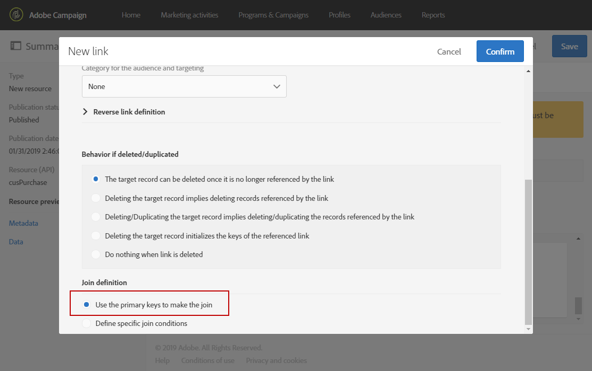
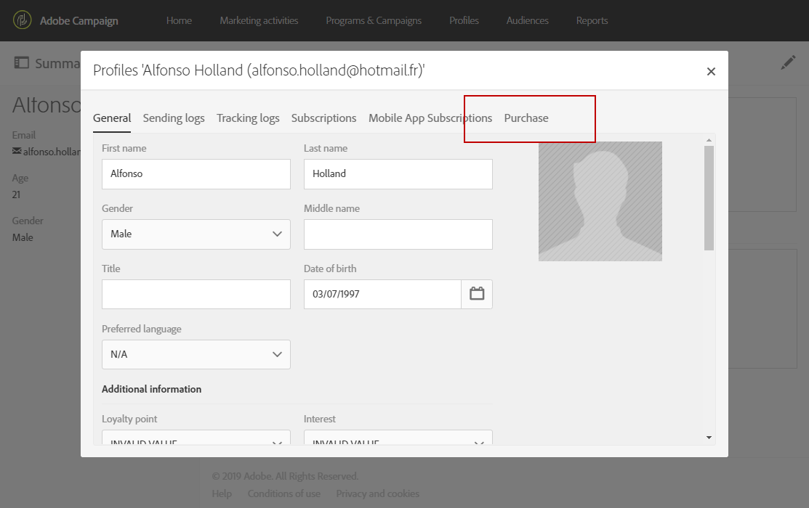

# Configuring the resource's data structure{#configuring-the-resource-s-data-structure}

Dopo aver creato una nuova risorsa personalizzata, è necessario configurare la struttura dati.

When editing the resource, in the **[!UICONTROL Data structure]** tab, you can add:

* [Campi](../../developing/using/configuring-the-resource-s-data-structure.md#adding-fields-to-a-resource)
* [Tasti di identificazione](../../developing/using/configuring-the-resource-s-data-structure.md#defining-identification-keys)
* [Indici](../../developing/using/configuring-the-resource-s-data-structure.md#defining-indexes)
* [Collegamenti](../../developing/using/configuring-the-resource-s-data-structure.md#defining-links-with-other-resources)
* [Invio di registri](../../developing/using/configuring-the-resource-s-data-structure.md#defining-sending-logs-extension)

## Adding fields to a resource {#adding-fields-to-a-resource}

È possibile aggiungere nuovi campi a una risorsa per memorizzare dati che non fanno parte del modello dati della casella.

1. Use the **[!UICONTROL Create element]** button to create a field.
1. Specificate un'etichetta, un ID, un tipo di campo e definite la lunghezza massima consentita per questo campo.

   **[!UICONTROL ID]** Il campo è obbligatorio e deve essere univoco per ogni campo aggiunto.

   >[!NOTE]
   >
   >If you leave the **[!UICONTROL Label]** field empty, it will automatically be completed from the ID.
   >È consigliabile utilizzare il massimo di 30 caratteri.

   

1. To modify one of the fields, check the **[!UICONTROL Edit Properties]** button.

   

1. In the **[!UICONTROL Field definition]** screen, you can define a category that will be used for the audience and targeting, or even add a description.

   

1. Check the **[!UICONTROL Specify a list of authorized values]** option if you need to define values that will be offered to the user (enumeration values).

   Then, click **[!UICONTROL Create element]** and specify a **[!UICONTROL Label]** and **[!UICONTROL Value]**. Aggiungere tutti i valori necessari.

1. Once you have added your fields, check the **[!UICONTROL Add audit fields]** box to include fields detailing the creation date, the user that created the resource, the date, and the author of the last modification.
1. Check the **[!UICONTROL Add access authorization management fields]** box to include the fields stating who has access rights to that particular resource.

   Questi campi vengono visualizzati nei dati e nei metadati che possono essere visualizzati una volta che l'aggiornamento del database è stato eseguito. For more on this, refer to the [Updating the database structure](../../developing/using/updating-the-database-structure.md) section.

1. Check the **[!UICONTROL Add automatic ID]** field to automatically generate an ID. Tenete presente che le entità esistenti rimarranno vuote.
1. To modify the way in which the name of the resource elements will appear in the lists and creation steps, check the **[!UICONTROL Personalize the resource title]** box. Selezionate un campo da quelli creati per la risorsa.

   

I campi della risorsa sono ora definiti.

## Defining identification keys {#defining-identification-keys}

Ciascuna risorsa deve avere almeno una chiave univoca. Ad esempio, è possibile specificare una chiave in modo che due prodotti non abbiano lo stesso ID in una tabella di acquisto.

1. Specify it in the **[!UICONTROL Automatic primary key]** section the size for the storage if you would like to have a technical key automatically and incrementally generated.

   

1. Use the **[!UICONTROL Create element]** button to create a key.

   The **[!UICONTROL Label]** and **[!UICONTROL ID]** fields are completed by default but you can edit them.

   >[!NOTE]
   >
   >È consigliabile utilizzare il massimo di 30 caratteri.

1. To define the elements making up this key, click **[!UICONTROL Create element]** and select the fields that you created for this resource.

   

   Created keys are displayed in the **[!UICONTROL Custom keys]** section.

Vengono ora create le chiavi di identificazione per la risorsa.

## Defining indexes {#defining-indexes}

Un indice può fare riferimento a uno o più campi di risorse. Gli indici consentono al database di ordinare i record per riutilizzarli più facilmente. Essi ottimizzano le prestazioni delle query SQL.

La definizione degli indici è consigliata ma non obbligatoria.

1. Use the **[!UICONTROL Create element]** button to create an index.

   

1. The **[!UICONTROL Label]** and **[!UICONTROL ID]** fields are completed by default, but you can edit them.

   >[!NOTE]
   >
   >È consigliabile utilizzare il massimo di 30 caratteri.

1. Per definire gli elementi che compongono questo indice, selezionate i campi da quelli creati per la risorsa.

   

1. Click **[!UICONTROL Confirm]**.

The indexes that were created appear in the list in the **[!UICONTROL Index]** section.

## Defining links with other resources {#defining-links-with-other-resources}

Un collegamento indica l'associazione di una tabella con altre tabelle.

1. Use the **[!UICONTROL Create element]** button to create a link to a target resource.
1. Click **[!UICONTROL Select a target resource]**.

   

1. Le risorse vengono visualizzate in ordine alfabetico e possono essere filtrate per nome. Il nome tecnico viene visualizzato tra parentesi.

   Select an element from the list and click **[!UICONTROL Confirm]**.

   

1. Select the **[!UICONTROL Link type]** according to cardinality. A seconda del tipo di sottolineatura selezionato, il comportamento se i record vengono eliminati o duplicati può variare.

   I vari tipi di collegamento sono i seguenti:

   * **[!UICONTROL 1 cardinality simple link]**: Un'occorrenza della tabella di origine può avere al massimo un'occorrenza corrispondente della tabella di destinazione.
   * **[!UICONTROL N cardinality collection link]**: Un'occorrenza della tabella di origine può avere diverse occorrenze corrispondenti della tabella di destinazione, ma una occorrenza della tabella di destinazione può avere al massimo un'occorrenza corrispondente della tabella di origine.
   * **[!UICONTROL 0 or 1 cardinality simple link]**: Un'occorrenza della tabella di origine può avere al massimo un'occorrenza corrispondente della tabella di destinazione o nessuno. Note that this kind of **[!UICONTROL Link type]** can cause performance issue.
   

1. In the **[!UICONTROL New link]** screen, the **[!UICONTROL Label]** and **[!UICONTROL ID]** fields are completed by default, but you can edit them.

   >[!NOTE]
   >
   >È consigliabile utilizzare il massimo di 30 caratteri.

   >[!CAUTION]
   >
   >Non è possibile rinominare un collegamento dopo la creazione. Per rinominare un collegamento, è necessario eliminarlo e crearlo di nuovo.

1. **[!UICONTROL Category for the audience and targeting]** L'elenco consente di assegnare questo collegamento a una categoria che lo rende più visibile nello strumento di query.
1. If needed, the **[!UICONTROL Reverse link definition]** section allows you to display the label and ID of the resource in the targeted resource.
1. Define the behavior of the records referenced by the link in the **[!UICONTROL Behavior if deleted/duplicated]** section.

   Per impostazione predefinita, il record di destinazione verrà eliminato una volta che il collegamento non viene più fatto riferimento.

   

1. In the **[!UICONTROL Join definition]** section, the default **[!UICONTROL Use the primary keys to make the join]** option is selected but you can choose between two options:

   * **[!UICONTROL Use the primary key to make the join]**: Questa definizione di partecipazione consente di utilizzare la chiave primaria dei profili per riconciliare con la chiave primaria degli acquisti.
   * **[!UICONTROL Define specific join conditions]**: Questa definizione di partecipazione consente di selezionare manualmente i campi che verranno uniti a entrambe le risorse. Please note that if data are not correctly configured, the **Purchase** record will not be visible.
   

The links created are displayed in the list in the **[!UICONTROL Links]** section.

**Esempio: Collegare una risorsa creata con la risorsa «Profili»**

In this example, we want to link a new resource **Purchase** with the **Profiles **custom resource:

1. Create your new **Purchase** resource.
1. To link it with the **Profiles** custom resource, unfold the **[!UICONTROL Links]** section in the **[!UICONTROL Data structure]** tab and click **[!UICONTROL Create element]**.
1. Select the target resource, here **[!UICONTROL Profiles (profile)]**.
1. In this example, keep the default **[!UICONTROL 1 cardinality simple link]** Link type selected.

   

1. Choose a join definition, here keep the default **[!UICONTROL Use the primary key to make the join]**.

   

1. If needed, you can define a detail screen to be able to edit **Purchase** and link it to a profile.

   Unfold the **[!UICONTROL Detail screen configuration]** section and check the **[!UICONTROL Define a detail screen]** to configure the screen that corresponds to each element of the resource. Se non selezionate questa casella, la visualizzazione dettagli degli elementi di questa risorsa non sarà accessibile.

1. Click **[!UICONTROL Create element]**.
1. Select your linked resource and click **[!UICONTROL Add]**.

   Your new resource will then be available in the advanced menu by selecting **[!UICONTROL Client data]** &gt; **[!UICONTROL Purchase]**.

   

1. Once your configuration is done, click **[!UICONTROL Confirm]**.

   Ora potete pubblicare la nuova risorsa.

By adding this link, a **Purchase** tab is added to the profiles detail screen from the **[!UICONTROL Profiles & audiences]** &gt; **[!UICONTROL Profiles]** menu. Please note that this is specific to the **[!UICONTROL Profile]** resource.

## Defining sending logs extension {#defining-sending-logs-extension}

L'estensione del registro di invio consente di:

* to extend dynamic report capabilities by **adding profile custom fields**
* to extend the sending logs data with **segment code and profile data**

**Estensione con un codice di segmento**

L'utente può estendere i registri con il codice del segmento proveniente dal motore del flusso di lavoro.

Il codice del segmento deve essere definito nel flusso di lavoro.

To activate this extension, check the option **[!UICONTROL Add segment code]**.

For more information on segment code, refer to the [Segmentation](../../automating/using/segmentation.md) section.

**Estensione con un campo profilo**

>[!NOTE]
>
>L'amministratore deve avere esteso la risorsa Profilo con un campo personalizzato.

Click **[!UICONTROL Add field]** and select any custom field from the profile resource.

In order to generate a new sub-dimension linked to the Profile dimension, check the **[!UICONTROL Add this field in Dynamic reporting as a new dimension]** option.

Da Reporting dinamico, puoi trascinare e rilasciare la dimensione del campo personalizzato in una tabella a forma libera.

For more information on Dynamic Reporting, refer to the [List of components](../../reporting/using/list-of-components-.md).

>[!CAUTION]
>
>Il numero di campi inviati a Reporting dinamico è limitato a 20.

## Editing resource properties {#editing-resource-properties}

In the custom resource screen, the **[!UICONTROL Summary]** pane indicates the status of the newly created resource. Potete gestirne l'accesso e le proprietà generali.

1. Click the **[!UICONTROL Edit properties]** button to add a description.

   

1. Se necessario, modificate l'etichetta e l'ID della risorsa.

   >[!NOTE]
   >
   >È consigliabile utilizzare il massimo di 30 caratteri.

1. Per limitare l'accesso a questa risorsa a determinate unità organizzative, specificatele qui. Solo gli utenti di unità autorizzate potranno lavorare con questa risorsa nell'applicazione.
1. Salvate le modifiche.

Le modifiche vengono salvate. È necessario pubblicare nuovamente la risorsa per applicarle.

## Generating a unique ID for profiles and custom resources {#generating-a-unique-id-for-profiles-and-custom-resources}

Per impostazione predefinita, i profili e le risorse personalizzate non hanno alcun ID aziendale al momento della creazione. Potete abilitare un'opzione che genera automaticamente un ID univoco quando vengono creati gli elementi. Questo ID può essere usato per:

* Identificare facilmente i record esportati in uno strumento esterno.
* Riconciliare i record durante l'importazione di dati aggiornati elaborati in un'altra applicazione.

Può essere attivato solo per i profili e le risorse personalizzate.

1. Create un'estensione alla risorsa dei profili o create una nuova risorsa.
1. In the data structure definition, check the **[!UICONTROL Add automatic ID field]** option, under the **[!UICONTROL Fields]** section.
1. Salvate e pubblicate la modifica apportata alla risorsa. Se desiderate che questo meccanismo venga applicato agli elementi creati tramite l'API, controllate l'opzione per estendere l'API.

The **[!UICONTROL ACS ID]** field is now available and automatically populated when new elements are created manually, from the API, or inserted from an import workflow. Il campo ID ACS è un campo UUID ed è indicizzato.

When exporting profiles or custom resources, you can now add the **[!UICONTROL ACS ID]** column if it has been enabled for that resource. Puoi riutilizzare questo ID in strumenti esterni per identificare i record.

Durante l'importazione di dati che sono stati elaborati/aggiornati in un'altra applicazione (ad esempio CRM), è possibile riconciliarli facilmente con questo ID univoco.

>[!NOTE]
>
>**[!UICONTROL ACS ID]** Il campo non viene aggiornato per i profili o gli elementi creati prima dell'attivazione dell'opzione. Solo i nuovi record avranno un ID ACS. Questo campo è in modalità di sola lettura. Non è possibile modificarlo.

