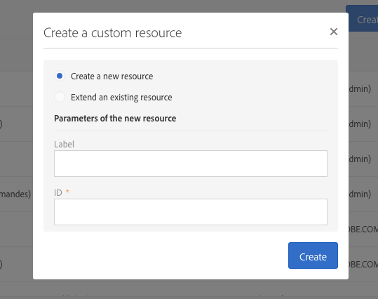

# Creazione o estensione della risorsa{#creating-or-extending-the-resource}

Gli amministratori possono creare una nuova risorsa da zero o creare un’estensione di una risorsa esistente se hai bisogno di lavorare su dati che non fanno parte del modello dati integrato.

È possibile estendere solo le seguenti risorse integrate:

* **[!UICONTROL Campaign (campaign)]**
* **[!UICONTROL Deliveries (delivery)]**
* **[!UICONTROL Landing page (Landingpage)]**
* **[!UICONTROL Profiles (profile)]**
* **[!UICONTROL Program (program)]**
* **[!UICONTROL Service (service)]**
* **[!UICONTROL Subscriptions to an application (appSubscriptionRcp)]**
* **[!UICONTROL Test profiles (seedMember)]**
* **[!UICONTROL Workflow (workflow)]**

Per creare o estendere una risorsa:

1. Da **[!UICONTROL Administration]** > **[!UICONTROL Development]** > **[!UICONTROL Custom Resources]**, fai clic su **[!UICONTROL Create]** pulsante .
1. Scegli l’azione da eseguire:

   * **[!UICONTROL Create a new resource]**: Inserisci il **[!UICONTROL Label]** e **[!UICONTROL ID]** campi. Il campo **[!UICONTROL ID]** è obbligatorio. Se lasci vuoto il campo Etichetta , verrà compilato automaticamente dall’ID.

      

      >[!NOTE]
      >
      >Utilizza un massimo di 30 caratteri.

   * **[!UICONTROL Extend an existing resource]**: Seleziona la risorsa da estendere.

      

1. Fai clic su **[!UICONTROL Create]** per creare la risorsa, che assume quindi il **[!UICONTROL Draft]** in caso di nuova risorsa o **[!UICONTROL Editing]** in caso di estensione.

La nuova risorsa viene creata e può essere configurata. Per ulteriori informazioni sulla configurazione delle risorse, consulta [Configurazione della struttura dati della risorsa](../../developing/using/configuring-the-resource-s-data-structure.md).
