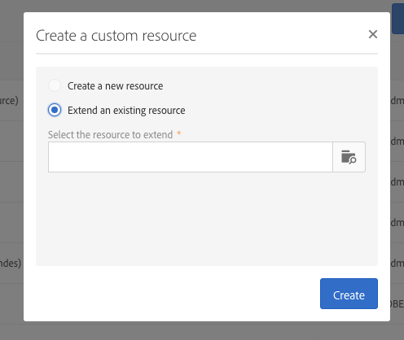

# Creating or extending the resource{#creating-or-extending-the-resource}

Gli amministratori possono creare una nuova risorsa da zero o creare un'estensione di una risorsa esistente per lavorare sui dati che non fanno parte del modello dati predefinito.

Possono essere estese solo le seguenti risorse out-of-the-box:

* **[!UICONTROL Campaign (campaign)]**
* **[!UICONTROL Deliveries (delivery)]**
* **[!UICONTROL Landing page (Landingpage)]**
* **[!UICONTROL Profiles (profile)]**
* **[!UICONTROL Program (program)]**
* **[!UICONTROL Service (service)]**
* **[!UICONTROL Subscriptions to an application (appSubscriptionRcp)]**
* **[!UICONTROL Test profiles (seedMember)]**
* **[!UICONTROL Workflow (workflow)]**

Per creare o estendere una risorsa:

1. From **[!UICONTROL Administration]** &gt; **[!UICONTROL Development]** &gt; **[!UICONTROL Custom Resources]**, click the **[!UICONTROL Create]** button.
1. Scegliete l'azione da eseguire:

   * **[!UICONTROL Create a new resource]**: Immettere i **[!UICONTROL Label]****[!UICONTROL ID]** campi e i campi. **[!UICONTROL ID]** Il campo è obbligatorio. Se lasciate vuoto il campo Etichetta, questo verrà automaticamente completato dall'ID.

      

      >[!NOTE]
      >
      >Consigliamo di utilizzare il massimo di 30 caratteri.

   * **[!UICONTROL Extend an existing resource]**: Selezionate la risorsa da estendere.

      

1. Click **[!UICONTROL Create]** to create the resource, which will then take on the **[!UICONTROL Draft]** status in case of new resource or the **[!UICONTROL Editing]** status in case of extension.

La nuova risorsa viene creata e ora può essere configurata. For more on resource configuration, refer to [Configuring the resource's data structure](../../developing/using/configuring-the-resource-s-data-structure.md).
