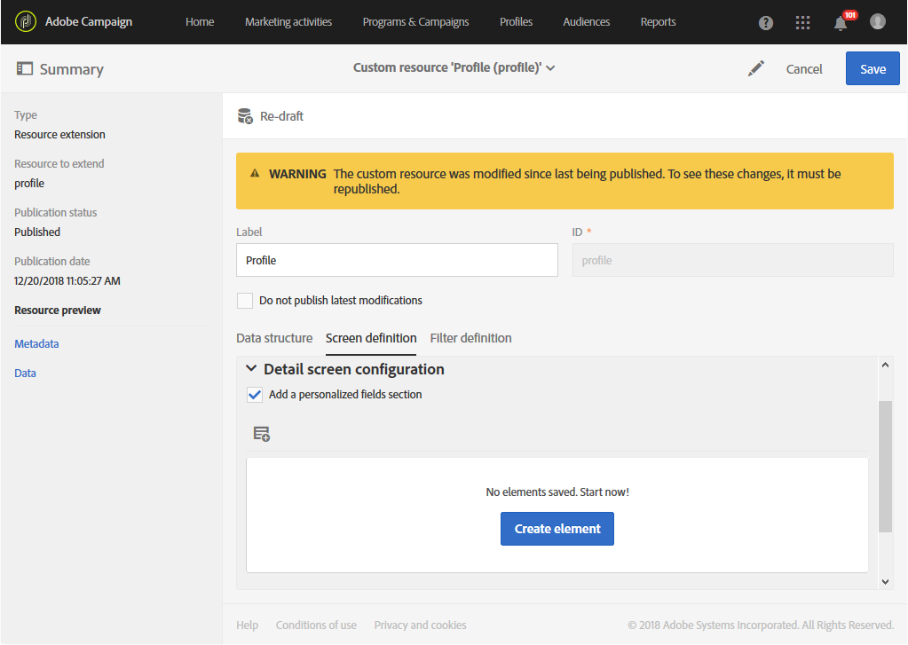

# Extending the profile resource with a new field{#extending-the-profile-resource-with-a-new-field}

## About extending profiles {#about-extending-profiles}

Questo caso di utilizzo illustra come estendere un profilo e un profilo di test con un campo dedicato.

Qui, vogliamo aggiornare i nostri profili con il nuovo campo utilizzando una pagina di destinazione, quindi eseguire il targeting dei profili con una newsletter specifica dei loro interessi.

A tal fine, attenetevi alla procedura seguente:

* [Passaggio 1: Estendere la risorsa profilo](../../developing/using/extending-the-profile-resource-with-a-new-field.md#step-1--extend-the-profile-resource)
* [Passaggio 2: Estensione del profilo di prova](../../developing/using/extending-the-profile-resource-with-a-new-field.md#step-2--extend-the-test-profile)
* [Passaggio 3: Pubblicare la risorsa personalizzata](../../developing/using/extending-the-profile-resource-with-a-new-field.md#step-3--publish-your-custom-resource)
* [Passaggio 4: Aggiornamento e targeting dei profili con un flusso di lavoro](../../developing/using/extending-the-profile-resource-with-a-new-field.md#step-4--update-and-target-profiles-with-a-workflow)

Il seguente campo verrà quindi aggiunto ai nostri profili e potrà essere mirato in una distribuzione:

Argomenti correlati:

* [Informazioni sulle risorse personalizzate](../../developing/using/data-model-concepts.md)
* [Gestione dei profili](../../audiences/using/about-profiles.md)
* [Gestione dei profili di prova](../../sending/using/managing-test-profiles-and-sending-proofs.md#managing-test-profiles)

## Step 1: Extend the profile resource {#step-1--extend-the-profile-resource}

To create the new **Interest** field for our profiles, you first need to extend the out-of-the-box **[!UICONTROL Profiles (profile)]** resource.

1. From the advanced menu, via the Adobe Campaign logo, select **[!UICONTROL Administration]** &gt; **[!UICONTROL Development]**, then **[!UICONTROL Custom resources]**.
1. If you have not extended the **[!UICONTROL Profiles]** resource yet, click **[!UICONTROL Create]**.
1. Choose the **[!UICONTROL Extend an existing resource]** option.
1. Select the **[!UICONTROL Profile (profile)]** resource.
1. Click **[!UICONTROL Create]**.

   

1. In the **[!UICONTROL Fields]** category of the **[!UICONTROL Data structure]** tab, click **[!UICONTROL Create element]**.

   >[!NOTE]
   >
   >Note that if you already extended the **[!UICONTROL Profile]** resource for previous purposes, you can start at this step by clicking **[!UICONTROL Add field]**.

   

1. Add a **[!UICONTROL Label]** and an **[!UICONTROL ID]**. Select the **[!UICONTROL Text]** type and click **[!UICONTROL Add]**.

   

1. Per configurare il campo, nella scheda **[!UICONTROL Data structure]** sotto al menu a discesa **[!UICONTROL Fields]**, fai clic su  e quindi su  dal campo creato in precedenza.
1. In this example we want to add specific values, to do so click **[!UICONTROL Specify a list of authorized values]**.

   

1. Click **[!UICONTROL Add an element]** then add as many value as needed by adding a **[!UICONTROL Label]** and an **[!UICONTROL ID]** and clicking **[!UICONTROL Add]**.

   In questa schermata verranno creati i valori Libri, Esposizioni, Filmati e N/D per scegliere tra queste opzioni.

   

1. To add this field in the **[!UICONTROL Profile]** screen, click the **[!UICONTROL Screen definition]** tab.
1. In the **[!UICONTROL Detail screen configuration]** drop-down, click **[!UICONTROL Add a personalized fields section]** and click **[!UICONTROL Create element]**.

   

1. Select a **[!UICONTROL Type]**. Qui si desidera aggiungere un campo di input. Then, select your previously created field and click **[!UICONTROL Add]**.

   

1. To add a separator to better organize your profile window, click **[!UICONTROL Create an element]** and select **[!UICONTROL Separator]** from the **[!UICONTROL Type]** drop-down.

   

Il campo è stato configurato. Ora è necessario estenderlo al profilo di prova.

>[!NOTE]
>
>Se non hai bisogno di estendere la risorsa del profilo di prova, puoi passare al passaggio Pubblicazione.

## Step 2: Extend the test profile {#step-2--extend-the-test-profile}

Per verificare se il nuovo campo creato è configurato correttamente, potete eseguire il test inviando la distribuzione ai profili di prova. Innanzitutto, è necessario eseguire anche il nuovo campo nei profili di prova.

1. From the advanced menu, via the Adobe Campaign logo, select **[!UICONTROL Administration]** &gt; **[!UICONTROL Development]**, then **[!UICONTROL Custom resources]**.
1. If you have not extended the **[!UICONTROL Profiles]** resource yet, click **[!UICONTROL Create]**.
1. Choose the **[!UICONTROL Extend an existing resource]** option.
1. Select the **[!UICONTROL Test profile (seedMember)]** resource.
1. Click **[!UICONTROL Create]**.

   

1. In the **[!UICONTROL Data structure]** tab, click **[!UICONTROL Create element]**.

   

1. Select your previously created resource field and click **[!UICONTROL Add]**.

   

1. Carry out the same steps from step 11 to 13 as the extend profile walkthrough above to add this field in the **[!UICONTROL Test profile]** screen.
1. Click **[!UICONTROL Save]**.

Sia i profili che i profili di test ora avranno il nuovo campo disponibile. Per configurare correttamente, è necessario pubblicare la risorsa personalizzata.

## Step 3: Publish your custom resource {#step-3--publish-your-custom-resource}

Per applicare le modifiche effettuate sulle risorse e utilizzarle, dovete eseguire un aggiornamento del database.

1. From the advanced menu, select **Administration** &gt; **Development**, then **Publishing**.
1. By default, the option **[!UICONTROL Determine modifications since the last publication]** is checked, which means that only the changes carried out since the last update will be applied.

   

1. Click **[!UICONTROL Prepare publication]** to start the analysis which will update your database.
1. Once the publication has been carried out, click the **Publish** button to apply your new configurations.

   

1. Once published, the **Summary** pane of each resource indicates that the status is now **Published** and specifies the date of the last publication.

   

1. Select the **[!UICONTROL Profiles]** tab and click **[!UICONTROL New]** to see if your changes have been correctly implemented.

   

Il nuovo campo di risorse è pronto per essere utilizzato e come destinazione di una consegna, ad esempio.

## Step 4: Update and target profiles with a workflow {#step-4--update-and-target-profiles-with-a-workflow}

To update profiles with data for the new custom field, you can create a landing page using the **[!UICONTROL Profile acquisition]** template. For more information on landing pages, refer to this [page](../../channels/using/about-landing-pages.md).

Qui si desidera eseguire il targeting in un profilo di workflow che non ha compilato questo campo. Riceveranno un'e-mail che chiede loro di aggiornare i profili per ricevere newsletter e offerte personalizzate. Ogni profilo riceverà quindi una newsletter personalizzata in base ai loro interessi scelti.

First, we need to create a landing page that will update the **Interest** fields of the targeted profiles:

1. From the **[!UICONTROL Marketing activities]**, click **[!UICONTROL Create]** then select **[!UICONTROL Landing page]**.
1. Selezionate una pagina di destinazione. Here, since we want to update our profiles, select **[!UICONTROL Profile acquisition]**.
1. Click **[!UICONTROL Create]**.
1. Click the **[!UICONTROL Content]** block to start editing the content of your landing page.

   

1. Personalizzate la pagina di destinazione in base alle vostre esigenze.
1. Fai clic sul campo configurato per i profili per scegliere tra la selezione degli interessi. In the left pane, select your previously created **Interest** custom resource.

   

1. Salva la pagina di destinazione e verifica che i campi siano configurati correttamente.
1. Click **[!UICONTROL Publish]** when your landing page is ready.

La pagina di destinazione è ora pronta. Per aggiornare i profili, puoi creare un flusso di lavoro che invierà un'offerta speciale a seconda dell'interesse selezionato.

1. From the **[!UICONTROL Marketing activities]** tab, click **[!UICONTROL Create]** then select **[!UICONTROL Workflow]**.
1. Drag and drop a **[!UICONTROL Query]** activity to target the profiles or audiences you need.
1. Drag and drop an **[!UICONTROL Email delivery]** activity to start configuring your email which will contain a link to the landing page. Select the **[!UICONTROL Add an outbound transition with the population]**.

   

1. Create e progettate l'e-mail in base alle vostre esigenze. For more information on email personalization, refer to this [page](../../designing/using/designing-content-in-adobe-campaign.md).
1. Aggiungi un pulsante all'e-mail che reindirizza i profili alla pagina di destinazione.
1. Select the added button and click  in the **[!UICONTROL Link]** section in the left pane.

   

1. In the **[!UICONTROL Insert link]** window, select **[!UICONTROL Landing page]** from the **[!UICONTROL Link type]** drop-down then select the previously created landing page.

   

1. Click **[!UICONTROL Save]**. L'e-mail è ora pronta per tornare al flusso di lavoro.
1. Add a **[!UICONTROL Wait]** activity to let some time for your profiles to fill the landing page.
1. Add a **[!UICONTROL Segmentation]** activity to split the outbound transition depending on their **Interests**.
1. Create an outbound segment for each **Interest**.

   

1. Add an **[!UICONTROL Email delivery]** activity after each transition and create a personalized email depending on the chosen **Interest**.
1. Avviate il flusso di lavoro al termine della configurazione.

   

I profili riceveranno ora l'e-mail di richiesta di compilare il campo Interesse seguito da un'e-mail personalizzata in base al valore scelto.
