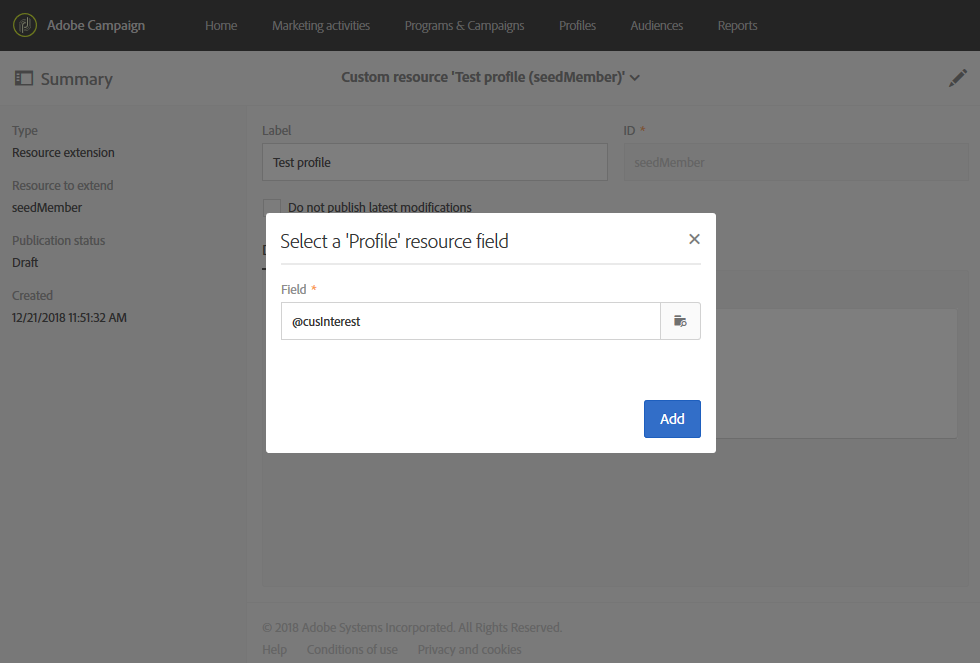
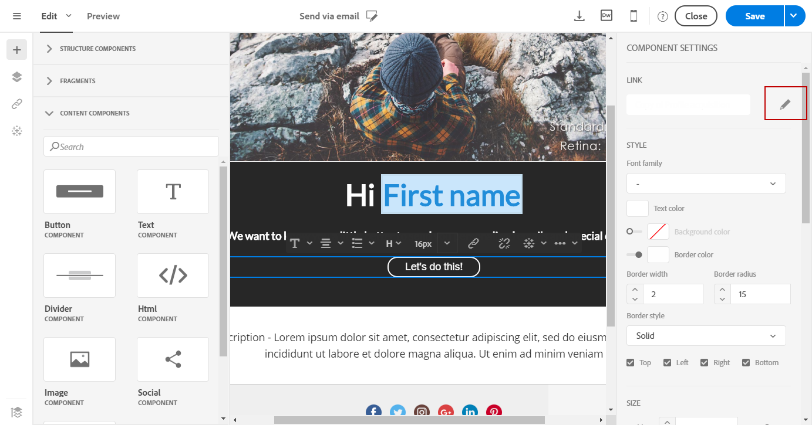
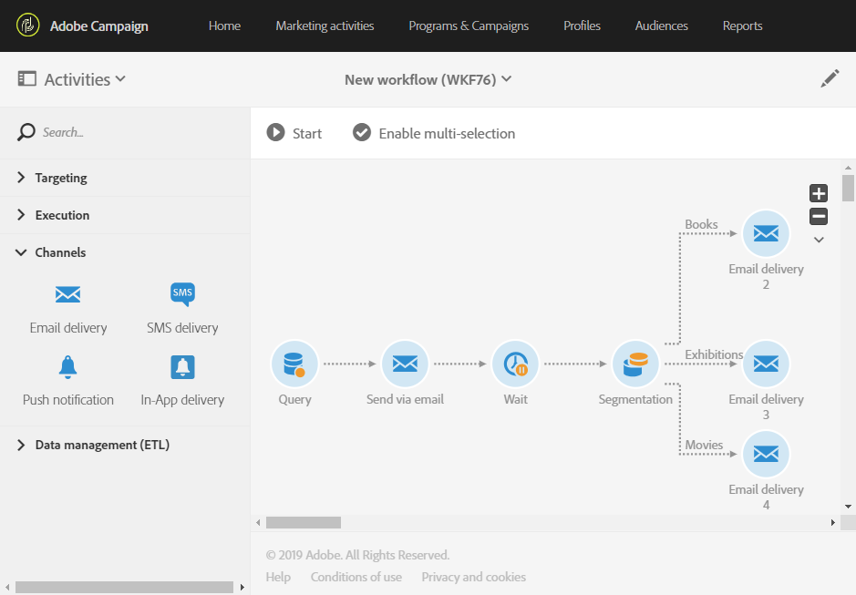

# Estensione della risorsa profilo con un nuovo campo{#extending-the-profile-resource-with-a-new-field}

## Informazioni sull’estensione dei profili {#about-extending-profiles}

Questo caso d’uso descrive in dettaglio come estendere un profilo e un profilo di test con un campo dedicato.

In questo caso, desideri aggiornare i profili con il nuovo campo utilizzando una pagina di destinazione e quindi eseguire il targeting dei profili con una newsletter specifica ai loro interessi.

A questo scopo, segui i passaggi riportati qui sotto:

* [Passaggio 1: estendere la risorsa profilo](#step-1--extend-the-profile-resource)
* [Passaggio 2: estendere il profilo di test](#step-2--extend-the-test-profile)
* [Passaggio 3: pubblicare la risorsa personalizzata](#step-3--publish-your-custom-resource)
* [Passaggio 4: aggiornare ed eseguire il targeting dei profili con un flusso di lavoro](#step-4--update-and-target-profiles-with-a-workflow)

Il seguente campo viene aggiunto ai profili e ne viene eseguito il targeting in una consegna:

Argomenti correlati:

* [Informazioni sulle risorse personalizzate](../../developing/using/data-model-concepts.md)
* [Gestione dei profili](../../audiences/using/about-profiles.md)
* [Gestione dei profili di test](../../audiences/using/managing-test-profiles.md)

## Passaggio 1: estendere la risorsa profilo {#step-1--extend-the-profile-resource}

Per creare il nuovo campo **Interest** per i profili, devi innanzitutto estendere la risorsa preconfigurata **[!UICONTROL Profiles (profile)]**.

1. Dal menu avanzato, tramite il logo Adobe Campaign, seleziona **[!UICONTROL Administration]** > **[!UICONTROL Development]**, quindi **[!UICONTROL Custom resources]**.
1. Se non hai ancora esteso la risorsa **[!UICONTROL Profiles]**, fai clic su **[!UICONTROL Create]**.
1. Scegli l’opzione **[!UICONTROL Extend an existing resource]**.
1. Seleziona la risorsa **[!UICONTROL Profile (profile)]**.
1. Fai clic su **[!UICONTROL Create]**.

   

1. Nella categoria **[!UICONTROL Fields]** della scheda **[!UICONTROL Data structure]**, fai clic su **[!UICONTROL Create element]**.

   >[!NOTE]
   >
   >Se hai già esteso la risorsa **[!UICONTROL Profile]** per scopi precedenti, puoi iniziare da questo passaggio facendo clic su **[!UICONTROL Add field]**.

   

1. Aggiungi un **[!UICONTROL Label]** e un **[!UICONTROL ID]**. Seleziona il tipo **[!UICONTROL Text]** e fai clic su **[!UICONTROL Add]**.

   

1. Per configurare il campo, nella scheda **[!UICONTROL Data structure]** sotto al menu a discesa **[!UICONTROL Fields]**, fai clic su  e quindi su  dal campo creato in precedenza.
1. In questo esempio desideri aggiungere valori specifici e a questo scopo fai clic su **[!UICONTROL Specify a list of authorized values]**.

   

1. Fai clic su **[!UICONTROL Add an element]** e aggiungi tutti i valori necessari aggiungendo un **[!UICONTROL Label]** e un **[!UICONTROL ID]** e facendo clic su **[!UICONTROL Add]**.

   In questo caso, crei i valori Books, Exhibitions, Movies e N/A affinché i profili possano scegliere tra queste opzioni.

   

1. Per aggiungere questo campo nella schermata **[!UICONTROL Profile]**, fai clic sulla scheda **[!UICONTROL Screen definition]**.
1. Nell’elenco a discesa **[!UICONTROL Detail screen configuration]**, fai clic su **[!UICONTROL Add a personalized fields section]** e quindi su **[!UICONTROL Create element]**.

   

1. Seleziona un **[!UICONTROL Type]**. In questo caso, desideri aggiungere un campo di immissione. Quindi, seleziona il campo creato in precedenza e fai clic su **[!UICONTROL Add]**.

   

1. Per aggiungere un separatore per organizzare meglio la finestra del profilo, fai clic su **[!UICONTROL Create an element]** e seleziona **[!UICONTROL Separator]** dal menu a discesa **[!UICONTROL Type]**.

   

Il campo è ora configurato. Ora devi estenderlo al profilo di test.

>[!NOTE]
>
>Se non devi estendere la risorsa del profilo di test, puoi passare direttamente al passaggio Publishing.

## Passaggio 2: estendere il profilo di test {#step-2--extend-the-test-profile}

Puoi verificare se il nuovo campo creato è configurato correttamente inviando la consegna ai profili di test. In primo luogo, è necessario eseguire la verifica del nuovo campo sui profili di test.

1. Dal menu avanzato, tramite il logo Adobe Campaign, seleziona **[!UICONTROL Administration]** > **[!UICONTROL Development]**, quindi **[!UICONTROL Custom resources]**.
1. Se non hai ancora esteso la risorsa **[!UICONTROL Profiles]**, fai clic su **[!UICONTROL Create]**.
1. Scegli l’opzione **[!UICONTROL Extend an existing resource]**.
1. Seleziona la risorsa **[!UICONTROL Test profile (seedMember)]**.
1. Fai clic su **[!UICONTROL Create]**.

   

1. Nella scheda **[!UICONTROL Data structure]**, fai clic su **[!UICONTROL Create element]**.

   

1. Seleziona il campo della risorsa creato in precedenza e fai clic su **[!UICONTROL Add]**.

   

1. Effettua gli stessi passaggi dall’11 al 13, in quanto il profilo di estensione descritto sopra consente di aggiungere questo campo nella schermata **[!UICONTROL Test profile]**.
1. Fai clic su **[!UICONTROL Save]**.

Ora il nuovo campo è disponibile sia per i profili sia per i profili di test. Per configurarlo correttamente, devi pubblicare la risorsa personalizzata.

## Passaggio 3: pubblicare la risorsa personalizzata {#step-3--publish-your-custom-resource}

Per applicare le modifiche apportate alle risorse e utilizzarle, devi eseguire un aggiornamento del database.

1. Seleziona **Administration** > **Development**, quindi **Publishing** dal menu avanzato.
1. Per impostazione predefinita, è selezionata l’opzione **[!UICONTROL Determine modifications since the last publication]**, il che significa che vengono applicate solo le modifiche eseguite dall’ultimo aggiornamento.

   

1. Fai clic su **[!UICONTROL Prepare publication]** per avviare l’analisi per aggiornare il database.
1. Al termine della pubblicazione fai clic sul pulsante **Publish** per applicare le nuove configurazioni.

   

1. Dopo la pubblicazione, il riquadro **Summary** di ciascuna risorsa indica che lo stato è **Published** e specifica la data dell’ultima pubblicazione.

   

1. Seleziona la scheda **[!UICONTROL Profiles]** e fai clic su **[!UICONTROL New]** per verificare se le modifiche sono state implementate correttamente.

   

Il nuovo campo della risorsa è ora pronto per l’utilizzo e impostato, ad esempio, con target in una consegna.

## Passaggio 4: aggiornare ed eseguire il targeting dei profili con un flusso di lavoro {#step-4--update-and-target-profiles-with-a-workflow}

Per aggiornare profili con i dati del nuovo campo personalizzato, puoi creare una pagina di destinazione utilizzando il modello **[!UICONTROL Profile acquisition]**. Per ulteriori informazioni sulle pagine di destinazione, consulta questa [pagina](../../channels/using/getting-started-with-landing-pages.md).

In questo caso, desideri eseguire il targeting nei profili di un flusso di lavoro che non hanno compilato questo campo. Questi ricevono un’e-mail con la richiesta di aggiornare il profilo per ricevere newsletter e offerte personalizzate. Ogni profilo riceve quindi una newsletter personalizzata in base agli interessi selezionati.

Innanzitutto, devi creare una pagina di destinazione che aggiorni i campi **Interest** dei profili target:

1. Dal menu **[!UICONTROL Marketing activities]**, fai clic su **[!UICONTROL Create]** e seleziona quindi **[!UICONTROL Landing page]**.
1. Seleziona un tipo di pagina di destinazione. In questo caso, dal momento che desideri aggiornare i profili, seleziona **[!UICONTROL Profile acquisition]**.
1. Fai clic su **[!UICONTROL Create]**.
1. Fai clic sul blocco **[!UICONTROL Content]** per iniziare a modificare il contenuto della pagina di destinazione.

   

1. Personalizza la pagina di destinazione, se necessario.
1. Fai clic sul campo configurato dei profili per scegliere tra la selezione degli interessi. Nel riquadro a sinistra, seleziona la risorsa personalizzata **Interest** creata precedentemente.

   

1. Salva la pagina di destinazione e verificala per controllare che i campi siano configurati correttamente.
1. Fai clic su **[!UICONTROL Publish]** quando la pagina di destinazione è pronta.

La pagina di destinazione è ora pronta. Per aggiornare i profili, puoi creare un flusso di lavoro che invia un’offerta speciale in base all’interesse scelto.

1. Dalla scheda **[!UICONTROL Marketing activities]**, fai clic su **[!UICONTROL Create]** e quindi seleziona **[!UICONTROL Workflow]**.
1. Trascina e rilascia un’attività **[!UICONTROL Query]** per eseguire il targeting dei profili o tipi di pubblico necessari.
1. Trascina e rilascia un’attività **[!UICONTROL Email delivery]** per iniziare a configurare l’e-mail che contiene un collegamento alla pagina di destinazione. Seleziona **[!UICONTROL Add an outbound transition with the population]**.

   

1. Crea e progetta l’e-mail secondo le tue esigenze. Per ulteriori informazioni sulla personalizzazione delle e-mail, consulta questa [pagina](../../designing/using/quick-start.md).
1. Aggiungi un pulsante all’e-mail per reindirizzare i profili alla pagina di destinazione.
1. Seleziona il pulsante aggiunto e fai clic su  nella sezione **[!UICONTROL Link]** del riquadro a sinistra.

   

1. Nella finestra **[!UICONTROL Insert link]**, seleziona **[!UICONTROL Landing page]** dall’elenco a discesa **[!UICONTROL Link type]**, quindi seleziona la pagina di destinazione creata in precedenza.

   

1. Fai clic su **[!UICONTROL Save]**. L’e-mail è ora pronta. Puoi tornare al flusso di lavoro.
1. Aggiungi un’attività **[!UICONTROL Wait]** per dare tempo ai profili di riempire la pagina di destinazione.
1. Aggiungi un’attività **[!UICONTROL Segmentation]** per suddividere la transizione in uscita in base ai loro **Interests**.
1. Crea un segmento in uscita per ogni **Interest**.

   

1. Aggiungi un’attività **[!UICONTROL Email delivery]** dopo ogni transizione e crea un’e-mail personalizzata in base all’**Interest** scelto.
1. Avvia il flusso di lavoro al termine della configurazione.

   

I profili ricevono ora l’e-mail con la richiesta di compilare il campo Interest seguito da un messaggio e-mail personalizzato in base al valore scelto.
