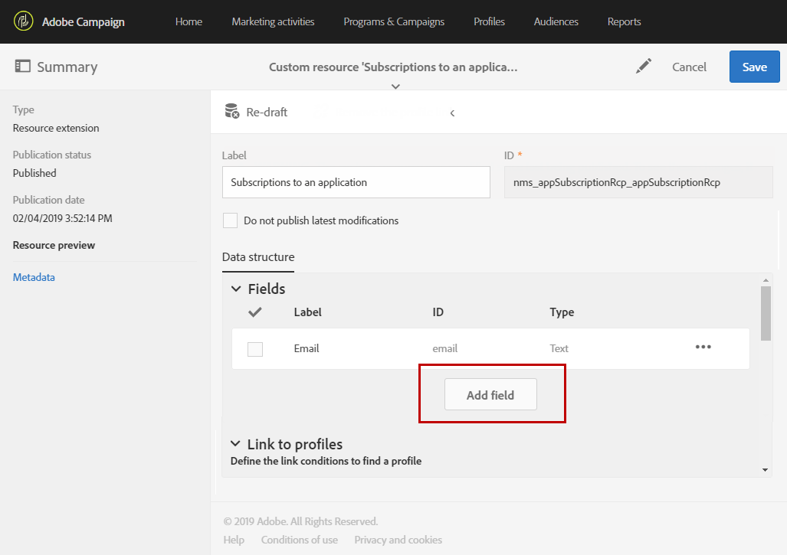

# Estensione degli abbonamenti a una risorsa dell’applicazione{#extending-the-subscriptions-to-an-application-resource}

In Adobe Campaign, i dati degli attributi del profilo mobile inviati da dispositivi mobili sono memorizzati nella risorsa **[!UICONTROL Subscriptions to an application (appSubscriptionRcp)]** che ti consente di definire i dati da raccogliere dagli abbonati alle tue applicazioni. For more information on custom resources, refer to [this page](../../developing/using/key-steps-to-add-a-resource.md).

Questa risorsa può essere estesa per raccogliere i dati che si intende inviare dal dispositivo mobile a  Adobe Campaign.

1. Dal menu avanzato, tramite il logo Adobe Campaign, seleziona **[!UICONTROL Administration]** > **[!UICONTROL Development]**, quindi **[!UICONTROL Custom resources]**.
1. Fate clic **[!UICONTROL Create]** e scegliete l’ **[!UICONTROL Extend an existing resource]** opzione.
1. Select the **[!UICONTROL Subscriptions to an application (appSubscriptionRcp)]** resource and click **[!UICONTROL Create]**.

   

1. Nella **[!UICONTROL Fields]** categoria della **[!UICONTROL Data structure]** scheda, definire i dati cliente che si desidera recuperare dall&#39;applicazione mobile facendo clic sul **[!UICONTROL Add field]** pulsante.

   >[!NOTE]
   >
   >Se gestite diverse applicazioni mobili, devono essere elencati tutti i campi utilizzati da tutte le applicazioni. La chiamata PII per la raccolta di iOS o Android definisce i campi acquisiti da ciascuna applicazione.

   

1. Aggiungere un **[!UICONTROL Label]** e un **[!UICONTROL ID]** campo al nuovo campo. Seleziona il campo **[!UICONTROL Type]**.

   

1. Nella **[!UICONTROL Link to profiles]** categoria, configurate la chiave di riconciliazione utilizzata per collegare i profili dal database Adobe Campaign  agli abbonati delle applicazioni, ad esempio l&#39;e-mail.

   Per i messaggi in-app puoi definire una sola chiave di riconciliazione per tutte le applicazioni mobili.

   

1. **[!UICONTROL Save]** e pubblicate la risorsa personalizzata. Per ulteriori informazioni sulla pubblicazione di risorse personalizzate, consultate questa [pagina](../../developing/using/updating-the-database-structure.md#publishing-a-custom-resource).

