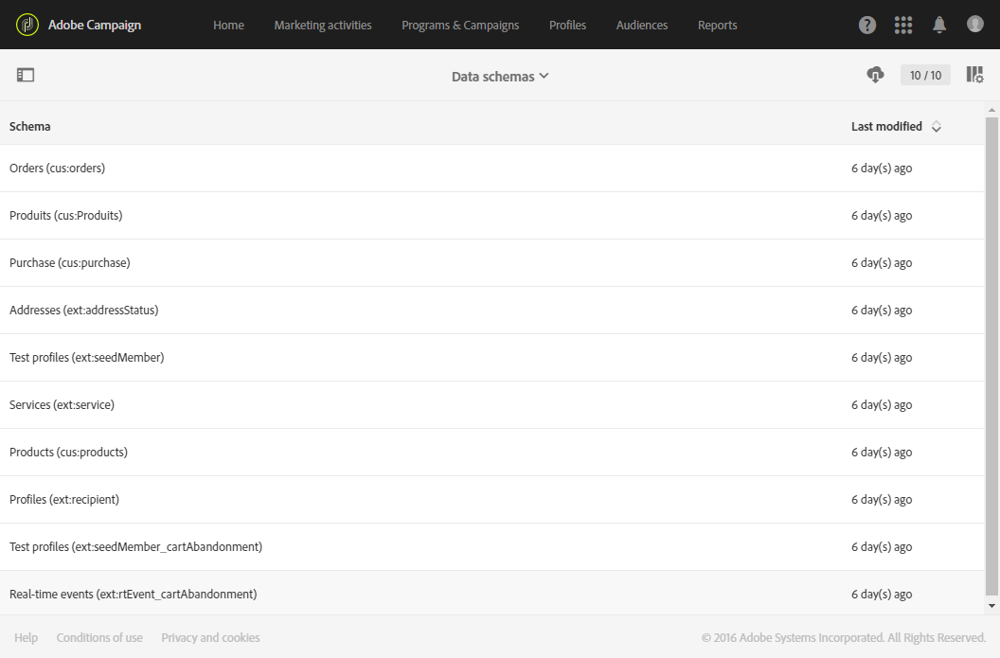

# Monitoring data model changes{#monitoring-data-model-changes}

**[!UICONTROL Diagnosis]** Il menu consente di consultare i diversi oggetti tecnici generati dall'applicazione per analizzarli.

>[!NOTE]
>
>Le schermate di questo menu sono di sola lettura.

È possibile visualizzare i seguenti tipi di oggetti:

* Schemi dati
* Pagine Web
* Filtri
* Navigazione
* Processi batch

