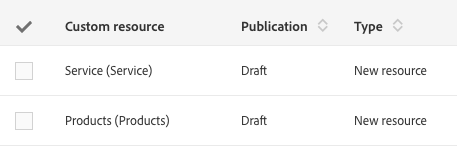

# Stati delle risorse{#resource-statuses}

A seconda del loro stato di pubblicazione o attivazione, le risorse possono avere stati diversi.

Sono disponibili due colonne dedicate alla visualizzazione di questi stati nella schermata **[!UICONTROL Custom resources]**.

**Stati pubblicazione**

* **Bozza**: la risorsa è stata appena creata o riscritta. Per creare le tabelle del database e le API corrispondenti, è necessario ripubblicare la risorsa. Se una risorsa viene riscritta, diventa automaticamente inattiva dopo il passaggio di pubblicazione.
* **Nuova bozza in sospeso**: la risorsa è stata riscritta. Il processo di riprogettazione si verificherà durante la pubblicazione successiva. La riprogettazione è irreversibile. Vengono visualizzati diversi messaggi di avviso per informare l’utente, sia durante la riprogettazione che durante la preparazione alla pubblicazione.

  Per ulteriori informazioni sulla riprogettazione, vedere [Eliminazione di una risorsa](../../developing/using/deleting-a-resource.md).

  >[!NOTE]
  >
  >L&#39;opzione **[!UICONTROL Cancel re-draft]** è disponibile quando la risorsa di cui si desidera rielaborare la bozza contiene ancora collegamenti attraverso altre risorse con stato &quot;Pubblicato&quot;. Questa opzione consente di ripristinare il processo di &quot;riprogettazione&quot;. Le risorse personalizzate torneranno quindi allo stato originale.

* **Pubblicato**: la risorsa è stata pubblicata. Se la risorsa viene modificata dopo l’ultima data di modifica, viene visualizzato un messaggio per invitarti a ripubblicare la risorsa per tenere conto delle ultime modifiche.

Il campo **[!UICONTROL Do not publish latest modifications]** impedisce che le modifiche vengano prese in considerazione durante le pubblicazioni future.

Questo campo può essere configurato nella definizione di risorsa personalizzata.
