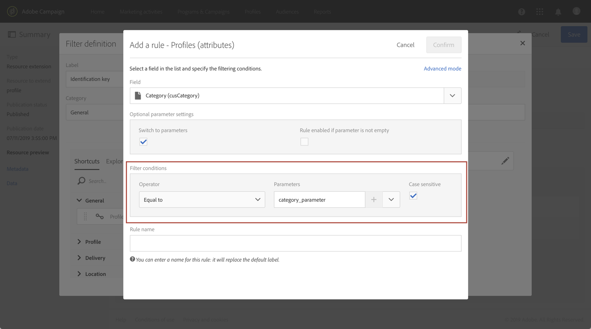

# Chiamata di una risorsa tramite una chiave di identificazione composita{#calling-a-resource-using-a-composite-identification-key}

In alcuni casi, potrebbe essere necessario definire per una risorsa una chiave di identificazione composta da due campi. Una volta configurata la chiave di identificazione, devi configurare una definizione di filtro per poter chiamare la risorsa con questa chiave di identificazione, sia dall'interfaccia Campaign Standard che dalle API.

In questo caso d'uso, la risorsa **Profilo** è stata estesa con il campo personalizzato **"ID CRM"** e **"categoria"** . Creeremo una chiave di identificazione per la risorsa Profilo, che sarà composta da questi due campi. Quindi configureremo una definizione di filtro in modo da poter accedere alla risorsa Profilo utilizzando la chiave di identificazione.

I passaggi principali per questo caso di utilizzo sono:

1. Configura la chiave di identificazione per la risorsa Profilo, in base ai due campi.
1. Configurate la definizione del filtro per poter chiamare la risorsa Profilo utilizzando la chiave di identificazione.
1. Chiama la risorsa Profilo dall'interfaccia o dall'API.

Argomenti correlati:

* [Creazione o estensione della risorsa](../../developing/using/creating-or-extending-the-resource.md)
* [Definizione dei tasti di identificazione](../../developing/using/configuring-the-resource-s-data-structure.md#defining-identification-keys)
* [API REST di Campaign Standard](../../api/using/about-campaign-standard-apis.md)

## Passaggio 1: Configurare la chiave di identificazione{#step-1-configure-the-identification-key}

>[!NOTE]
> I concetti globali per la configurazione delle chiavi di identificazione sono descritti in [questa sezione](../../developing/using/configuring-the-resource-s-data-structure.md#defining-identification-keys).

1. Prima di configurare la chiave di identificazione, accertatevi che la risorsa sia stata estesa con i campi desiderati e che sia stata pubblicata. For more on this, refer to [this section](../../developing/using/creating-or-extending-the-resource.md).

1. Andate al **[!UICONTROL Administration]** / **[!UICONTROL Developement]** / **[!UICONTROL Custom resources]** menu, quindi aprite la **[!UICONTROL Profile]** risorsa.

   

1. Nella **[!UICONTROL Identification keys]** sezione fare clic sul **[!UICONTROL Create element]** pulsante.

   

1. Aggiungi i due campi "CRM ID" e "Category" personalizzati, quindi fai clic su **[!UICONTROL Confirm]**.

   

   >[!NOTE]
   > Se si desidera visualizzare i due campi personalizzati nell'interfaccia del profilo, configurare la **[!UICONTROL Screen definition]** scheda. For more on this, refer to [this section](../../developing/using/configuring-the-screen-definition.md).

1. Ora puoi configurare la definizione del filtro in modo che possa chiamare la risorsa utilizzando la relativa chiave di identificazione.

## Passaggio 2: Configurare la definizione del filtro{#step-2-configure-the-filter-definition}

>[!NOTE]
> I concetti globali per la configurazione delle definizioni dei filtri sono descritti in [questa sezione](../../developing/using/configuring-filter-definition.md).

1. Nella **[!UICONTROL Filter definition]** scheda, fai clic su **[!UICONTROL Add an element]**, quindi immetti l'etichetta e l'ID della definizione del filtro.

1. Modificate le proprietà della definizione del filtro per configurarne le regole.

   

1. Trascinare nell’area di lavoro la tabella che contiene i campi utilizzati nella chiave di identificazione.

   

1. Selezionare il primo campo utilizzato nella chiave di identificazione ("ID CRM"), quindi attivare l' **[!UICONTROL Switch to parameters]** opzione.

   

1. Nella **[!UICONTROL Filter conditions]** sezione, mantenere l' **[!UICONTROL Equal]** operatore, definire il nome del parametro e fare clic sul segno più per crearlo.

   

   >[!NOTE]
   > Dopo aver fatto clic sul pulsante più, il nome del parametro viene generato automaticamente. Tenete presente queste informazioni, in quanto saranno necessarie per utilizzare il filtro dalle API.

1. Ripetete i passaggi descritti qui sopra con tutti i campi che compongono la chiave di identificazione ("categoria"), quindi salvate le modifiche.

   

1. La definizione del filtro è ora configurata. Potete pubblicare la risorsa in modo che il filtro sia disponibile.

## Passaggio 3: Chiama la risorsa in base alla relativa chiave di identificazione{#step-3-call-the-resource-based-on-its-identification-key}

Una volta configurate la chiave di identificazione e la relativa definizione del filtro, potete utilizzarle per chiamare la risorsa, sia dall'interfaccia standard Campaign che dalle API REST.

Per utilizzare la definizione del filtro dall'interfaccia, utilizzate un' **[!UICONTROL Query]** attività in un flusso di lavoro (consultate [questa sezione](../../automating/using/query.md)). Il filtro è quindi disponibile nel riquadro a sinistra.


Per utilizzare la definizione del filtro dalle API REST Campaign Standard, utilizza la sintassi seguente:

```
GET /profileAndServicesExt/<resourceName>/by<filterName>?<param1_parameter>=<value>&<param2_parameter>=<value>
```

>[!NOTE]
>Per richiamare un filtro cliente, usate il prefisso "by" seguito dal nome del filtro definito al momento della configurazione della definizione del filtro nel [passaggio 2](../../developing/using/uc-calling-resource-id-key.md#step-2-configure-the-filter-definition).

Nel nostro caso, la sintassi per recuperare un profilo dalla categoria "molla" con l'ID CRM "123456" sarebbe:

```
GET https://mc.adobe.io/<ORGANIZATION>/campaign/profileAndServicesExt/profile/byidentification_key?category_parameter=spring&crm_id_parameter=123456
```

Per ulteriori informazioni, consulta la documentazione [sulle API REST di](../../api/using/filtering.md)Campaign Standard.