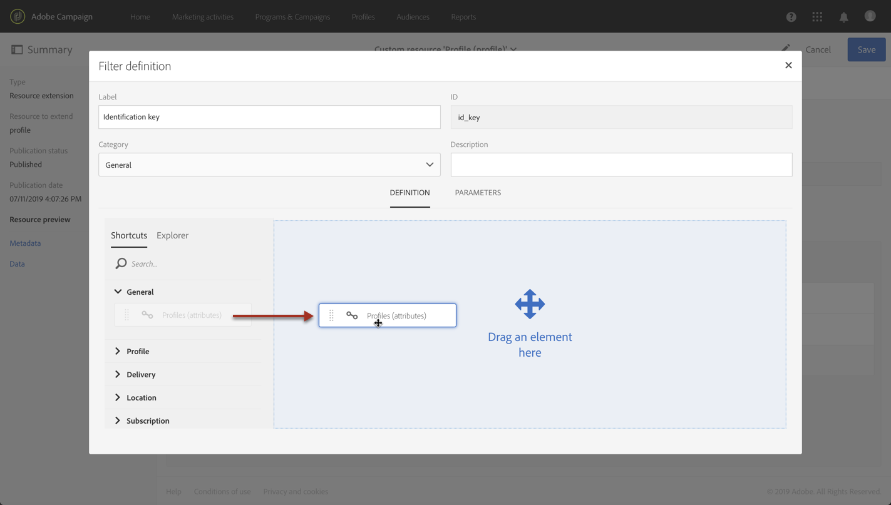

# Chiamata di una risorsa tramite una chiave di identificazione composita{#calling-a-resource-using-a-composite-identification-key}

In alcuni casi, potrebbe essere necessario definire per una risorsa una chiave di identificazione composta da due campi. Una volta configurata la chiave di identificazione, devi configurare una definizione di filtro per poter chiamare la risorsa con questa chiave di identificazione, dall’interfaccia di Campaign Standard o dalle API.

In questo caso d’uso, la risorsa **Profilo** è stata estesa con campi **&quot;CRM ID&quot;** e **&quot;category&quot;** personalizzati. Verrà creata una chiave di identificazione per la risorsa Profilo, che sarà composta da questi due campi. Configureremo quindi una definizione di filtro, in modo da poter accedere alla risorsa Profilo utilizzando la chiave di identificazione.

I passaggi principali per questo caso d’uso sono i seguenti:

1. Configura la chiave di identificazione per la risorsa Profilo, in base ai due campi.
1. Configura la definizione del filtro per poter chiamare la risorsa Profilo utilizzando la relativa chiave di identificazione.
1. Chiama la risorsa Profilo dall’interfaccia o dalle API.

Argomenti correlati:

* [Creazione o estensione della risorsa](../../developing/using/creating-or-extending-the-resource.md)
* [Definizione delle chiavi di identificazione](../../developing/using/configuring-the-resource-s-data-structure.md#defining-identification-keys)
* [API REST di Campaign Standard](../../api/using/get-started-apis.md)

## Passaggio 1: Configura la chiave di identificazione{#step-1-configure-the-identification-key}

>[!NOTE]
> I concetti globali durante la configurazione delle chiavi di identificazione sono descritti in [questa sezione](../../developing/using/configuring-the-resource-s-data-structure.md#defining-identification-keys).

1. Prima di configurare la chiave di identificazione, accertati che la risorsa sia stata estesa con i campi desiderati e che sia stata pubblicata. Per ulteriori informazioni al riguardo, consulta [questa sezione](../../developing/using/creating-or-extending-the-resource.md).

1. Vai al menu **[!UICONTROL Administration]** / **[!UICONTROL Development]** / **[!UICONTROL Custom resources]**, quindi apri la risorsa **[!UICONTROL Profile]**.

   

1. Nella sezione **[!UICONTROL Identification keys]**, fai clic sul pulsante **[!UICONTROL Create element]** .

   

1. Aggiungi i due campi personalizzati &quot;ID CRM&quot; e &quot;Categoria&quot;, quindi fai clic su **[!UICONTROL Confirm]**.

   

   >[!NOTE]
   > Se desideri visualizzare i due campi personalizzati nell’interfaccia del profilo, configura la scheda **[!UICONTROL Screen definition]** . Per ulteriori informazioni al riguardo, consulta [questa sezione](../../developing/using/configuring-the-screen-definition.md).

1. Ora puoi configurare la definizione del filtro in modo da poter chiamare la risorsa utilizzando la relativa chiave di identificazione.

## Passaggio 2: Configura la definizione del filtro{#step-2-configure-the-filter-definition}

>[!NOTE]
> I concetti globali durante la configurazione delle definizioni dei filtri sono descritti in [questa sezione](../../developing/using/configuring-filter-definition.md).

1. Nella scheda **[!UICONTROL Filter definition]** , fai clic su **[!UICONTROL Add an element]**, quindi immetti l’etichetta e l’ID della definizione del filtro.

1. Modifica le proprietà della definizione del filtro per configurarne le regole.

   

1. Trascina nell’area di lavoro la tabella contenente i campi utilizzati nella chiave di identificazione .

   

1. Seleziona il primo campo utilizzato nella chiave di identificazione (&quot;ID CRM&quot;), quindi attiva l&#39;opzione **[!UICONTROL Switch to parameters]**.

   

1. Nella sezione **[!UICONTROL Filter conditions]** , mantieni l’operatore **[!UICONTROL Equal]**, definisci il nome del parametro e fai clic sul segno più per crearlo.

   

   >[!NOTE]
   > Dopo aver fatto clic sul pulsante **+**, il nome del parametro viene generato automaticamente. Tieni presente queste informazioni, in quanto sarà necessario per utilizzare il filtro dalle API.

1. Ripeti i passaggi precedenti con tutti i campi che compongono la chiave di identificazione (&quot;categoria&quot;), quindi salva le modifiche.

   

1. La definizione del filtro è ora configurata. Puoi pubblicare la risorsa in modo che il filtro sia disponibile.

## Passaggio 3: Chiama la risorsa in base alla sua chiave di identificazione{#step-3-call-the-resource-based-on-its-identification-key}

Una volta configurati la chiave di identificazione e la relativa definizione del filtro, puoi utilizzarli per chiamare la risorsa, dall’interfaccia Campaign standard o dalle API REST.

Per utilizzare la definizione del filtro dall&#39;interfaccia, utilizza un&#39;attività **[!UICONTROL Query]** in un flusso di lavoro (consulta [questa sezione](../../automating/using/query.md)). Il filtro è quindi disponibile nel riquadro a sinistra.


Per utilizzare la definizione del filtro dalle API REST di Campaign Standard, utilizza la sintassi seguente:

```
GET /profileAndServicesExt/<resourceName>/by<filterName>?<param1_parameter>=<value>&<param2_parameter>=<value>
```

>[!NOTE]
>Per chiamare un filtro personalizzato, utilizza il prefisso &quot;by&quot; seguito dal nome del filtro definito durante la configurazione della definizione del filtro in [passaggio 2](../../developing/using/uc-calling-resource-id-key.md#step-2-configure-the-filter-definition).

Nel nostro caso, la sintassi per recuperare un profilo dalla categoria &quot;spring&quot; con l’ID CRM &quot;123456&quot; sarebbe:

```
GET https://mc.adobe.io/<ORGANIZATION>/campaign/profileAndServicesExt/profile/byidentification_key?category_parameter=spring&crm_id_parameter=123456
```

Per ulteriori informazioni, consulta la documentazione [Campaign Standard REST APIs](../../api/using/filtering.md).