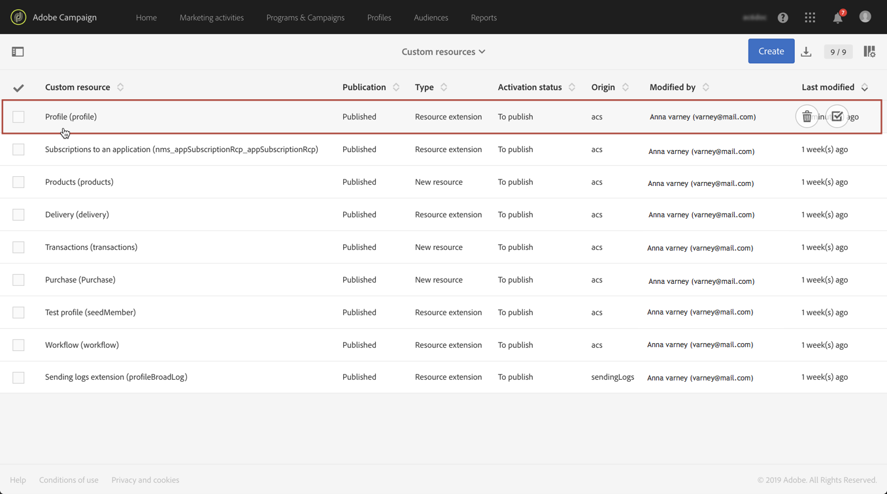

# Chiamata di una risorsa tramite una chiave di identificazione composita{#calling-a-resource-using-a-composite-identification-key}

In alcuni casi, potrebbe essere necessario definire per una risorsa una chiave di identificazione composta da due campi. Una volta configurata la chiave di identificazione, devi configurare una definizione di filtro per poter chiamare la risorsa con questa chiave di identificazione, dall’interfaccia Campaign Standard o dalle API.

In questo caso d’uso, il **Profilo** la risorsa è stata estesa con personalizzate **&quot;ID CRM&quot;** e **&quot;categoria&quot;** campi. Creeremo una chiave di identificazione per la risorsa Profilo, che sarà costituita da questi due campi. Quindi configureremo una definizione di filtro, in modo da poter accedere alla risorsa Profilo utilizzando la chiave di identificazione.

I passaggi principali per questo caso d’uso sono:

1. Configura la chiave di identificazione per la risorsa Profilo, in base ai due campi.
1. Configura la definizione del filtro per poter chiamare la risorsa profilo utilizzando la relativa chiave di identificazione.
1. Chiama la risorsa Profilo dall’interfaccia o dall’API.

Argomenti correlati:

* [Creazione o estensione della risorsa](../../developing/using/creating-or-extending-the-resource.md)
* [Definizione delle chiavi di identificazione](../../developing/using/configuring-the-resource-s-data-structure.md#defining-identification-keys)
* [API REST di Campaign Standard](../../api/using/get-started-apis.md)

## Passaggio 1: configurare la chiave di identificazione{#step-1-configure-the-identification-key}

>[!NOTE]
> I concetti globali durante la configurazione delle chiavi di identificazione sono descritti in [questa sezione](../../developing/using/configuring-the-resource-s-data-structure.md#defining-identification-keys).

1. Prima di configurare la chiave di identificazione, accertati che la risorsa sia stata estesa con i campi desiderati e che sia stata pubblicata. Per ulteriori informazioni al riguardo, consulta [questa sezione](../../developing/using/creating-or-extending-the-resource.md).

1. Vai a **[!UICONTROL Administration]** / **[!UICONTROL Development]** / **[!UICONTROL Custom resources]** , quindi aprire il **[!UICONTROL Profile]** risorsa.

   

1. In **[!UICONTROL Identification keys]** , fare clic sul pulsante **[!UICONTROL Create element]** pulsante.

   

1. Aggiungi i due campi personalizzati &quot;ID CRM&quot; e &quot;Categoria&quot;, quindi fai clic su **[!UICONTROL Confirm]**.

   

   >[!NOTE]
   > Se desideri visualizzare i due campi personalizzati nell’interfaccia del profilo, configura **[!UICONTROL Screen definition]** scheda. Per ulteriori informazioni al riguardo, consulta [questa sezione](../../developing/using/configuring-the-screen-definition.md).

1. Ora puoi configurare la definizione del filtro in modo da poter chiamare la risorsa utilizzando la relativa chiave di identificazione.

## Passaggio 2: configurare la definizione del filtro{#step-2-configure-the-filter-definition}

>[!NOTE]
> I concetti globali durante la configurazione delle definizioni dei filtri sono descritti in [questa sezione](../../developing/using/configuring-filter-definition.md).

1. In **[!UICONTROL Filter definition]** , fare clic su **[!UICONTROL Add an element]**, quindi inserisci l’etichetta e l’ID della definizione del filtro.

1. Modifica le proprietà della definizione del filtro per configurarne le regole.

   

1. Trascina nell’area di lavoro la tabella contenente i campi utilizzati nella chiave di identificazione.

   

1. Seleziona il primo campo utilizzato nella chiave di identificazione (&quot;ID CRM&quot;), quindi attiva il **[!UICONTROL Switch to parameters]** opzione.

   

1. In **[!UICONTROL Filter conditions]** sezione, mantieni **[!UICONTROL Equal]** , quindi definire il nome del parametro e fare clic sul segno più per crearlo.

   

   >[!NOTE]
   > Dopo aver fatto clic su **+** , il nome del parametro viene generato automaticamente. Tieni presente queste informazioni, in quanto saranno necessarie per utilizzare il filtro delle API.

1. Ripeti i passaggi precedenti con tutti i campi che compongono la chiave di identificazione (&quot;categoria&quot;), quindi salva le modifiche.

   

1. La definizione del filtro è ora configurata. Puoi pubblicare la risorsa in modo che il filtro sia disponibile.

## Passaggio 3: chiama la risorsa in base alla sua chiave di identificazione{#step-3-call-the-resource-based-on-its-identification-key}

Una volta configurata la chiave di identificazione e la relativa definizione del filtro, puoi utilizzarle per chiamare la risorsa dall’interfaccia standard di Campaign o dalle API REST.

Per utilizzare la definizione del filtro dall’interfaccia, utilizza una **[!UICONTROL Query]** attività in un flusso di lavoro (consulta [questa sezione](../../automating/using/query.md)). Il filtro è quindi disponibile nel riquadro a sinistra.


Per utilizzare la definizione del filtro dalle API REST di Campaign Standard, utilizza la sintassi seguente:

```
GET /profileAndServicesExt/<resourceName>/by<filterName>?<param1_parameter>=<value>&<param2_parameter>=<value>
```

>[!NOTE]
>Per chiamare un filtro personalizzato, utilizza il prefisso &quot;by&quot; seguito dal nome del filtro definito durante la configurazione della definizione del filtro in [passaggio 2](../../developing/using/uc-calling-resource-id-key.md#step-2-configure-the-filter-definition).

Nel nostro caso, la sintassi per recuperare un profilo dalla categoria &quot;Spring&quot; con l’ID del sistema di gestione delle relazioni con i clienti &quot;123456&quot; sarebbe:

```
GET https://mc.adobe.io/<ORGANIZATION>/campaign/profileAndServicesExt/profile/byidentification_key?category_parameter=spring&crm_id_parameter=123456
```

Per ulteriori informazioni, consulta [Documentazione API REST di Campaign Standard](../../api/using/filtering.md).
