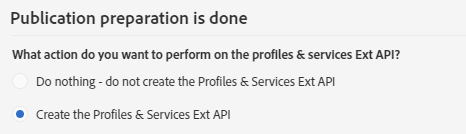
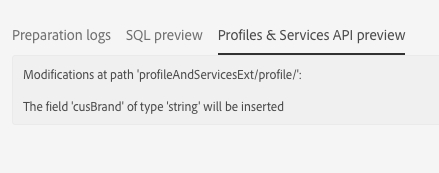

# Aggiornamento della struttura del database{#updating-the-database-structure}

Per rendere effettive le modifiche al modello dati e utilizzarle, è necessario aggiornare la struttura del database.

>[!NOTE]
>
>Le risorse personalizzate vengono aggiornate automaticamente durante gli aggiornamenti automatici eseguiti da Adobe.

## Pubblicazione di una risorsa personalizzata {#publishing-a-custom-resource}

Per applicare le modifiche eseguite sulle risorse, è necessario eseguire un aggiornamento del database.

>[!NOTE]
>
>Se un campo di una risorsa personalizzata utilizzata in un evento viene modificato o eliminato, l'evento corrispondente viene automaticamente annullato. See [Configuring Transactional messaging](../../administration/using/configuring-transactional-messaging.md).

1. Dal menu avanzato, tramite il logo Adobe Campaign, seleziona **[!UICONTROL Administration]** &gt; **[!UICONTROL Development]**, quindi **[!UICONTROL Publishing]**.
1. Per impostazione predefinita, l'opzione **[!UICONTROL Determine modifications since the last publication]** è selezionata, il che significa che verranno applicate solo le modifiche eseguite dall'ultimo aggiornamento.

   >[!NOTE]
   >
   >Viene **[!UICONTROL Repair database structure]** ristabilita una configurazione corretta se la pubblicazione non è riuscita prima del completamento. Eventuali modifiche eseguite direttamente nel database e non utilizzando risorse personalizzate verranno eliminate.

   

1. Fare clic sul **[!UICONTROL Prepare publication]** pulsante per avviare l'analisi. Tenere presente che è necessario eseguire grandi aggiornamenti delle tabelle quando l'istanza non è occupata intensamente dai flussi di lavoro.

   Per ulteriori informazioni sull'azione da eseguire nell'API Profili e servizi, consultate [Pubblicazione di una risorsa con estensione](#publishing-a-resource-with-api-extension)API.

   

1. Una volta effettuata la pubblicazione, fare clic sul **[!UICONTROL Publish]** pulsante per applicare le nuove configurazioni.
1. Dopo la pubblicazione, il **[!UICONTROL Summary]** riquadro di ciascuna risorsa indica che lo stato è ora **[!UICONTROL Published]** e specifica la data dell’ultima pubblicazione.

   >[!NOTE]
   >
   >Se si apportano nuove modifiche a una risorsa, è necessario ripetere l'operazione per applicare le modifiche.

   Se lo stato delle risorse è **[!UICONTROL Pending re-draft]** precedente alla pubblicazione, verrà visualizzato un messaggio aggiuntivo che invita a controllare le azioni, in quanto la pubblicazione darà luogo a modifiche definitive (eliminazione di colonne, tabelle...). Per facilitare l'esecuzione di quest'ultima modifica, è disponibile una **[!UICONTROL SQL Script]** scheda. Fornisce il comando SQL che verrà eseguito durante la pubblicazione.

   

   >[!NOTE]
   >
   >Per arrestare il processo di rielaborazione, fare clic sul **[!UICONTROL Cancel re-draft]** pulsante. Questa azione ripristina lo stato originale della risorsa.

1. Se la pubblicazione non è riuscita, è sempre possibile tornare alla pubblicazione precedente facendo clic su **[!UICONTROL Back to latest successful publication]**.

   Se la pubblicazione viene lasciata in uno stato di errore, non appena si accede all’istanza viene visualizzata una finestra a comparsa per ricordare di correggere la pubblicazione. L'istanza non verrà aggiornata con le nuove versioni del prodotto finché la pubblicazione non sarà stata corretta.

   

## Pubblicazione di una risorsa con estensione API {#publishing-a-resource-with-api-extension}

Puoi creare l'API Profilo e Servizi nei seguenti casi:

* Quando estendete le risorse personalizzate **[!UICONTROL Profiles]** o **[!UICONTROL Services]**, potete eseguire un aggiornamento dell'API Profili e servizi per integrare i campi dichiarati nell'estensione delle risorse personalizzate.
* Quando definite una risorsa personalizzata e create un collegamento tra le risorse **[!UICONTROL Profiles]** o **[!UICONTROL Services]** e la risorsa personalizzata, potete eseguire un aggiornamento per includere la nuova risorsa nell'API.

Potete selezionare questa opzione nella schermata della pubblicazione.

* Se l'API non è ancora stata pubblicata (ovvero se non avete mai esteso la risorsa o se non avete ancora selezionato questa opzione per questa risorsa o un'altra risorsa), potete scegliere se crearla o meno.

   

* Se l'API è già stata pubblicata (ovvero se avete già esteso la risorsa e selezionato questa opzione una volta), l'aggiornamento dell'API viene forzato.

   Infatti, una volta creata, l'API viene automaticamente aggiornata ogni volta che viene pubblicata di nuovo. In questo modo si evita di interrompere la risorsa del profilo o del servizio di questa API e di danneggiare l'istanza.

Per impostazione predefinita, la risorsa personalizzata è integrata, ma per un comportamento specifico, se non desiderate pubblicare la risorsa, potete selezionare l'opzione **[!UICONTROL Hide this resource from APIs]** disponibile nella **[!UICONTROL Resource Properties]**.

Dopo il **[!UICONTROL Prepare Publication]** passaggio, Adobe Campaign visualizza il delta tra la versione corrente dell'API e la versione futura dopo la pubblicazione nella scheda **[!UICONTROL Profiles & Services API Preview]**. Se estendete l'API per la prima volta, il delta confronta la definizione di risorsa personalizzata out-of-the-box con l'estensione.

Le informazioni visualizzate nella scheda sono suddivise in tre sezioni: elementi aggiunti, eliminati e modificati.

L'analisi del delta è un passaggio obbligatorio in quanto il passaggio della pubblicazione modificherà il comportamento API e molto probabilmente influenzerà lo sviluppo circostante in un effetto domino.

>[!NOTE]
>
>Questa pubblicazione aggiorna l' **[!UICONTROL profilesAndServicesExt]** API. L' **[!UICONTROL profilesAndServices]** API non è aggiornata.

Per ulteriori informazioni sull'API di Adobe Campaign, consulta la documentazione dedicata di Adobe Campaign su [Adobe IO](https://docs.campaign.adobe.com/doc/standard/en/adobeio.html).
