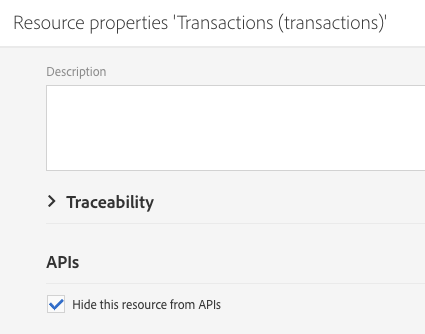

# Updating the database structure{#updating-the-database-structure}

Per rendere effettive le modifiche al modello dati e per utilizzarle, è necessario aggiornare la struttura del database.

>[!NOTE]
>
>Le risorse personalizzate vengono aggiornate automaticamente durante gli aggiornamenti automatici eseguiti da Adobe.

## Publishing a custom resource {#publishing-a-custom-resource}

Per applicare le modifiche apportate alle risorse, dovete eseguire un aggiornamento del database.

>[!NOTE]
>
>Se un campo di una risorsa personalizzata utilizzato in un evento viene modificato o eliminato, l'evento corrispondente verrà automaticamente non pubblicato. See [Configuring Transactional messaging](../../administration/using/configuring-transactional-messaging.md).

1. From the advanced menu, via the Adobe Campaign logo, select **[!UICONTROL Administration]** &gt; **[!UICONTROL Development]**, then **[!UICONTROL Publishing]**.
1. By default, the option **[!UICONTROL Determine modifications since the last publication]** is checked, which means that only the changes carried out since the last update will be applied.

   >[!NOTE]
   >
   >The **[!UICONTROL Repair database structure]** reestablishes a correct configuration if the publication failed before completing. Eventuali modifiche eseguite direttamente nel database e non utilizzando le risorse personalizzate verranno eliminate.

   

1. Click the **[!UICONTROL Prepare publication]** button to start the analysis. Tieni presente che gli aggiornamenti di grandi dimensioni devono essere effettuati quando l'istanza non è occupata in modo approfondito dai flussi di lavoro.

   To learn more on the action to perform on the Profiles &amp; Services API, refer to [Publishing a resource with API extension](../../developing/using/updating-the-database-structure.md#publishing-a-resource-with-api-extension).

   

1. Once the publication has been carried out, click the **[!UICONTROL Publish]** button to apply your new configurations.
1. Once published, the **[!UICONTROL Summary]** pane of each resource indicates that the status is now **[!UICONTROL Published]** and specifies the date of the last publication.

   >[!NOTE]
   >
   >Se apportate nuove modifiche a una risorsa, è necessario ripetere questa operazione per rendere effettive le modifiche.

   If resources have the **[!UICONTROL Pending re-draft]** status before publishing, then an additional message will appear inviting you to check your actions because publishing will result in definitive changes (deleting columns, tables...). To help you carry out this last change, an **[!UICONTROL SQL Script]** tab is available. Fornisce il comando SQL che verrà eseguito durante la pubblicazione.

   

   >[!NOTE]
   >
   >You can stop the Re-draft process by clicking the **[!UICONTROL Cancel re-draft]** button. Questa azione ripristina l'originale dello stato della risorsa.

1. If your publication failed, you can always go back to the previous publication by clicking **[!UICONTROL Back to latest successful publication]**.

   Tenete presente che, se lasciate la pubblicazione in stato non riuscito, viene aperta una finestra a comparsa non appena accedete all'istanza per ricordarvi di risolvere la pubblicazione. Fino alla correzione della pubblicazione, l'istanza non verrà aggiornata con nuove versioni di prodotto.

   

## Publishing a resource with API extension {#publishing-a-resource-with-api-extension}

Puoi creare l'API Profilo e Servizi nei casi seguenti:

* When you extend the custom resources **[!UICONTROL Profiles]** or **[!UICONTROL Services]**, you can perform an update of the Profiles and Services API to integrate the fields declared in the custom resources extension.
* When you define a custom resource and you create a link between the resources **[!UICONTROL Profiles]** or **[!UICONTROL Services]** and the custom resource, you can perform an update to include the new resource in the API.

Potete selezionare questa opzione nella schermata di pubblicazione.

* Se l'API non è ancora stata pubblicata (ossia se non hai mai esteso la risorsa o se non hai ancora controllato questa opzione per la risorsa o un'altra risorsa), puoi crearla o meno.

   

* Se l'API è già stata pubblicata (ossia se avete già esteso la risorsa e verificate questa opzione una volta), viene imposto l'aggiornamento API.

   Una volta creata, l'API viene aggiornata automaticamente ogni volta che la pubblicate nuovamente. In modo da evitare la suddivisione della risorsa di profilo o servizio dell'API e il danneggiamento dell'istanza.

Note that by default, the custom resource is integrated, but, for a specific behavior, if you don't want to publish this resource, you can select the option **[!UICONTROL Hide this resource from APIs]** available in the **[!UICONTROL Resource Properties]**.

After the **[!UICONTROL Prepare Publication]** step, Adobe Campaign displays the delta between the current version of the API and the future version after the publication in the tab **[!UICONTROL Profiles & Services API Preview]**. Se ampliate l'API per la prima volta, il delta confronta la definizione di risorse personalizzate out-of-the-box con l'estensione.

Le informazioni visualizzate nella scheda sono suddivise in tre sezioni: elementi aggiunti, eliminati e modificati.

L'analisi del delta è un passaggio obbligatorio quando il passaggio di pubblicazione modificherà il comportamento dell'API e molto probabilmente influenzerà lo sviluppo circostante in un effetto domino.

>[!NOTE]
>
>This publication updates the **[!UICONTROL profilesAndServicesExt]** API. The **[!UICONTROL profilesAndServices]** API is not updated.

For more information on the Adobe Campaign API, consult the dedicated Adobe Campaign documentation on [Adobe IO](https://docs.campaign.adobe.com/doc/standard/en/adobeio.html).
