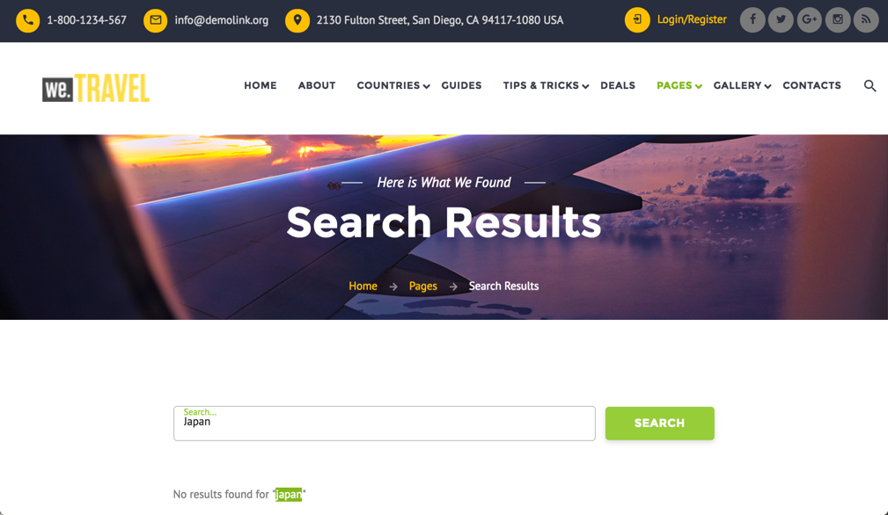

# Casi di utilizzo degli attivatori di abbandono{#abandonment-triggers-use-cases}

Questa sezione presenta diversi casi di utilizzo che possono essere implementati utilizzando l'integrazione tra Adobe Campaign e Experience Cloud Triggers. Sono disponibili due esempi di casi di utilizzo:

* [Trigger](#browse-abandonment-trigger)abbandono navigazione: inviare una comunicazione ai clienti che hanno abbandonato la visita sul sito Web.
* [Trigger](#search-abandonment-trigger)abbandono ricerca: coinvolgere nuovamente i visitatori che hanno effettuato una ricerca sul sito Web, ma che non hanno effettuato un acquisto.

>[!NOTE]
>
>I casi di utilizzo descritti in questa sezione si basano sull’ID visitatore di Experience Cloud. È inoltre possibile implementarli con l’ID dichiarato di Experience Cloud. Sono supportati anche gli ID dichiarati crittografati e con hash. Puoi inviare e-mail/SMS a un profilo inesistente in Campaign decrittografando direttamente l'indirizzo e-mail o il numero di cellulare crittografati. In questo caso, tuttavia, non è possibile utilizzare la personalizzazione utilizzando i dati del profilo.

## Prerequisiti {#pre-requisites}

Per implementare questi casi di utilizzo, è necessario avere accesso alle soluzioni/ai servizi di base seguenti:

* Adobe Campaign
* Adobe Analytics Ultimate, Premium, Foundation, OD, Select, Prime, Mobile Apps, Select o Standard.
* Servizio di base di Experience Cloud Triggers
* Servizio di base Experience Cloud DTM
* ID visitatore Experience Cloud e servizio di base Experience Cloud People

Dovete anche avere un sito Web funzionante.

Per ulteriori informazioni, consulta [Configurazione di soluzioni e servizi](../../integrating/using/configuring-triggers-in-experience-cloud.md#configuring-solutions-and-services).

## Trigger abbandono Sfoglia {#browse-abandonment-trigger}

In questo caso d'uso, creeremo un semplice trigger che verrà attivato ogni volta che un cliente abbandona una visita sul sito web. Questo esempio presuppone che DTM raccolga e invii già dati ad Adobe Analytics e che tutti gli eventi siano stati creati.

### Creazione di un attivatore Experience Cloud Triggers {#creating-an-experience-cloud-trigger}

1. Selezionate **[!UICONTROL Manage Triggers]** dal menu Servizio di base attivazione di Experience Cloud.

   

1. Scegliete un tipo di trigger ( **[!UICONTROL Abandonment]** nel caso in cui lo si utilizzi).

   

1. Per questo caso d'uso, abbiamo bisogno di un semplice trigger di abbandono. Lo scopo di business è quello di identificare i visitatori che sfogliano il nostro sito web di prenotazione viaggio, guardare la pagina "Offerte" ma non prenotare alcun viaggio. Una volta identificato questo pubblico, vogliamo raggiungerlo entro breve tempo. In questo esempio, scegliamo di inviare l'attivatore dopo un periodo di 10 minuti.

   

### Utilizzo dell'attivatore in Adobe Campaign {#using-the-trigger-in-adobe-campaign}

Ora che abbiamo creato un Experience Cloud Trigger, utilizzalo in Adobe Campaign.

In Adobe Campaign, devi creare un trigger collegato a quello creato in Experience Cloud.

1. Per creare l'attivatore in Adobe Campaign, fai clic sul **[!UICONTROL Adobe Campaign]** logo, nell'angolo in alto a sinistra, quindi seleziona **[!UICONTROL Marketing plans]** &gt; **[!UICONTROL Transactional messages]** &gt; **[!UICONTROL Experience Cloud triggers]**.

   

1. Click **[!UICONTROL Create]**.
1. Seleziona l’attivatore creato in precedenza e fai clic su **[!UICONTROL Next]**.

   

1. Selezionate il **[!UICONTROL Email]** canale e la dimensione di **[!UICONTROL Real-time event]** targeting e fate clic su **[!UICONTROL Create]**.

   

1. Pubblicate il trigger in Adobe Campaign. Questo processo creerà automaticamente un modello di messaggio transazionale.

   

1. Per visualizzare il modello del messaggio, fai clic sul **[!UICONTROL More]** pulsante, in alto a destra, quindi fai clic su **[!UICONTROL Trigger Transactional Template]**.

1. Personalizzare il contenuto e i dettagli del mittente.

   

1. Pubblicate il modello di messaggio. Il trigger è ora attivo e funzionante.

   

### Esecuzione dello scenario {#running-the-scenario}

1. Questo caso di utilizzo inizia con un messaggio e-mail iniziale inviato al pubblico con Adobe Campaign.

   

1. Il destinatario apre il messaggio e-mail.

   

1. Clicca su un link che lo porta al tuo sito web. In questo esempio, il banner porta il destinatario nella home page del sito Web di prenotazione del viaggio.

   

1. Il destinatario va alla pagina "Offerte" ma improvvisamente interrompe la sua visita. Dopo 10 minuti, Adobe Campaign attiva l'invio del messaggio transazionale.

   

1. In qualsiasi momento, puoi controllare i registri di Experience Cloud per vedere quante volte è stato attivato l’attivatore.

   

1. Puoi anche visualizzare il rapporto di attivazione di Adobe Campaign.

   

## Trigger abbandono ricerca {#search-abandonment-trigger}

In questo caso d'uso, creeremo un trigger per coinvolgere nuovamente i visitatori che sono andati sul nostro sito web di prenotazione del viaggio, hanno cercato una destinazione, non hanno trovato risultati di successo, e non hanno registrato nulla dopo. Il processo generale è lo stesso del precedente caso di utilizzo (vedere Trigger di abbandono [Sfoglia](#browse-abandonment-trigger)). Qui ci concentreremo su come personalizzare il messaggio e-mail di remarketing.

### Creazione di un attivatore Experience Cloud Triggers {#creating-an-experience-cloud-trigger-1}

Segui i passaggi descritti nel caso di utilizzo precedente per creare Experience Cloud Trigger. Consulta [Creazione di un attivatore](#creating-an-experience-cloud-trigger)Experience Cloud Trigger. La differenza principale è la definizione del trigger.

La **[!UICONTROL Include Meta Data]** sezione consente di trasmettere tutti i dati raccolti da Analytics al payload Trigger. In questo esempio, creiamo una eVar personalizzata (ad esempio, eVar 3) per raccogliere il termine di ricerca immesso dal visitatore. Questo termine verrà quindi utilizzato nel messaggio e-mail transazionale inviato allo stesso visitatore.

### Utilizzo dell'attivatore in Adobe Campaign {#using-the-trigger-in-adobe-campaign-1}

1. Segui i passaggi descritti nel caso di utilizzo precedente per creare l'attivatore in Adobe Campaign. Consulta [Utilizzo dell'attivatore in Adobe Campaign](#using-the-trigger-in-adobe-campaign). La differenza principale è il modo in cui accediamo e utilizziamo, in Adobe Campaign, i metadati inviati nel payload Trigger.
1. Nell'attivatore di abbandono della ricerca creato in Adobe Campaign, fai clic sull' **[!UICONTROL Event content and enrichment]** icona per visualizzare il payload inviato ad Adobe Campaign.

   

1. Come potete vedere, l'eVar personalizzata viene passata nel payload Trigger e mappata alla tabella Contesto **** evento (ctx). Ora possiamo accedervi per personalizzare il messaggio transazionale.

   

1. In questo esempio, scegliamo di includere il termine di ricerca di destinazione sia nella riga dell’oggetto che nel corpo dell’e-mail.

   

1. Quando selezionate un campo personalizzato, cercate i metadati del payload nella tabella Evento **transazionale (rtEvent), quindi nella tabella secondaria Contesto** **** evento (ctx).

   

### Esecuzione dello scenario {#running-the-scenario-1}

1. Il visitatore va sul sito web della prenotazione del viaggio e cerca una destinazione. In questo esempio, il visitatore sta cercando un viaggio in Giappone ma non trova alcun risultato. Questa è un'opportunità per noi di raggiungere questo visitatore e consigliare un piano di viaggio alternativo.

   

   >[!NOTE]
   >
   >In questo caso d’uso, supponiamo che il visitatore/destinatario abbia già aperto e fatto clic su un’e-mail proveniente dallo stesso sito Web. Questo ci consente di utilizzare e raccogliere l’ID visitatore e mapparlo al destinatario. Dobbiamo fare questo solo una volta.

1. Pochi minuti dopo, lo stesso visitatore/destinatario riceve un messaggio di remarketing. Il messaggio include la destinazione ricercata di recente.

   

