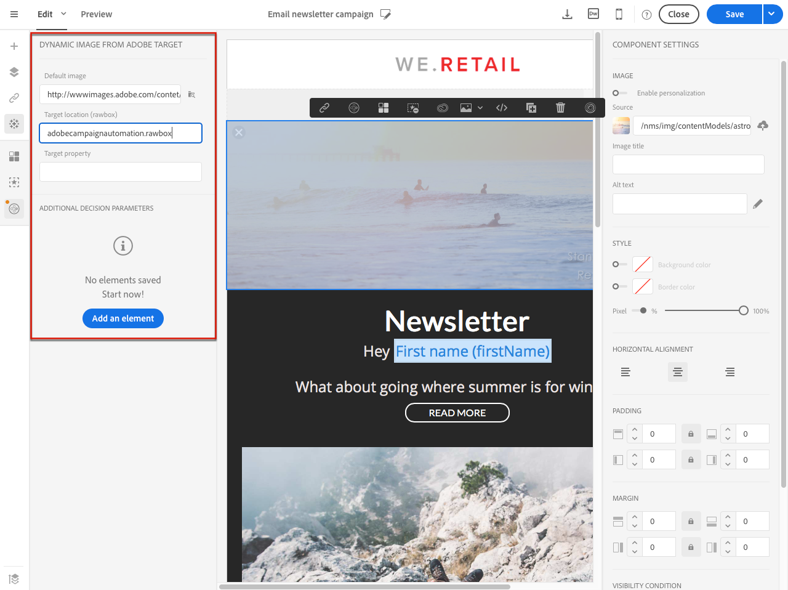

# Adding Target dynamic content{#adding-target-dynamic-content}

Con l'integrazione di Adobe Target, le immagini dinamiche possono essere aggiunte in una distribuzione per personalizzare i contenuti in base alle esperienze.

Quando si modifica un'e-mail, è possibile inserire un'immagine dinamica da Adobe Target che cambia a seconda dei destinatari.

Prima di accedere all'immagine in Adobe Campaign, le seguenti attività devono essere eseguite prima in Adobe Target:

* Create one or several [redirect offers](https://docs.adobe.com/content/help/en/target/using/experiences/offers/offer-redirect.html), in which you must specify the URL of the image you will be using.
* Create one or several [audiences](https://marketing.adobe.com/resources/help/en_US/target/ov/c_about_segments.html), to define the target of your activity.
* Create a [Form-based experience composer](https://marketing.adobe.com/resources/help/en_US/target/target/t_form_experience_composer.html) activity, in which you have to select a rawbox and specify several experiences, depending on the number of redirect offers created. Per ogni esperienza, dovete selezionare una delle offerte di reindirizzamento create.
* Crea segmenti utilizzando informazioni di Adobe Campaign per specificare esperienze. Per utilizzare i dati di Adobe Campaign nelle regole di selezione dell'offerta, devi specificare i dati nella rawbox in Adobe Target.

1. Creare un'e-mail di consegna.
1. When editing the content of an email or a landing page, go to an image block, then select **[!UICONTROL Dynamic image from Adobe Target]** via the contextual menu.

   

1. Selezionate l'immagine che verrà visualizzata per impostazione predefinita nell'e-mail. You can directly specify the image URL or select an image shared via [Assets](../../integrating/using/working-with-campaign-and-assets-core-service.md).

   L'integrazione supporta solo le immagini statiche. Il resto del contenuto non è personalizzabile.

1. Immettete il nome della rawbox specificata in Adobe Target.
1. Se utilizzate le autorizzazioni Enterprise nelle impostazioni in Adobe Target, aggiungete la proprietà corrispondente in questo campo. Learn more about Target Enterprise permissions in [this page](https://marketing.adobe.com/resources/help/en_US/target/target/properties-overview.html). Questo campo è facoltativo e non obbligatorio se non utilizzate le autorizzazioni Enterprise in Target.
1. In **[!UICONTROL Additional decision parameters]**, specify the mapping between the fields defined in the Adobe Target segments and the Adobe Campaign fields.

   I campi Adobe Campaign utilizzati devono essere stati specificati nella rawbox. Qui, definiremo esperienze diverse a seconda del genere del destinatario.

   

1. Visualizzate l'anteprima dell'e-mail per verificare se, quando selezionate profili diversi, l'immagine inserita cambia in base ai parametri specificati nell'attività Adobe Target e in Adobe Campaign.

Ora è possibile inviare la distribuzione contenente l'immagine dinamica. I risultati sono disponibili in Adobe Target.

**Argomenti correlati:**

* [Adobe Target Portal](https://marketing.adobe.com/resources/help/en_US/target/a4t/c_campaign_and_target.html)
* [Informazioni sulla progettazione di contenuto e-mail](../../designing/using/about-email-content-design.md)
* [Personalizza le immagini e-mail nel](https://helpx.adobe.com/marketing-cloud/how-to/email-marketing.html) video in tempo reale

