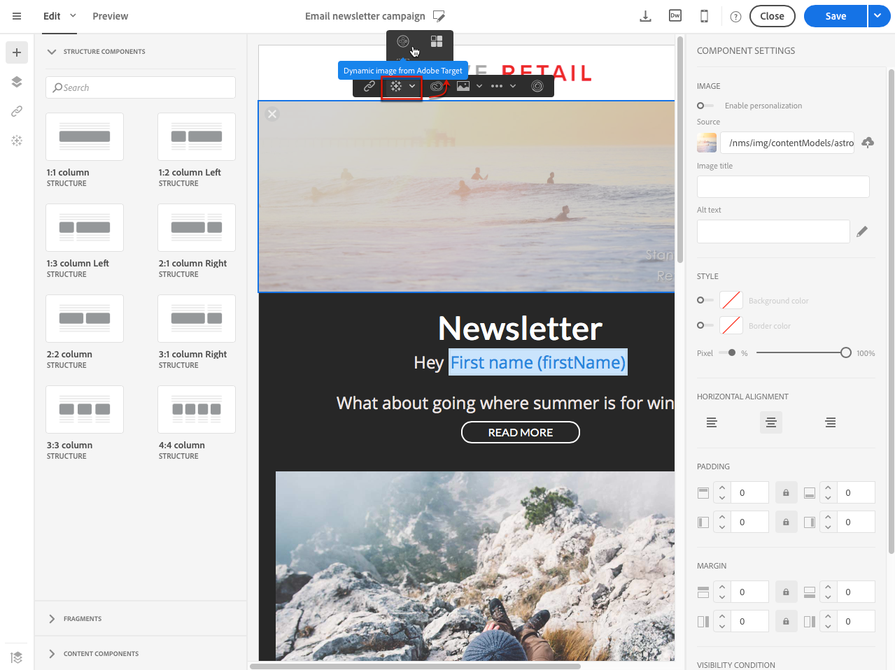

# Aggiunta di contenuto dinamico Target{#adding-target-dynamic-content}

Con l’integrazione di Adobe Target, è possibile aggiungere immagini dinamiche a una consegna per personalizzare il contenuto in base alle esperienze.

Durante la modifica di un’e-mail, puoi inserire da Adobe Target un’immagine dinamica che cambia a seconda dei destinatari.

Prima di accedere all’immagine in Adobe Campaign, è necessario eseguire le seguenti attività in Adobe Target:

* Crea una o più [offerte di reindirizzamento](https://experienceleague.adobe.com/docs/target/using/experiences/offers/offer-redirect.html), in cui devi specificare l&#39;URL dell&#39;immagine che userai.
* Crea uno o più [tipi di pubblico](https://experienceleague.adobe.com/docs/target/using/audiences/create-audiences/audiences.html) per definire la destinazione dell&#39;attività.
* Crea un&#39;attività [Compositore esperienza basato su moduli](https://experienceleague.adobe.com/docs/target/using/experiences/form-experience-composer.html), in cui devi selezionare una rawbox e specificare diverse esperienze, a seconda del numero di offerte di reindirizzamento create. Per ogni esperienza, devi selezionare una delle offerte di reindirizzamento create.
* Crea segmenti utilizzando le informazioni di Adobe Campaign per specificare le esperienze. Per utilizzare i dati di Adobe Campaign nelle regole di selezione dell’offerta, è necessario specificare i dati nella rawbox in Adobe Target.

1. Creare una consegna e-mail.
1. Quando modifichi il contenuto di un&#39;e-mail o di una pagina di destinazione, passa a un blocco di immagine, quindi seleziona **[!UICONTROL Dynamic image from Adobe Target]** tramite il menu contestuale.

   

1. Seleziona l’immagine che verrà visualizzata per impostazione predefinita nell’e-mail. Puoi specificare direttamente l&#39;URL dell&#39;immagine o selezionare un&#39;immagine condivisa tramite [Assets](../../integrating/using/working-with-campaign-and-assets-core-service.md).

   L’integrazione supporta solo immagini statiche. Il resto del contenuto non è personalizzabile.

1. Immetti il nome della rawbox specificata in Adobe Target.
1. Se utilizzi le autorizzazioni Enterprise nelle impostazioni di Adobe Target, aggiungi la proprietà corrispondente in questo campo. Ulteriori informazioni sulle autorizzazioni di Target Enterprise in [questa pagina](https://experienceleague.adobe.com/docs/target/using/administer/manage-users/enterprise/properties-overview.html). Questo campo è facoltativo e non obbligatorio se non utilizzi le autorizzazioni Enterprise in Target.
1. In **[!UICONTROL Additional decision parameters]**, specifica il mapping tra i campi definiti nei segmenti di Adobe Target e i campi di Adobe Campaign.

   I campi Adobe Campaign utilizzati devono essere stati specificati nella rawbox. In questo esempio, definisci esperienze diverse a seconda del sesso del destinatario.

   

1. Visualizza l’anteprima del messaggio e-mail per vedere se, selezionando diversi profili, l’immagine inserita cambia a seconda dei parametri specificati nell’attività di Adobe Target e in Adobe Campaign.

È ora possibile inviare la consegna contenente l’immagine dinamica. I risultati sono disponibili in Adobe Target.

**Argomenti correlati:**

* [Portale Adobe Target](https://experienceleague.adobe.com/docs/target/using/integrate/campaign-and-target.html)
* [Informazioni sulla progettazione di contenuti e-mail](../../designing/using/designing-content-in-adobe-campaign.md)
* [Personalizzazione delle immagini e-mail in video in tempo reale](https://helpx.adobe.com/it/marketing-cloud/how-to/email-marketing.html)
