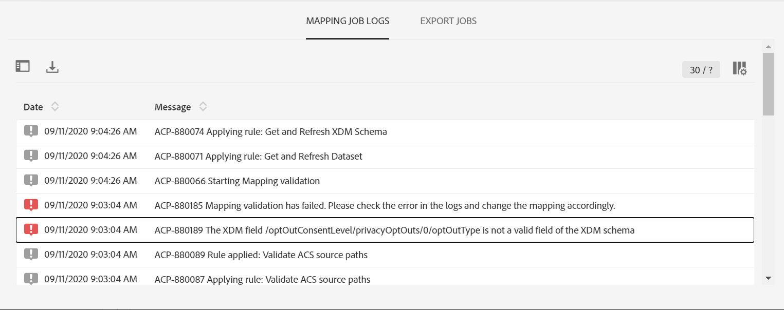
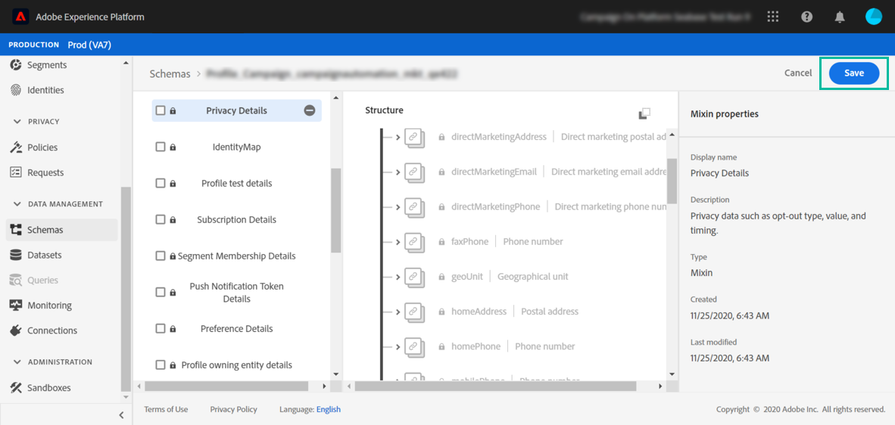

# Attivazione mappature {#mapping-activation}

>[!IMPORTANT]
>
>Adobe Experience Platform Data Connector è attualmente in versione beta, che potrebbe essere soggetta a frequenti aggiornamenti senza preavviso. Per accedere a queste funzionalità, i clienti devono essere ospitati su Azure (attualmente in versione beta solo per il Nord America). Per accedere, contatta l’Assistenza clienti di Adobe.

Una volta completata la definizione della mappatura, puoi pubblicare la mappatura. Dopo la fase di distribuzione, la replica dei dati tra Campaign Standard e Adobe Experience Platform viene avviata automaticamente. In qualsiasi momento, puoi interrompere la replica facendo clic sul pulsante **[!UICONTROL Stop]** .

A seconda delle modifiche di mappatura, puoi scegliere di inviare nuovamente tutti i tuoi record a Adobe Experience Platform.

Dal riquadro di distribuzione è possibile accedere ai registri di pubblicazione ed esportazioni.

Nella scheda **[!UICONTROL Export jobs]** puoi monitorare il processo di esportazione per la mappatura pubblicata.

Per monitorare tutti i processi di esportazione dei dati, vai al menu **[!UICONTROL Administration]** > **[!UICONTROL Development]** > **[!UICONTROL Platform]** > **[!UICONTROL Status of data export to platform]** .

Gli stati dei processi di inserimento dati sono:

* **[!UICONTROL Created]**: Viene creato un processo di inserimento dei dati e l’inserimento dei dati è in corso.
* **[!UICONTROL Failed]**: Un processo di inserimento dei dati non è riuscito. Il campo reason descrive il motivo dell’errore. L&#39;errore può essere temporaneo o permanente. In caso di errori transitori, viene creato un nuovo processo di acquisizione dopo un intervallo configurato. Come primo passo per la risoluzione dei problemi, l&#39;utente può controllare il campo del motivo dell&#39;errore. Se il motivo reindirizza un utente all’interfaccia utente di Adobe Experience Platform, l’utente può accedere a Adobe Experience Platform e può controllare lo stato del batch nel set di dati per determinare il motivo esatto dell’errore.
* **[!UICONTROL Uploaded]**: Un batch viene prima creato in Adobe Experience Platform e i dati vengono quindi acquisiti nel batch. Il campo ID batch mostra l&#39;ID batch del batch in Adobe Experience Platform. Adobe Experience Platform esegue anche una convalida post sul batch. Il batch viene inizialmente contrassegnato come caricato fino a quando Adobe Experience Platform completa il passaggio di post convalida. Un processo continua a eseguire il polling di Adobe Experience Platform per lo stato del batch dopo il caricamento. Un batch può passare in Convalida post non riuscita o in stato di successo in Adobe Experience Platform.
* **[!UICONTROL Success]**: Dopo il caricamento di un batch in Adobe Experience Platform, lo stato del processo (post convalida in platform) viene controllato dopo un intervallo configurato. Uno stato &quot;Success&quot; ha identificato un’acquisizione di dati riuscita in Adobe Experience Platform.

In alcuni casi, potresti ricevere l’errore di convalida seguente durante la pubblicazione della mappatura.

Questo si verifica quando lo schema XDM utilizzato non è stato aggiornato con il campo XDM più recente relativo alla gestione della privacy e contiene ancora il campo XDM &quot;ccpa&quot; obsoleto.

Per aggiornare lo schema XDM, effettua le seguenti operazioni:

1. Vai al set di dati su Adobe Experience Platform utilizzando il collegamento presente nella pagina di mappatura XDM.

1. Passa allo schema XDM.

1. Aggiungi il mixin **[!UICONTROL Profile Privacy]** allo schema.

   

1. Salva lo schema, quindi riprova a pubblicare la mappatura. Ora la pubblicazione deve passare.

   
