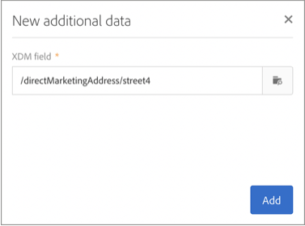

# Personalizzazione di campagne tramite gli attributi di Adobe Experience Platform {#personalizing-campaigns-using-aep-attributes}

>[!IMPORTANT]
>
>Il servizio Audience Destinations è attualmente in versione beta e potrebbe essere soggetto a frequenti aggiornamenti senza preavviso. Per accedere a queste funzionalità, i clienti devono essere ospitati su Azure (attualmente in versione beta solo per il Nord America). Per accedere, contatta l’Assistenza clienti di Adobe.
>
>**Push** e **In-App** i canali non sono ancora disponibili per la personalizzazione utilizzando dati contestuali di Adobe Experience Platform.

Una volta configurato il flusso di lavoro con un [Pubblico Adobe Experience Platform](../../integrating/using/aep-about-audience-destinations-service.md), puoi personalizzare i messaggi con gli attributi di profilo esistenti esclusivamente in Experience Data Model (XDM).

A questo scopo, devi aggiungere questi attributi nel **[!UICONTROL Read audience]** attività:

1. Apri **[!UICONTROL Read audience]** attività. In **[!UICONTROL Additional data]** fai clic sulla scheda **[!UICONTROL Create element]** pulsante .

   Tieni presente che **[!UICONTROL Additional data]** è disponibile solo dopo che è stato selezionato un pubblico di Adobe Experience Platform .

   

   >[!NOTE]
   >
   >I tipi di dati relativi a array e mappe non sono supportati in questa funzione. Inoltre, nel selettore verranno visualizzati solo i dati dello schema di unione.

1. Seleziona il campo XDM desiderato dall’elenco, quindi fai clic su **[!UICONTROL Confirm]**.

   

1. Fai clic sul pulsante **[!UICONTROL Add]** per aggiungerlo all’elenco dei dati aggiuntivi.

   

1. Ripeti questi passaggi per ogni campo XDM che desideri aggiungere al flusso di lavoro.

   >[!NOTE]
   >
   >Puoi aggiungere un massimo di 20 campi XDM in una **[!UICONTROL Read audience]** attività.

1. Una volta aggiunti tutti i campi, fai clic sul pulsante **[!UICONTROL Confirm]** per salvare le modifiche. Ora saranno disponibili per personalizzare le consegne.

Per ulteriori informazioni su come creare e personalizzare le consegne, consulta la documentazione di Campaign Standard:

* [Esplorazione dei canali di comunicazione](../../channels/using/get-started-communication-channels.md)
* [Informazioni sulle attività del canale](../../automating/using/about-channel-activities.md)
* [Personalizzazione delle consegne](../../designing/using/personalization.md)
