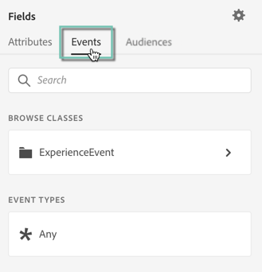
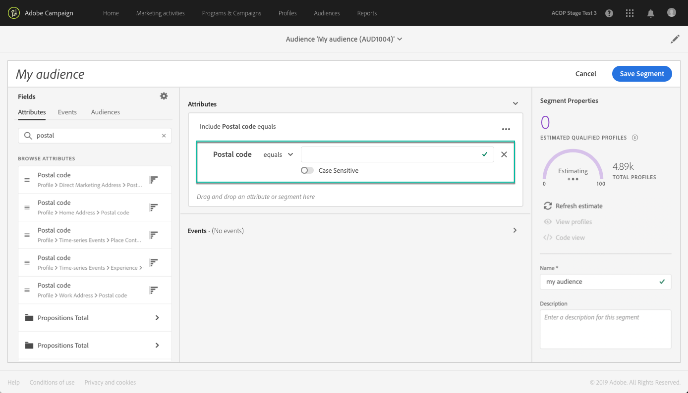

# Utilizzo del Generatore di segmenti {#using-the-segment-builder}

>[!IMPORTANT]
>
>Il servizio Audience Destinations è attualmente in versione beta, e potrebbe essere soggetto ad aggiornamenti frequenti senza preavviso. Per accedere a queste funzionalità, i clienti devono essere ospitati su Azure (attualmente in versione beta solo per il Nord America). Contatta l’Assistenza clienti di Adobe se desideri accedervi.

Il Generatore di segmenti consente di creare tipi di pubblico definendo regole basate sui dati provenienti dal [Profilo cliente in tempo reale](https://experienceleague.adobe.com/docs/experience-platform/profile/home.html).

Questa sezione presenta i concetti globali durante la creazione di un segmento. Per informazioni dettagliate sul Generatore di segmenti stesso, consulta [Guida utente di Segment Builder](https://experienceleague.adobe.com/docs/experience-platform/segmentation/ui/overview.html).

L’interfaccia del Generatore di segmenti è composta come segue:

* Il riquadro a sinistra fornisce tutti gli attributi, gli eventi e i tipi di pubblico disponibili per creare il segmento trascinando i campi desiderati nell’area di lavoro del Generatore di segmenti.
* L’area centrale fornisce un’area di lavoro per creare il segmento definendo e combinando regole dai campi disponibili.
* L’intestazione e il riquadro di destra visualizzano le proprietà del segmento (ovvero nome, descrizione e profili qualificati stimati per il segmento).

## Creazione di un segmento

Per creare un segmento, effettua le seguenti operazioni:

Ora il Generatore di segmenti dovrebbe essere visualizzato nell’area di lavoro. Consente di creare un segmento utilizzando i dati di Adobe Experience Platform che verranno utilizzati per creare il pubblico.

1. Assegna un nome al segmento, quindi inserisci una descrizione (facoltativa).

   

1. Assicurati che il criterio di unione desiderato sia selezionato nel riquadro delle impostazioni.

   Per ulteriori informazioni sui criteri di unione, consulta la sezione dedicata dalla sezione [Guida utente di Segment Builder](https://experienceleague.adobe.com/docs/experience-platform/segmentation/ui/overview.html).

   

1. Cercare i campi desiderati nel riquadro di sinistra e trascinarli nell&#39;area di lavoro centrale.

   

1. Configura le regole corrispondenti ai campi trascinati.

   

1. Fai clic sul pulsante **[!UICONTROL Create segment]**.

## Ricerca dei campi corretti per un segmento

Nel riquadro a sinistra sono elencati tutti gli attributi, gli eventi e i tipi di pubblico disponibili per la creazione di regole.

I campi elencati sono attributi acquisiti dalla società e sono stati resi disponibili tramite [Sistema Experience Data Model (XDM)](https://experienceleague.adobe.com/docs/experience-platform/xdm/home.html).

I campi sono organizzati in schede:

* **[!UICONTROL Attributes]**: attributi di profili esistenti che possono provenire dal database Adobe Campaign e/o Adobe Experience Platform. Si riferiscono a informazioni statiche allegate a un profilo (ad esempio indirizzo e-mail, paese di residenza, stato del programma fedeltà, ecc.).

  

* **[!UICONTROL Events]**: attività che identificano i consumatori che hanno avuto qualche interazione con i punti di contatto dei clienti della tua azienda, ad esempio &quot;chiunque abbia ordinato due volte in due settimane&quot;. Può essere inviato in streaming da Adobe Analytics o acquisito direttamente in Adobe Experience Platform utilizzando strumenti ETL di terze parti.

  

>[!NOTE]
>
>**Segmentazione di più entità** consente di estendere i dati profilo con dati aggiuntivi basati su prodotti, store o altre classi non di profilo. Una volta effettuata la connessione, i dati provenienti da classi aggiuntive diventano disponibili come se fossero nativi per lo schema Profilo.
>
>Per ulteriori informazioni, consulta la [documentazione dedicata](https://experienceleague.adobe.com/docs/experience-platform/segmentation/multi-entity-segmentation.html).

Per impostazione predefinita, il Generatore di segmenti visualizza i campi in cui i dati sono già presenti. Per visualizzare lo schema completo, inclusi i campi per i quali non sono presenti dati, abilita **[!UICONTROL Show full XDM schema]** dalle impostazioni.

Il simbolo alla fine di ogni campo fornisce informazioni aggiuntive sull&#39;attributo e su come utilizzarlo.

## Definizione delle regole per un segmento

>[!NOTE]
>
>La sezione seguente fornisce informazioni globali sulla definizione delle regole. Per ulteriori informazioni, consulta [Guida utente di Segment Builder](https://experienceleague.adobe.com/docs/experience-platform/segmentation/ui/overview.html).

Per creare una regola, effettua le seguenti operazioni:

1. Trova il campo dal riquadro a sinistra che riflette gli attributi o gli eventi su cui sarà basata la regola.

1. Trascina il campo nell’area di lavoro centrale, quindi configuralo in base alla definizione del segmento desiderata. A questo scopo, sono disponibili diverse funzioni stringa e data/ora.

   Nell’esempio seguente, la regola eseguirà il targeting di tutti i profili con genere uguale a &quot;Maschio&quot;.

   

   La popolazione stimata corrispondente al segmento viene ricalcolata automaticamente nel **[!UICONTROL Segment Properties]** sezione.

1. Il **[!UICONTROL View Profiles]** Questo pulsante ti consente di visualizzare in anteprima i primi 20 record corrispondenti alla regola, consentendoti di convalidare rapidamente il segmento.

   

   Puoi aggiungere tutte le regole aggiuntive necessarie per eseguire il targeting dei profili giusti.

   Quando si aggiunge una regola a un contenitore, questa viene aggiunta a tutte le regole esistenti con l’operatore logico AND. Se necessario, fai clic sull’operatore logico per modificarlo.

   

Una volta collegate, le due regole formano un contenitore.

## Confronto dei campi

Il Generatore di segmenti consente di confrontare due campi per definire una regola. Ad esempio, le donne il cui indirizzo principale si trova in un codice postale diverso dall’indirizzo di lavoro.

Per farlo, segui questi passaggi:

1. Trascinare il primo campo che si desidera confrontare, ad esempio il CAP dell&#39;indirizzo dell&#39;abitazione, nell&#39;area di lavoro centrale.

   

1. Seleziona il secondo campo (ad esempio, il codice postale dell’indirizzo dell’ufficio) che verrà confrontato con il primo campo.

   Trascinarlo nel workspace centrale, nello stesso contenitore del primo campo, nel **[!UICONTROL Drop here to compare operands]** casella.

   

1. Configura l’operatore tra i due campi come desiderato. In questo esempio, vogliamo che il segmento esegua il targeting di profili con l’indirizzo dell’abitazione diverso da quello dell’ufficio.

   

La regola ora è configurata ed è pronta per essere attivata come pubblico.
