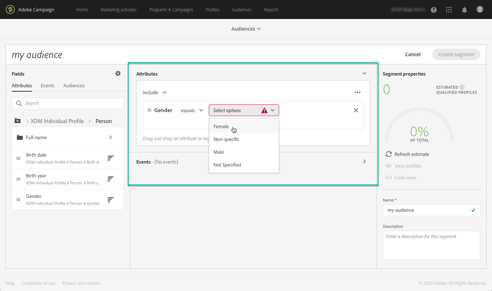

# Utilizzo del Generatore di segmenti {#using-the-segment-builder}

>[!IMPORTANT]
>
>Il servizio Audience Destinations è attualmente in versione beta e potrebbe essere soggetto a frequenti aggiornamenti senza preavviso. Per accedere a queste funzionalità, i clienti devono essere ospitati su Azure (attualmente in versione beta solo per il Nord America). Per accedere, contatta l’Assistenza clienti di Adobe.

Il Generatore di segmenti consente di creare tipi di pubblico definendo regole basate sui dati provenienti dal [Profilo del cliente in tempo reale](https://docs.adobe.com/content/help/it-IT/experience-platform/profile/home.html).

Questa sezione presenta concetti globali durante la creazione di un segmento. Per informazioni dettagliate sullo stesso Generatore di segmenti, consulta la [Guida utente del Generatore di segmenti](https://docs.adobe.com/content/help/en/experience-platform/segmentation/ui/overview.html).

L’interfaccia del Generatore di segmenti è composta come segue:

* Il riquadro a sinistra fornisce tutti gli attributi, gli eventi e i tipi di pubblico disponibili per creare il segmento trascinando e rilasciando i campi desiderati nell’area di lavoro del generatore di segmenti.
* L’area centrale fornisce un’area di lavoro per creare il segmento definendo e combinando regole dai campi disponibili.
* Nel riquadro di intestazione e destra vengono visualizzate le proprietà del segmento (ovvero nome, descrizione e profili qualificati stimati per il segmento).

## Creazione di un segmento

Per creare un segmento, effettua le seguenti operazioni:

Il Generatore di segmenti dovrebbe ora essere visualizzato nell’area di lavoro. Ti consente di creare un segmento utilizzando i dati di Adobe Experience Platform che verranno utilizzati per creare il pubblico.

1. Assegna un nome al segmento, quindi immetti una descrizione (facoltativa).

   

1. Assicurati che il criterio di unione desiderato sia selezionato nel riquadro delle impostazioni.

   Per ulteriori informazioni sui criteri di unione, consulta la sezione dedicata dalla [guida utente del Generatore di segmenti](https://docs.adobe.com/content/help/en/experience-platform/segmentation/ui/overview.html).

   

1. Individua i campi desiderati nel riquadro a sinistra e trascinali nell’area di lavoro centrale.

   

1. Configura le regole corrispondenti ai campi trascinati.

   

1. Fai clic sul pulsante **[!UICONTROL Create segment]**.

## Ricerca dei campi giusti per un segmento

Nel riquadro a sinistra sono elencati tutti gli attributi, gli eventi e i tipi di pubblico disponibili per la creazione delle regole.

I campi elencati sono attributi acquisiti dalla società e sono stati resi disponibili tramite il [sistema Experience Data Model (XDM)](https://docs.adobe.com/content/help/it-IT/experience-platform/xdm/home.html).

I campi sono organizzati in schede:

* **[!UICONTROL Attributes]**: Attributi dei profili esistenti che possono provenire dal database Adobe Campaign e/o da Adobe Experience Platform. Si riferiscono a informazioni statiche allegate a un profilo (ad esempio, indirizzo e-mail, paese di residenza, stato del programma fedeltà, ecc.).

   

* **[!UICONTROL Events]**: Attività che identificano i consumatori che hanno avuto qualche interazione con i punti di contatto dei clienti della tua azienda, come &quot;chiunque abbia ordinato due volte in due settimane&quot;. Questo può essere inviato in streaming da Adobe Analytics o acquisito direttamente in Adobe Experience Platform utilizzando strumenti ETL di terze parti.

   

>[!NOTE]
>
>**La** segmentazione su più entità consente di estendere i dati di profilo con dati aggiuntivi basati su prodotti, store o altre classi non di profilo. Una volta connessi, i dati provenienti da classi aggiuntive diventano disponibili come se fossero nativi dello schema Profilo.
>
>Per ulteriori informazioni, consulta la [documentazione dedicata](https://docs.adobe.com/content/help/en/experience-platform/segmentation/multi-entity-segmentation.html).

Per impostazione predefinita, il Generatore di segmenti visualizza i campi in cui i dati sono già presenti. Per visualizzare lo schema completo, inclusi i campi per i quali i dati non sono presenti, abilita l&#39;opzione **[!UICONTROL Show full XDM schema]** dalle impostazioni.

Il simbolo alla fine di ciascun campo fornisce informazioni aggiuntive sull’attributo e su come utilizzarlo.

## Definizione di regole per un segmento

>[!NOTE]
>
>La sezione seguente fornisce informazioni globali sulla definizione delle regole. Per ulteriori informazioni, consulta la [guida utente del Generatore di segmenti](https://docs.adobe.com/content/help/en/experience-platform/segmentation/ui/overview.html).

Per generare una regola, effettua le seguenti operazioni:

1. Trova il campo dal riquadro a sinistra che riflette gli attributi o gli eventi su cui si baserà la regola.

1. Trascina il campo nell’area di lavoro centrale, quindi configuralo in base alla definizione del segmento desiderata. A questo scopo, sono disponibili diverse funzioni stringa e data/ora.

   Nell’esempio seguente, la regola eseguirà il targeting di tutti i profili con genere uguale a &quot;Uomo&quot;.

   

   La popolazione stimata corrispondente al segmento viene ricalcolata automaticamente nella sezione **[!UICONTROL Segment Properties]** .

1. Il pulsante **[!UICONTROL View Profiles]** ti offre un’anteprima dei primi 20 record corrispondenti alla regola, consentendoti di convalidare rapidamente il segmento.

   

   Puoi aggiungere tutte le regole aggiuntive desiderate, al fine di eseguire il targeting dei profili giusti.

   Quando aggiungi una regola a un contenitore, questa viene aggiunta a tutte le regole esistenti con l’operatore logico AND. Se necessario, fai clic sull’operatore logico per modificarlo.

   

Una volta collegate tra loro, le due regole formano un contenitore .

## Confronto dei campi

Il Generatore di segmenti consente di confrontare due campi per definire una regola. Ad esempio, le femmine il cui indirizzo di casa si trova in un codice postale diverso dal loro indirizzo di lavoro.

Per farlo, esegui questi passaggi:

1. Trascina il primo campo da confrontare (ad esempio, il codice postale dell’indirizzo principale) nell’area di lavoro centrale.

   

1. Selezionare il secondo campo (ad esempio, il codice postale dell&#39;indirizzo di lavoro) che verrà confrontato con il primo campo.

   Trascinala nell’area di lavoro centrale, nello stesso contenitore del primo campo, nella casella **[!UICONTROL Drop here to compare operands]**.

   

1. Configura l’operatore tra i due campi come desideri. In questo esempio, vogliamo che il nostro segmento esegua il targeting dei profili con l’indirizzo di origine diverso dall’indirizzo di lavoro.

   

La regola è ora configurata ed è pronta per essere attivata come pubblico.
