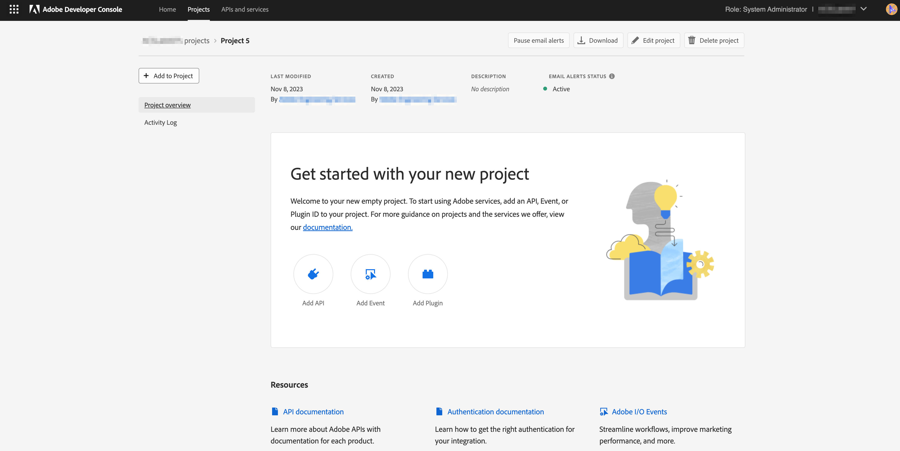
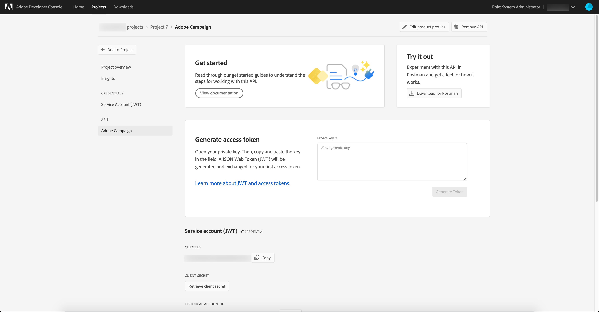

# Configurazione di Adobe IO per l’integrazione con Microsoft Dynamics 365

Attiva i dati CRM sulla comunicazione tra canali: durante la configurazione di pre-integrazione, scopri i passaggi necessari per creare un nuovo progetto IO di Adobe  e configurarlo per l&#39;integrazione con Microsoft Dynamics 365.

## Panoramica

 integrazione Adobe Campaign Standard - Microsoft Dynamics 365 è descritta in [questa pagina](../../integrating/using/working-with-campaign-standard-and-microsoft-dynamics-365.md).

Prima di eseguire la configurazione di pre-integrazione in questo articolo, si presume che sia già stato eseguito il provisioning e che l&#39;amministratore abbia accesso all&#39;istanza Campaign Standard dell&#39;organizzazione.  Se non è successo, per completare il provisioning delle campagne dovrete contattare &#39;Assistenza clienti di Adobe.

>[!CAUTION]
>
>I passaggi descritti di seguito devono essere eseguiti da un amministratore.

## Configurazione

Sarà necessario creare un nuovo progetto IO di Adobe  e configurarlo per l&#39;integrazione.

### Creare un nuovo progetto

A tal fine, attenersi alla procedura seguente:

1. Andate a [console](https://console.adobe.io/home#) IO Adobe e selezionate l&#39;ID organizzazione IMS del Adobe  dal menu a discesa in alto a destra della schermata.

1. Quindi fate clic **[!UICONTROL Create new project]** sotto **[!UICONTROL Quick Start]**.

   

1. In **[!UICONTROL Get started with your new project]**, fare clic su **[!UICONTROL Add API]**.

   

1. Selezionate l&#39;API Adobe Campaign  (potrebbe essere necessario scorrere verso il basso) e fate clic **[!UICONTROL Next]**.

   

1. Nella schermata successiva sarà possibile caricare la propria chiave pubblica o lasciare che  IO Adobe generi la coppia di chiavi. Queste istruzioni seguiranno l&#39;ultima opzione. Se si decide di lasciare che  IO Adobe generi la coppia di chiavi, fare clic sull&#39;opzione 1; quindi fate clic sul **[!UICONTROL Generate keypair]** pulsante.

   

1. Nella schermata successiva vi verrà richiesto di assegnare un nome e selezionare il percorso di download del file zip della coppia di chiavi.

Una volta scaricato, potete decomprimere il file per visualizzare le chiavi pubblica e privata.  I/O Adobe ha già applicato la chiave pubblica al progetto I/O del Adobe . Dovrete mantenere la vostra chiave privata per un momento successivo; la chiave privata verrà utilizzata durante la configurazione preliminare dello strumento di integrazione.

1. Fare clic **[!UICONTROL Next]** per continuare

   

1. Nella schermata successiva verranno selezionati i profili di prodotto da associare a questo progetto. Selezionate il profilo di prodotto che contiene il titolo: L’ID tenant dell’istanza della campagna: [!UICONTROL Administrators]

   Esempio: Campaign Standard - your-campaign-tenantID - Administrators

1. Fai clic su **[!UICONTROL Save configured API]**.

   

1. Nella schermata successiva verranno visualizzati i dettagli del nuovo progetto IO del Adobe . Fate clic **[!UICONTROL Add to Project]** in alto a sinistra nella schermata e selezionate **API** dall&#39;elenco a discesa.

   

1. Nella schermata successiva dovrete selezionare l&#39;API Eventi di I/O, quindi fare clic su **[!UICONTROL Next]**.

1. Nella schermata successiva fate clic su **[!UICONTROL Save the configured API]**.  Viene nuovamente visualizzata la schermata dei dettagli del progetto.

1. Ora fai clic **[!UICONTROL Add to Project]** in alto a sinistra dello schermo e seleziona **API** dall&#39;elenco a discesa, come hai fatto in precedenza.

1. Nella schermata successiva dovrete selezionare l&#39;API di gestione I/O e fare clic su **[!UICONTROL Next]**.

1. Nella schermata successiva fate clic su **[!UICONTROL Save the configured API]**.

La configurazione di pre-integrazione in Campaign ora è completa.  Completare la configurazione [di pre-integrazione per Microsoft Dynamics 365](../../integrating/using/configure-microsoft-dynamics-365-for-campaign-integration.md).

**Argomenti correlati**

* [I/O Adobe  - Integrazione dell&#39;account di servizio](https://www.adobe.io/authentication/auth-methods.html#!AdobeDocs/adobeio-auth/master/AuthenticationOverview/ServiceAccountIntegration.md)
* [Campaign Standard - Impostazione accesso API](../../api/using/setting-up-api-access.md)
* [Campaign Standard - Integrazione Dynamics 365](../../integrating/using/configure-microsoft-dynamics-365-for-campaign-integration.md)