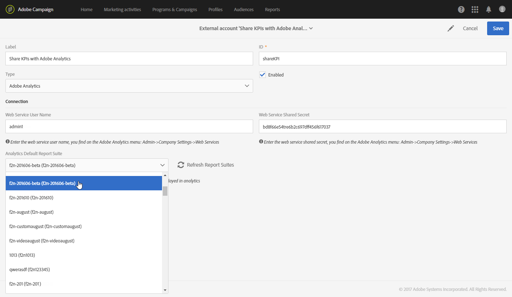

# Configurare l’integrazione di Campaign e Analytics{#configure-campaign-analytics-integration}

Questa integrazione ti consente di condividere i dati degli indicatori di prestazioni chiave direttamente da Adobe Campaign ad Adobe Analytics Standard o Premium.

Per avviare l’integrazione tra Adobe Campaign Standard e Adobe Analytics, devi innanzitutto configurare l’account esterno collegato ad Adobe Analytics.

Gli account esterni e i flussi di lavoro tecnici possono essere gestiti solo dall’amministratore funzionale della piattaforma.

1. Dal menu avanzato, tramite il logo Adobe Campaign, selezionare **[!UICONTROL Administration > Application settings > External accounts]**.
1. Selezionare l&#39;account esterno **[!UICONTROL Share KPIs with Adobe Analytics]**.

   

1. Specificare **[!UICONTROL Web services user name]** e **[!UICONTROL Web services share secret]** nel campo **[!UICONTROL Connection]**.

   Questi parametri sono disponibili in Analytics selezionando **[!UICONTROL Admin > Company settings > Web services]**.

   

1. Fai clic sul pulsante **[!UICONTROL Refresh report suites]**.
1. Seleziona nel menu a discesa **[!UICONTROL Analytics default report suite]** la suite di rapporti di Adobe Analytics che desideri arricchire con i dati di Adobe Campaign.

   Il tuo account esterno è ora pronto e collegato ad Adobe Analytics. È possibile disattivarla in qualsiasi momento selezionando la casella **[!UICONTROL Enabled]**.

   

Il flusso di lavoro tecnico **[!UICONTROL Share KPIs with Adobe Analytics]** verrà avviato automaticamente e potrà essere visualizzato dal menu avanzato selezionando **[!UICONTROL Administration > Application settings > Workflow]**. Questo flusso di lavoro tecnico può conservare i broadlog che risalgono a un massimo di 6 mesi fa. Tieni presente che questo flusso di lavoro è incrementale e invierà i dati del giorno precedente.

I dati sono ora disponibili in Adobe Analytics.

**Argomenti correlati:**

* [Account esterni](../../administration/using/external-accounts.md)
* [Flussi di lavoro tecnici](../../administration/using/technical-workflows.md)
* [Video sulla condivisione dei KPI per il reporting integrato di Campaign](https://helpx.adobe.com/it/marketing-cloud/how-to/email-marketing.html)
