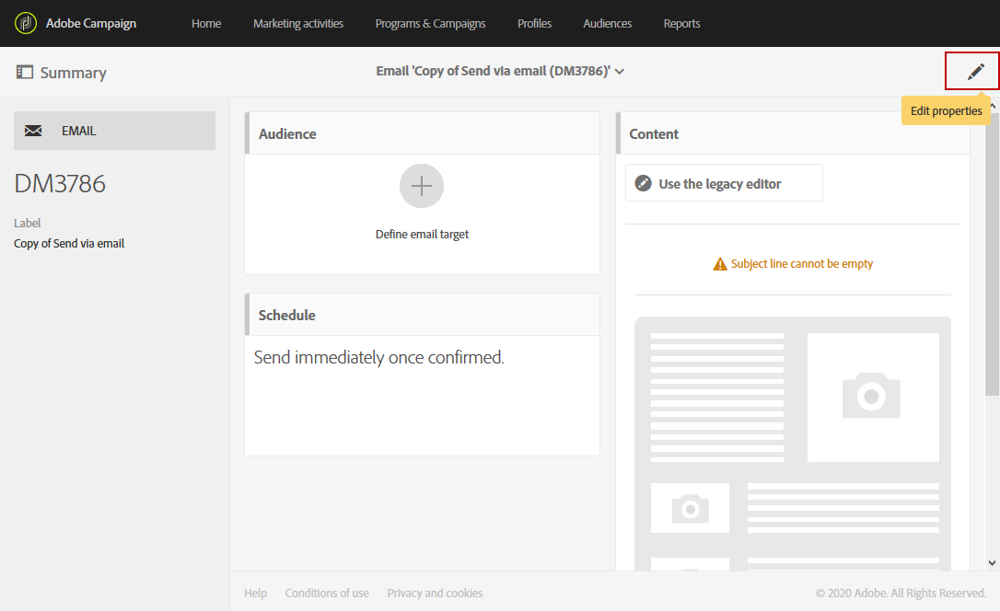

# Configurazione per l’integrazione di Campaign-Experience Manager {#configuration-aem}

Questa integrazione tra  Adobe Campaign Standard e Adobe Experience Manager consente di utilizzare il contenuto creato in Adobe Experience Manager nelle e-mail  Adobe Campaign.

In questo caso verrà illustrato come creare e gestire i contenuti delle e-mail in Adobe Experience Manager, quindi utilizzarli per le campagne di marketing importandoli nelle e-mail in  Adobe Campaign Standard.

## Prerequisiti {#prerequisites}

Prima di iniziare, accertatevi di disporre dei seguenti elementi:

* Un’istanza di **authoring** Adobe Experience Manager
* Un’istanza di **pubblicazione** Adobe Experience Manager
* Un&#39;istanza  Adobe Campaign

## Configurazione in  Adobe Campaign Standard {#config-acs}

Per utilizzare insieme queste due soluzioni, è necessario configurarle in modo che si connettano tra loro.
Per configurare  Adobe Campaign:

1. È innanzitutto necessario configurare l&#39;account **[!UICONTROL Adobe Experience Manager instance]** esterno in **[!UICONTROL Administration]** > **[!UICONTROL Application settings]** > **[!UICONTROL External accounts menu]**.

1. Configura l&#39;account esterno di tipo Adobe Experience Manager con il tuo **[!UICONTROL Server]** URL **[!UICONTROL Account]** e **[!UICONTROL Password]**.

   

1. Verificate che l&#39; **[!UICONTROL AEMResourceTypeFilter]** opzione sia stata configurata correttamente. Accedete al **[!UICONTROL Options]** menu in **[!UICONTROL Administration]** > **[!UICONTROL Application settings]** > **[!UICONTROL Options]** menu.

1. Nel **[!UICONTROL Value (text)]** campo, verificare che la sintassi seguente sia corretta:

   ```
   mcm/campaign/components/newsletter,mcm/campaign/components/campaign_newsletterpage,mcm/neolane/components/newsletter
   ```

   

1. Quindi, nel menu avanzato in **[!UICONTROL Resources]** > **[!UICONTROL Templates]** > **[!UICONTROL Delivery templates]**, duplicate uno dei modelli esistenti per creare un modello e-mail specifico per Adobe Experience Manager.

   

1. Fate clic sull&#39; **[!UICONTROL Edit properties]** icona.

   

1. Nell&#39; **[!UICONTROL Content]** elenco a discesa, seleziona **[!UICONTROL Adobe Experience Manager]** nel **[!UICONTROL Content source]** campo l&#39;account esterno creato in precedenza nell&#39; **[!UICONTROL Adobe Experience Manager account]**.

È ora necessario configurare l&#39;integrazione in Adobe Experience Manager.

## Configurazione in Adobe Experience Manager {#config-aem}

Per configurare Adobe Experience Manager con  Adobe Campaign Standard, è necessario effettuare le seguenti operazioni:

1. È innanzitutto necessario configurare la replica tra le istanze di creazione e pubblicazione Adobe Experience Manager. Refer to this [section](https://docs.adobe.com/content/help/en/experience-manager-65/administering/integration/campaignstandard.html#configuring-adobe-experience-manager).

1. Quindi, connettete Adobe Experience Manager a  Adobe Campaign configurando un&#39;app dedicata **[!UICONTROL Cloud Service]**. Refer to this [section](https://docs.adobe.com/content/help/en/experience-manager-65/administering/integration/campaignstandard.html#connecting-aem-to-adobe-campaign).

1. È ora necessario configurare l’esternalizzatore in Adobe Experience Manager nell’istanza di creazione. Refer to this [section](https://docs.adobe.com/content/help/en/experience-manager-65/administering/integration/campaignstandard.html#configuring-the-externalizer).

