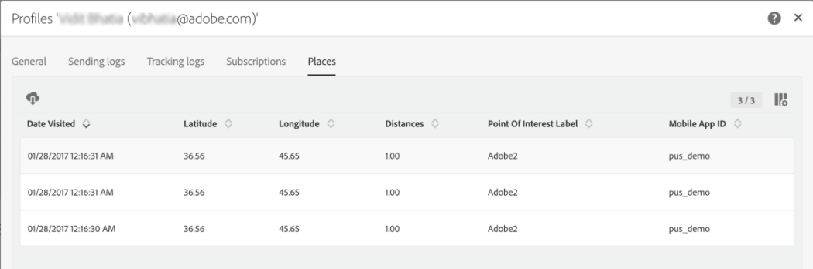

# Configuring Campaign-Points of Interest data integration{#configuring-campaign-points-of-interest-data-integration}

The mobile applications used to collect location data must be configured by an **administrator** in the Adobe Campaign interface.

Per utilizzare la funzione dati Punto di interesse, devi:

1. Accedere ad Adobe Analytics per dispositivi mobili. Controllate il contratto di licenza o contattate il vostro account esecutivo Adobe per ulteriori informazioni.
1. Imposta la tua applicazione mobile in Adobe Campaign. See [Setting up a mobile app in Campaign](../../integrating/using/configuring-campaign-points-of-interest-data-integration.md#setting-up-a-mobile-app-in-campaign).
1. Configura la tua applicazione mobile nell'interfaccia di Adobe Mobile Services. Questo consente di garantire che i dati raccolti da Adobe Mobile Services vengano inviati ad Adobe Campaign. See [Configuring a mobile app in Adobe Mobile Services](../../integrating/using/configuring-campaign-points-of-interest-data-integration.md#configuring-a-mobile-app-in-adobe-mobile-services).
1. Eseguite la configurazione specifica dell'applicazione mobile:

   * Crea un pacchetto con il file di configurazione scaricato dall'interfaccia di Adobe Mobile Services con l'applicazione mobile.
   * Integra l'SDK di Experience Cloud Mobile nell'applicazione mobile. See [Integrating the SDK into a mobile application](../../integrating/using/configuring-campaign-points-of-interest-data-integration.md#integrating-the-sdk-into-a-mobile-application).

1. Definisci punti di interesse nell'interfaccia di Adobe Mobile Services. See [Defining Points of Interest in Adobe Mobile Services](../../integrating/using/configuring-campaign-points-of-interest-data-integration.md#defining-points-of-interest-in-adobe-mobile-services).
1. Definite i dati che desiderate raccogliere dagli abbonati dell'applicazione mobile. See [Collecting subscribers' Points of interest data](../../integrating/using/configuring-campaign-points-of-interest-data-integration.md#collecting-subscribers--points-of-interest-data).
1. Assicurati di accedere all'applicazione mobile e ai dati sulla posizione raccolti in Adobe Campaign. See [Accessing mobile apps used to collect location data](../../integrating/using/configuring-campaign-points-of-interest-data-integration.md#accessing-mobile-apps-used-to-collect-location-data) and [Accessing collected location data](../../integrating/using/configuring-campaign-points-of-interest-data-integration.md#accessing-collected-location-data).

## Setting up a mobile app in Campaign {#setting-up-a-mobile-app-in-campaign}

Per poter raccogliere i dati dei punti di interesse con Adobe Campaign, devi configurare l'applicazione mobile dalla quale Adobe Campaign riceverà i dati.

1. Click the **[!UICONTROL Adobe Campaign]** logo, in the top left corner, then select **[!UICONTROL Administration]** &gt; **[!UICONTROL Channels]** &gt; **[!UICONTROL Mobile app]**.
1. Click **[!UICONTROL Create]** to set up an application.
1. Enter a name in the **[!UICONTROL Application name]** field and click **[!UICONTROL Create]**.

   Do not fill in the **[!UICONTROL Device-specific settings]** section. Ciò vale solo per la configurazione delle applicazioni che ricevono le notifiche push.

In the **[!UICONTROL Mobile application properties]** section, two URLs are listed: **[!UICONTROL Collect PII endpoint]** and **[!UICONTROL Location Services endpoint]**. Saranno utilizzati nell'interfaccia di Adobe Mobile Services. See [Configuring a mobile app in Adobe Mobile Services](../../integrating/using/configuring-campaign-points-of-interest-data-integration.md#configuring-a-mobile-app-in-adobe-mobile-services).

* The **[!UICONTROL Collect PII endpoint]** URL is used to collect the users' Experience Cloud IDs and registration tokens from the mobile application when it is launched. Quando un utente accede all'applicazione utilizzando credenziali quali e-mail, nome, cognome ecc., questi dati vengono raccolti e utilizzati per riconciliare il token di registrazione dell'utente con un profilo Adobe Campaign.
* The **[!UICONTROL Location Services endpoint]** URL is used to collect location data such as a user's latitude, longitude and radius from a Point of Interest.

You can now use these values in Adobe Mobile Services to finish the configuration, as explained in the [Configuring a mobile app in Adobe Mobile Services](../../integrating/using/configuring-campaign-points-of-interest-data-integration.md#configuring-a-mobile-app-in-adobe-mobile-services) section.


## Configuring a mobile app in Adobe Mobile Services {#configuring-a-mobile-app-in-adobe-mobile-services}

Per inviare i dati raccolti da Adobe Mobile Services ad Adobe Campaign, devi configurare i postback nell'interfaccia di Mobile Services.

You will need specific information that you can find in the mobile application parameters set in Adobe Campaign (see [Setting up a mobile app in Campaign](../../integrating/using/configuring-campaign-points-of-interest-data-integration.md#setting-up-a-mobile-app-in-campaign)):

* **[!UICONTROL IMS Organization ID]**
* **[!UICONTROL Collect PII Endpoint]**
* **[!UICONTROL Location Services endpoint]**

Per effettuare la configurazione seguente, devi avere accesso ad Adobe Analytics. Se non sei un utente di Adobe Analytics, contatta l'amministratore di Adobe Campaign.

1. Log into [mobilemarketing.adobe.com](http://mobilemarketing.adobe.com/).
1. Create l'applicazione o selezionatene una esistente.
1. Go to the **[!UICONTROL Manage App Settings]** page.
1. In the **Visitor ID Service ** section, check **Enable** and select your organization from the drop-down list. Click **Save**.

   >[!CAUTION]
   >
   >Questa organizzazione deve essere uguale a quella utilizzata nell'istanza di Adobe Campaign.

1. Click **[!UICONTROL Manage Postbacks]**.
1. Crea un postback.

   * Select **[!UICONTROL PII]** as the **[!UICONTROL Postback Type]**.
   * In the **[!UICONTROL URL]** field, copy the **[!UICONTROL Collect PII Endpoint]** URL from the mobile application that you configured in the Adobe Campaign interface, preceded by the server name. See [Setting up a mobile app in Campaign](../../integrating/using/configuring-campaign-points-of-interest-data-integration.md#setting-up-a-mobile-app-in-campaign).
   * Fill in the **[!UICONTROL Post Body]** field as follows:

      Per iOS:

      ```
      {
      "userKey": "{userKey}",
      "pushPlatform":"apns",
      "marketingCloudId":"",
      "cusEmail":"{email}",
      "cusFirstName":"{firstName}",
      "cusLastName":"{lastName}"
      }
      ```

      Per Android:

      ```
      {
      "userKey": "{userKey}",
      "pushPlatform":"gcm",
      "marketingCloudId":"",
      "cusEmail":"{email}",
      "cusFirstName":"{firstName}",
      "cusLastName":"{lastName}"
      }
      ```

   * Set **Content Type** as **[!UICONTROL application/json]**.
   * In the **Which Data Tags Trigger the Postback?**, selezionate qualsiasi evento, in genere **[!UICONTROL Launched]** e **[!UICONTROL exists]**.
   * Click **[!UICONTROL Save & Activate]**.

1. Crea un secondo postback.

   * Select **[!UICONTROL Postback]** as the **[!UICONTROL Postback Type]**.
   * In the **[!UICONTROL URL]** field, copy the **[!UICONTROL Location Services Endpoint]** URL from the mobile application that you configured in the Adobe Campaign interface, preceded by the server name. See [Setting up a mobile app in Campaign](../../integrating/using/configuring-campaign-points-of-interest-data-integration.md#setting-up-a-mobile-app-in-campaign).
   * Fill in the **[!UICONTROL Post Body]** field as follows:

      ```
      {
      "locationData":{
      "distances":"{a.loc.dist}",
      "poiLabel":"{a.loc.poi}",
      "latitude.a":"{a.loc.lat.a}",
      "latitude.b":"{a.loc.lat.b}",
      "latitude.c":"{a.loc.lat.c}",
      "longitude.a":"{a.loc.lon.a}",
      "longitude.b":"{a.loc.lon.b}",
      "longitude.c":"{a.loc.lon.c}",
      "appId":"{a.appid}",
      "marketingCloudId":"{mid}"
      }
      }
      ```

   * Set **Content Type** as **[!UICONTROL application/json]**.
   * In the **Which Data Tags Trigger the Postback?**, selezionate **[!UICONTROL campaign.test]** e **[!UICONTROL exists]**.
   * Click **[!UICONTROL Save & Activate]**.

>[!NOTE]
>
>For detailed information on configuring postbacks, refer to the [Adobe Mobile Services documentation](https://marketing.adobe.com/resources/help/en_US/mobile/signals_.html).

## Integrating the SDK into a mobile application {#integrating-the-sdk-into-a-mobile-application}

Il kit di sviluppo software (SDK) del servizio di base Mobile facilita l'integrazione di un'applicazione mobile in Adobe Campaign.

This step is described in this [page](https://helpx.adobe.com/campaign/kb/configuring-app-sdkv4.html).

## Defining Points of Interest in Adobe Mobile Services {#defining-points-of-interest-in-adobe-mobile-services}

Per definire i punti di interesse utilizzati per raccogliere i dati sulla posizione:

1. Vai all'interfaccia di Adobe Mobile Services.
1. Aggiungete l'applicazione.

   For more information on managing applications in Mobile Services, refer to the [Adobe Mobile Services documentation](https://marketing.adobe.com/resources/help/en_US/mobile/t_new_app.html).

1. Definire i punti di interesse.

   For more information on managing Points of Interest, refer to the [Adobe Mobile Services documentation](https://marketing.adobe.com/resources/help/en_US/mobile/t_manage_points.html).

## Collecting subscribers' Points of interest data {#collecting-subscribers--points-of-interest-data}

Una specifica risorsa personalizzata consente di definire i dati da raccogliere dagli abbonati delle applicazioni.

This step is described in the [Configuring a mobile application using SDK V4](https://helpx.adobe.com/campaign/kb/configuring-app-sdkv4.html) page.

## Accessing mobile apps used to collect location data {#accessing-mobile-apps-used-to-collect-location-data}

Per accedere alle applicazioni create con successo in Adobe Campaign:

1. Click the **[!UICONTROL Adobe Campaign]** logo, in the top left corner.
1. Select **[!UICONTROL Administration]** &gt; **[!UICONTROL Channels]** &gt; **[!UICONTROL Mobile app]**.
1. Selezionate un'applicazione mobile dall'elenco per visualizzarne le proprietà.

   

Viene visualizzato anche un elenco degli abbonati all'applicazione. Gli utenti iscritti sono tutti gli utenti che hanno installato l'applicazione sul dispositivo mobile. I profili del database di Adobe Campaign sono identificati da un token di registrazione.

## Accessing collected location data {#accessing-collected-location-data}

Once the setup is done, the collected Points of Interest data is listed in the **[!UICONTROL Places]** tab of each profile. Per accedere all'elenco:

1. Selezionate un profilo.
1. Click the **[!UICONTROL Edit profile properties]** button on the right.
1. Select the **[!UICONTROL Places]** tab.

   

Vengono elencati i dati dei punti di interesse raccolti per il profilo corrente. I dati sulla posizione sono memorizzati nel database Adobe Campaign per sei mesi.

For more information on accessing and editing profiles, see [Profiles](../../audiences/using/about-profiles.md).
