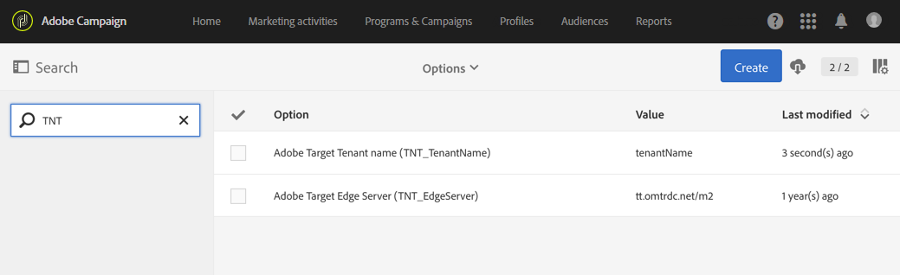

# Configurazione dell’integrazione Campaign-Target{#configuring-the-campaign-target-integration}

L&#39;integrazione tra  Adobe Campaign e  Adobe Target consente di inserire contenuto dinamico nella distribuzione.

Per utilizzare le funzionalità di integrazione con  Adobe Target, è necessario  prima una configurazione in Adobe Campaign e deve essere gestita dall&#39;amministratore funzionale.

Per questa procedura sono necessari i seguenti elementi:

* Un tenant Adobe Experience Cloud
* Un tenant Adobe Target 
* Una rawbox Adobe Target  specificata per stabilire la connessione con  Adobe Campaign

1. Dal menu avanzato, tramite il logo Adobe Campaign  nell&#39;angolo in alto a sinistra, selezionate **[!UICONTROL Administration]** > **[!UICONTROL Application settings]** > **[!UICONTROL Options]**.
1. Per configurare le opzioni del server e del tenant per  Adobe Target, compila i seguenti campi di conseguenza:

   * **[!UICONTROL TNT_TenantName]**: nome del tenant Adobe Target . Questo valore corrisponde al nome dell&#39;Adobe Target  **[!UICONTROL Client]**.
   * **[!UICONTROL TNT_EdgeServer]**:  server Adobe Target utilizzato per l&#39;integrazione. Questa opzione è già disponibile per impostazione predefinita. Questo valore corrisponde al  Adobe Target **[!UICONTROL Server Domain]**, seguito dal valore **/m2** . Ad esempio: **tt.omtrdc.net/m2**.

   

Gli utenti possono ora aggiungere immagini dinamiche in una distribuzione con  Adobe Target.
