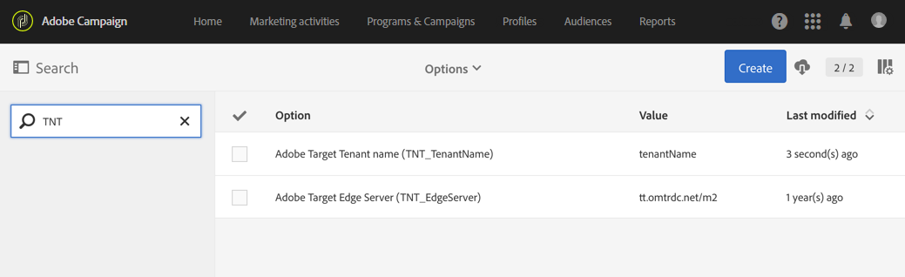

# Configurazione dell’integrazione di Campaign e Target{#configuring-the-campaign-target-integration}

L’integrazione tra Adobe Campaign e Adobe Target ti consente di inserire contenuto dinamico nella consegna.

Per utilizzare le funzionalità di integrazione con Adobe Campaign è innanzitutto necessaria una configurazione, che deve essere gestita dall’amministratore funzionale.

Per questa procedura sono necessari i seguenti elementi:

* Un tenant Adobe Experience Cloud
* Un tenant Adobe Target
* Un rawbox Adobe Target specificato per stabilire la connessione con Adobe Campaign

1. Dal menu avanzato, tramite il logo Adobe Campaign nell&#39;angolo in alto a sinistra, seleziona **[!UICONTROL Administration]** > **[!UICONTROL Application settings]** > **[!UICONTROL Options]**.
1. Per configurare le opzioni server e tenant per Adobe Target, compila i campi seguenti di conseguenza:

   * **[!UICONTROL TNT_TenantName]**: nome del tenant Adobe Target. Questo valore corrisponde al nome dell&#39;Adobe Target **[!UICONTROL Client]**.
   * **[!UICONTROL TNT_EdgeServer]**: server Adobe Target utilizzato per l&#39;integrazione. Questa opzione è già fornita per impostazione predefinita. Questo valore corrisponde all&#39;Adobe Target **[!UICONTROL Server Domain]**, seguito dal valore **/m2**. Ad esempio: **tt.omtrdc.net/m2**.

   

Ora gli utenti possono aggiungere immagini dinamiche in una consegna con Adobe Target.
