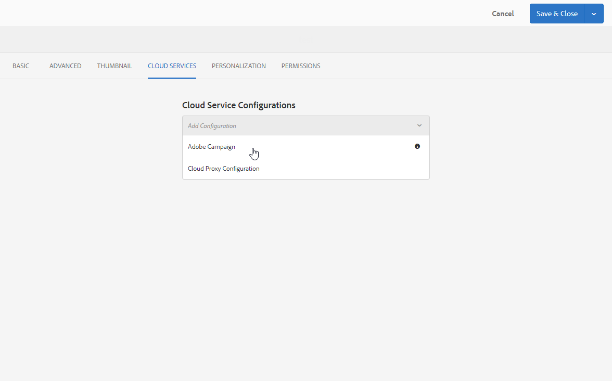

# Creazione di un modulo Campaign in Experience Manager {#creating-a-campaign-form-in-experience-manager}

Puoi creare &quot;moduli&quot; sui tuoi siti AEM e mappare i campi di un modulo ai campi del database Adobe Campaign. Questo consente di creare e aggiornare profili o gestire gli abbonamenti a un servizio.

Per creare un modulo Adobe Campaign sul sito AEM:

1. Nel tuo sito AEM, crea una nuova pagina basata sul modello **Adobe Campaign Profile**.

   

1. Nelle proprietà della pagina, seleziona **[!UICONTROL Cloud Service]** corrispondente alla tua istanza di Adobe Campaign.

   

1. Selezionare il tipo di modulo dal componente **[!UICONTROL Form Start]**:

   * **Adobe Campaign: Salva profilo**
   * **Adobe Campaign: abbonati a servizi**
   * **Adobe Campaign: Annulla abbonamento a servizi**

1. Modifica il contenuto del modulo aggiungendo diversi campi e componenti che puoi mappare ai campi del database di Adobe Campaign.
1. Verifica e pubblica il modulo per renderlo accessibile sul tuo sito AEM.

Per ulteriori informazioni, consulta la [documentazione dettagliata](https://experienceleague.adobe.com/docs/experience-manager-65/authoring/aem-adobe-campaign/adobe-campaign-forms.html?lang=it).
