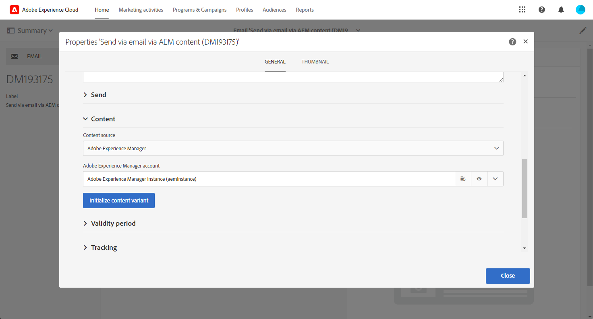

# Importazione di un contenuto Adobe Experience Manager in un messaggio e-mail di Adobe Campaign {#creating-email-aem}

Questo documento illustra come creare e gestire i contenuti delle e-mail in Adobe Experience Manager, per poi utilizzarli per le campagne di marketing importandoli nelle e-mail in Adobe Campaign Standard.

Sussistono i seguenti prerequisiti:

* Accesso a un’istanza AEM configurata per l’integrazione.
* Accesso a un’istanza di Adobe Campaign configurata per l’integrazione.
* Un modello e-mail Adobe Campaign configurato per ricevere contenuti AEM.

## Accesso alle e-mail in Adobe Experience Manager {#email-content-aem}

Accedi all’istanza di authoring di Adobe Experience Manager e sfoglia il tuo sito per accedere alla cartella che contiene i contenuti dell’e-mail.

>[!VIDEO](https://video.tv.adobe.com/v/29996)

## Creazione di nuovi contenuti e-mail in Adobe Experience Manager {#creating-email-content-aem}

Sono disponibili diversi modelli specifici per Adobe Campaign. Devi utilizzare uno di questi modelli in quanto contengono componenti predefiniti supportati da Adobe Campaign.

Per impostazione predefinita, due modelli predefiniti consentono di creare contenuti e-mail per Adobe Campaign.

* **[!UICONTROL Adobe Campaign Email]**: questo modello contiene un contenuto standard che puoi personalizzare. Puoi scegliere tra Adobe Campaign Email (AC6.1) e Adobe Campaign Email (ACS).
* **[!UICONTROL Importer Page]**: questo modello ti consente di importare un file ZIP contenente un file HTML con contenuto che potrai quindi personalizzare.

1. In Adobe Experience Manager, crea un nuovo **[!UICONTROL Page]**.

1. Seleziona la **[!UICONTROL Adobe Campaign Email]** modello. Per i passaggi dettagliati, guarda il video seguente.

   >[!VIDEO](https://video.tv.adobe.com/v/29997)

1. Apri il nuovo contenuto e-mail.

1. In **[!UICONTROL Page properties]**, impostato **[!UICONTROL Adobe Campaign]** come **[!UICONTROL Cloud Service Configuration]**. Questo consente la comunicazione tra il contenuto e l’istanza Adobe Campaign.

   Per ulteriori informazioni, guarda il seguente video:

   >[!VIDEO](https://video.tv.adobe.com/v/29999)

## Modifica e invio di un’e-mail {#editing-email-aem}

Puoi modificare il contenuto dell’e-mail aggiungendo componenti e risorse. I campi di personalizzazione possono essere utilizzati per inviare un messaggio più rilevante in base ai dati dei destinatari in Adobe Campaign.

Per creare un contenuto e-mail in Adobe Experience Manager:

1. Modificare l&#39;oggetto e **[!UICONTROL Plain text]** versione dell’e-mail accedendo a **[!UICONTROL Page properties]** > **[!UICONTROL Email]** dalla barra laterale.

1. Aggiungi **[!UICONTROL Personalization fields]** tramite **[!UICONTROL Text & Personalization]** componente. Ogni componente corrisponde a un utilizzo specifico: inserimento di immagini, aggiunta di personalizzazione, ecc.

   Per ulteriori informazioni, guarda il seguente video:

   >[!VIDEO](https://video.tv.adobe.com/v/29998)

1. Dalla sezione **[!UICONTROL Workflow]** , seleziona la scheda **[!UICONTROL Approve for Adobe Campaign]** workflow di convalida. Non potrai inviare un’e-mail in Adobe Campaign se utilizza un contenuto non approvato.

Per inviare il messaggio e-mail in Adobe Campaign Standard:

1. Una volta definiti il contenuto e i parametri di invio, crea un’e-mail basata su un modello e-mail specifico per l’AEM in Adobe Campaign Standard.

+++ Ulteriori informazioni sul modello specifico per AEM.

   1. Dal menu avanzato, accedere a **[!UICONTROL Resources]** `>` **[!UICONTROL Templates]** `>` **[!UICONTROL Delivery templates]**.

      

   1. Duplica o seleziona uno dei modelli di consegna.

   1. Dalla sezione **[!UICONTROL Properties]** del modello, nella sezione **[!UICONTROL Content]** a discesa, seleziona **[!UICONTROL Adobe Experience Manager as Content mode]** quindi il tuo account Adobe Experience Manager.

      

+++

   

1. Inserisci le proprietà dell’e-mail e fai clic su **[!UICONTROL Create]** per poter selezionare il contenuto dell’AEM.

1. Accedere a **[!UICONTROL Content]** blocco.

   

1. Dalla sezione **[!UICONTROL Use Adobe Experience Manager content]** menu, fai clic su **[!UICONTROL Link AEM content]**.

   Quindi, seleziona il contenuto da utilizzare nell’e-mail.

   

1. Personalizza ulteriormente l’e-mail specificando parametri aggiuntivi, ad esempio il pubblico target e la pianificazione dell’esecuzione, tramite la dashboard. Una volta configurata, ora puoi inviare la consegna e-mail. [Ulteriori informazioni](../../sending/using/confirming-the-send.md)

