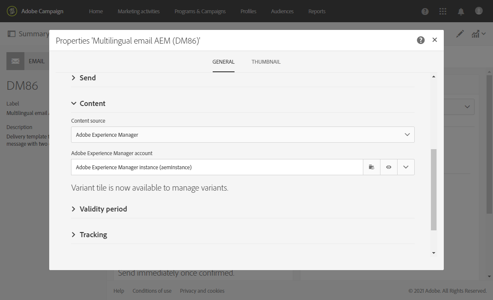
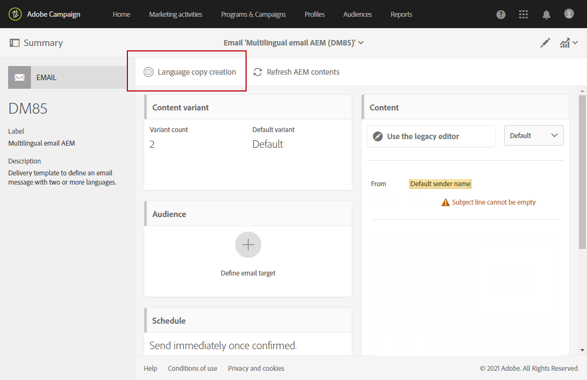

# Creazione di un&#39;e-mail in più lingue con l&#39;integrazione Adobe Experience Manager {#creating-multilingual-email-aem}

Questo documento illustra come creare un messaggio e-mail in più lingue utilizzando il contenuto Adobe Experience Manager e le copie della lingua.

Sussistono i seguenti prerequisiti:

* Accesso a un&#39;istanza AEM configurata per l&#39;integrazione.
* Accesso a un&#39;istanza Adobe Campaign  configurata per l&#39;integrazione.
* Modello e-mail multilingue  Adobe Campaign configurato per la ricezione AEM contenuto.

## Creazione di nuovo contenuto e-mail in Adobe Experience Manager {#creating-email-content-aem}

1. Nella home page di Adobe Experience Manager, selezionare **[!UICONTROL Site]**.

   

1. Selezionare la cartella in cui si desidera creare la pagina e fare clic su **[!UICONTROL Create]** quindi **[!UICONTROL Page]**. Qui, creiamo la nostra pagina nella cartella en_us che sarà la nostra lingua predefinita.

   

1. Selezionare il modello **[!UICONTROL Adobe Campaign Email (ACS)]**.

1. Compila le proprietà dell&#39;e-mail e fai clic su **[!UICONTROL Create]**.

   

1. Apri il nuovo contenuto e-mail e personalizzalo come necessario. Per ulteriori informazioni, consulta questa [pagina](../../integrating/using/creating-email-experience-manager.md#editing-email-aem).

   

1. Dalla scheda **[!UICONTROL Workflow]**, selezionare il flusso di lavoro di convalida **[!UICONTROL Approve for Adobe Campaign]**. Non potrete inviare un&#39;e-mail in  Adobe Campaign se utilizza un contenuto non approvato.

   

1. Fare clic su **[!UICONTROL Complete]**, quindi **[!UICONTROL Newsletter review]** dalla finestra **[!UICONTROL Complete work item]**.

1. Fai clic su **[!UICONTROL Complete]**, quindi su **[!UICONTROL Newsletter approval]**. Una volta definiti il contenuto e i parametri di invio, potete procedere all’approvazione, alla preparazione e all’invio dell’e-mail in  Adobe Campaign Standard.

   

## Creazione di copie della lingua {#creating-language-copies}

Dopo aver progettato il contenuto dell&#39;e-mail, è ora necessario creare copie della lingua che verranno sincronizzate con  Adobe Campaign Standard come varianti.

1. Selezionate la pagina precedentemente creata, fate clic su **[!UICONTROL Create]**, quindi su **[!UICONTROL Language Copy]**.

   

1. Selezionate il contenuto dell&#39;e-mail creato in precedenza che verrà tradotto nelle lingue selezionate, quindi fate clic su **[!UICONTROL Next]**.

   

1. Nel menu a discesa **[!UICONTROL Target language(s)]**, selezionate la lingua in cui tradurre il contenuto e fate clic su **[!UICONTROL Next]**.

   

1. Fai clic su **[!UICONTROL Create]**.

Le copie della lingua vengono ora create. È ora possibile modificare il contenuto in base alla lingua scelta.

>[!CAUTION]
>
>Ogni copia della lingua deve essere approvata tramite il flusso di lavoro di convalida **[!UICONTROL Approve for Adobe Campaign]**. Non potrete inviare un&#39;e-mail in  Adobe Campaign se utilizza un contenuto non approvato.

## Creazione di contenuti multilingue in  Adobe Campaign Standard {#multilingual-acs}

1. Dalla  pagina principale di Adobe Campaign Standard, fare clic su **[!UICONTROL Create an email]**.

   

1. Selezionate  modello di e-mail in più lingue Adobe Campaign configurato per la ricezione dei contenuti Adobe Experience Manager. Per ulteriori informazioni su come creare un modello collegato all&#39;istanza Adobe Experience Manager, fare riferimento a questa [pagina](../../integrating/using/configure-experience-manager.md#config-acs).

   >[!NOTE]
   >
   >In questo caso, sarà necessario duplicare il modello incorporato **[!UICONTROL Multilingual email (mailMultiLang)]** per poter inviare le e-mail in più lingue.

   

1. Compilate i **[!UICONTROL Properties]** e **[!UICONTROL Audience]** del messaggio e fate clic su **[!UICONTROL Create]**.

1. In **[!UICONTROL Edit properties]**, accertatevi che l&#39;account Adobe Experience Manager sia impostato correttamente nel menu a discesa **[!UICONTROL Content]**.

   

1. Fai clic su **[!UICONTROL Language copy creation]**.

   

1. Selezionate il contenuto Adobe Experience Manager creato in precedenza e fate clic su **[!UICONTROL Confirm]**. I contenuti Adobe Experience Manager visualizzati qui sono solo contenuti convalidati e possono essere filtrati sulle **[!UICONTROL Label]** e **[!UICONTROL Path]**.

   >[!NOTE]
   >
   >La copia della lingua scelta verrà impostata come predefinita. Successivamente, sarà possibile modificarla nel blocco **[!UICONTROL Content variant]**.

   

1. Fate clic su **[!UICONTROL Create variants]** per collegare il contenuto multilingue.  Adobe Campaign Standard collegherà automaticamente a questo contenuto le altre copie in lingua. Le varianti create avranno la stessa etichetta e la stessa lingua del codice scelta in Adobe Experience Manager.

   

1. Fare clic sul blocco **[!UICONTROL Content variant]** per modificare la variante predefinita, se necessario, quindi fare clic su **[!UICONTROL Confirm]**.

   

1. Se il contenuto o le varianti vengono aggiornati in Adobe Experience Manager, è possibile sincronizzarli direttamente in  Adobe Campaign Standard con il pulsante **[!UICONTROL Refresh AEM contents]**.

1. È ora possibile inviare l&#39;e-mail. Per ulteriori informazioni, fare riferimento a questa [pagina](../../sending/using/get-started-sending-messages.md).

Il pubblico riceverà l&#39;e-mail a seconda del **[!UICONTROL Preferred languages]** impostato nel **[!UICONTROL Profiles]**. Per ulteriori informazioni su come modificare i profili e le lingue preferite, fare riferimento a questa [pagina](../../audiences/using/editing-profiles.md).
