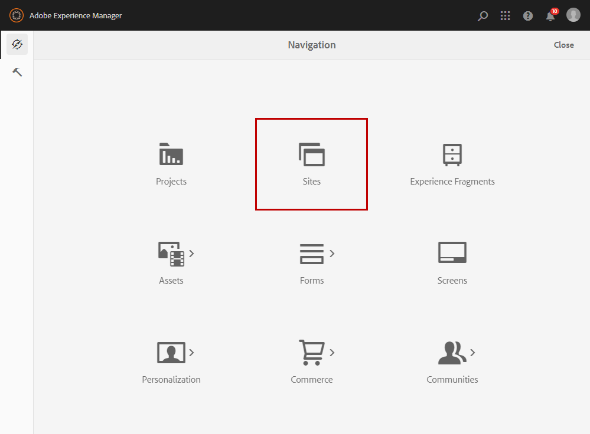

# Creazione di un’e-mail multilingue con l’integrazione Adobe Experience Manager {#creating-multilingual-email-aem}

Questo documento illustra come creare un’e-mail multilingue utilizzando contenuti e copie per lingua di Adobe Experience Manager.

Sussistono i seguenti prerequisiti:

* Accesso a un’istanza AEM configurata per l’integrazione.
* Accesso a un’istanza di Adobe Campaign configurata per l’integrazione.
* Un modello e-mail multilingue di Adobe Campaign configurato per la ricezione AEM contenuto.

## Creazione di nuovi contenuti e-mail in Adobe Experience Manager {#creating-email-content-aem}

1. Dalla home page di Adobe Experience Manager, seleziona **[!UICONTROL Site]**.

   

1. Selezionare la cartella in cui si desidera creare la pagina e fare clic su **[!UICONTROL Create]** then **[!UICONTROL Page]**. In questo caso, creiamo la nostra pagina nella cartella en_us che sarà la nostra lingua predefinita.

   

1. Seleziona la **[!UICONTROL Adobe Campaign Email (ACS)]** modello.

1. Inserisci le proprietà dell’e-mail e fai clic su **[!UICONTROL Create]**.

   

1. Apri il nuovo contenuto e-mail e personalizzalo in base alle esigenze. Per ulteriori informazioni, consulta questa [pagina](../../integrating/using/creating-email-experience-manager.md#editing-email-aem).

   

1. Da **[!UICONTROL Workflow]** seleziona la scheda **[!UICONTROL Approve for Adobe Campaign]** flusso di lavoro di convalida. Non potrai inviare un’e-mail in Adobe Campaign se utilizza un contenuto non approvato.

   

1. Fai clic su **[!UICONTROL Complete]** then **[!UICONTROL Newsletter review]** dal **[!UICONTROL Complete work item]** finestra.

1. Fai clic su **[!UICONTROL Complete]**, quindi su **[!UICONTROL Newsletter approval]**. Una volta definiti il contenuto e i parametri di invio, puoi procedere all’approvazione, alla preparazione e all’invio dell’e-mail in Adobe Campaign Standard.

   

## Creazione di copie per lingua {#creating-language-copies}

Dopo aver progettato il contenuto dell’e-mail, ora devi creare le copie della lingua che saranno sincronizzate con Adobe Campaign Standard come varianti.

1. Seleziona la pagina creata in precedenza e fai clic su **[!UICONTROL Create]** then **[!UICONTROL Language Copy]**.

   

1. Seleziona il contenuto dell’e-mail creato in precedenza che verrà tradotto nelle lingue selezionate, quindi fai clic su **[!UICONTROL Next]**.

   

1. In **[!UICONTROL Target language(s)]** a discesa, seleziona la lingua in cui il contenuto verrà tradotto e fai clic su **[!UICONTROL Next]**.

   

1. Fai clic su **[!UICONTROL Create]**.

Le copie per lingua vengono ora create e ora puoi modificare il contenuto in base alla lingua scelta.

>[!CAUTION]
>
>Ogni copia della lingua deve essere approvata tramite il **[!UICONTROL Approve for Adobe Campaign]** flusso di lavoro di convalida. Non potrai inviare un’e-mail in Adobe Campaign se utilizza un contenuto non approvato.

## Creazione di contenuti multilingue in Adobe Campaign Standard {#multilingual-acs}

1. Dalla home page di Adobe Campaign Standard, fai clic su **[!UICONTROL Create an email]**.

   

1. Seleziona il modello e-mail multilingue di Adobe Campaign configurato per la ricezione del contenuto Adobe Experience Manager. Per ulteriori informazioni su come creare un modello collegato alla tua istanza Adobe Experience Manager, consulta questo [page](../../integrating/using/configure-experience-manager.md#config-acs).

   >[!NOTE]
   >
   >In questo caso, dovrai duplicare il modello incorporato **[!UICONTROL Multilingual email (mailMultiLang)]** per poter inviare la tua e-mail multilingue.

   

1. Compila il **[!UICONTROL Properties]** e **[!UICONTROL Audience]** dell&#39;e-mail e fai clic su **[!UICONTROL Create]**.

1. In **[!UICONTROL Edit properties]**, accertati che il tuo account Adobe Experience Manager sia impostato correttamente in **[!UICONTROL Content]** a discesa.

   

1. Fai clic su **[!UICONTROL Language copy creation]**.

   

1. Seleziona il contenuto Adobe Experience Manager creato in precedenza e fai clic su **[!UICONTROL Confirm]**. I contenuti Adobe Experience Manager visualizzati qui sono solo contenuti convalidati e possono essere filtrati in base ai relativi **[!UICONTROL Label]** e **[!UICONTROL Path]**.

   >[!NOTE]
   >
   >La copia per lingua selezionata verrà impostata come predefinita, in seguito sarà possibile modificarla nel **[!UICONTROL Content variant]** blocco.

   

1. Fai clic su **[!UICONTROL Create variants]** per collegare i contenuti multilingue. Adobe Campaign Standard quindi collegherà automaticamente al contenuto le altre copie in lingua. Le varianti create avranno la stessa etichetta e la stessa lingua di codice di quelle scelte in Adobe Experience Manager.

   

1. Fai clic sul pulsante **[!UICONTROL Content variant]** blocca per modificare la variante predefinita, se necessario, e fai clic su **[!UICONTROL Confirm]**.

   

1. Se il contenuto o le varianti sono aggiornati in Adobe Experience Manager, puoi sincronizzarli direttamente in Adobe Campaign Standard con il **[!UICONTROL Refresh AEM contents]** pulsante .

1. L’e-mail è ora pronta per l’invio. Per ulteriori informazioni, consulta questo [page](../../sending/using/get-started-sending-messages.md).

   >[!NOTE]
   >
   >Non potrai inviare un’e-mail in Adobe Campaign se utilizza un contenuto AEM non approvato.

Il pubblico riceverà l’e-mail a seconda del **[!UICONTROL Preferred languages]** impostati **[!UICONTROL Profiles]**. Per ulteriori informazioni su come modificare profili e lingue preferite, consulta questo articolo [page](../../audiences/using/editing-profiles.md).
