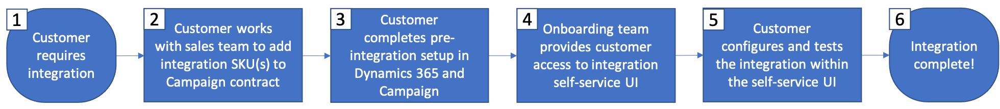

# Guida introduttiva all’integrazione con Microsoft Dynamics 365

Attiva i dati CRM sulla comunicazione tra canali: scopri come trasferire i contatti da Microsoft Dynamics 365 a  Adobe Campaign e condividere i dati sulle prestazioni delle campagne (invii, aperture, clic e rimbalzi) da  Adobe Campaign a Microsoft Dynamics 365.

Questa integrazione richiede le seguenti versioni software:

* Microsoft Dynamics 365 per Vendite online, versione più recente

*  Adobe Campaign Standard, ultima versione

>[!CAUTION]
>
>Questa funzionalità non è disponibile come funzione predefinita del prodotto. La sua implementazione richiede l’intervento della Consulenza Adobe. Per maggiori informazioni, contatta un rappresentante Adobe di fiducia.

## Principi

L&#39;integrazione  Adobe Campaign Standard con Microsoft Dynamics 365 consente la sincronizzazione di tutti i dati di contatto disponibili nel sistema CRM, rendendo disponibili tutti i dati di contatto pertinenti per le attività della campagna.

Al contrario, come profili all&#39;interno  Adobe Campaign Standard interagiscono con i messaggi, tali dati (ad es.: invia, apre, fa clic e rimbalza) automaticamente in Microsoft Dynamics 365 per tenere i record di contatto completi anche con l&#39;attività di marketing.

L&#39;integrazione supporta anche l&#39;abilitazione delle [entità personalizzate](../../integrating/using/d365-acs-self-service-app-settings.md) in Dynamics 365 per la sincronizzazione con le **risorse personalizzate** corrispondenti in Campaign.

Questa integrazione è stata progettata per supportare quattro casi di utilizzo principali:

1. Sincronizzazione dei contatti da Dynamics 365 a Campaign per consentire il targeting dei contatti nelle campagne di marketing
1. Sincronizzazione di entità personalizzate da Dynamics 365 a Campaign per consentirne l&#39;utilizzo per la segmentazione e la personalizzazione
1. Invio di eventi di marketing tramite e-mail (invii, aperture, clic e rimbalzi) da Campaign a Dynamics 365 per visualizzare l&#39;archivio vendite nell&#39;interfaccia di Dynamics 365
1. Sincronizzazione degli stati di rifiuto (ad esempio, non inviare per e-mail) tra Dynamics 365 e Campaign per mantenere le preferenze sulla privacy dei clienti.

I vantaggi principali sono:

* Messaggistica coerente tra vendite e marketing: l&#39;integrazione Adobe Campaign Standard  con Dynamics 365 consente a entrambi i sistemi di accedere alle informazioni sui clienti e alla cronologia marketing delle e-mail, consentendo a tutti i messaggi al cliente di condividere gli stessi messaggi coerenti.

* Vista olistica di tutti i dati di potenziali clienti: integrando  Adobe Campaign Standard con Dynamics 365, è possibile condividere e accedere alla cronologia marketing delle e-mail su ogni contatto dall&#39;interno del sistema CRM.

* Attiva i dati di Dynamics 365 su qualsiasi canale: con i dati di contatto sincronizzati su  Adobe Campaign, le comunicazioni possono essere inviate su qualsiasi canale online o offline con Campaign, inclusi push mobile, in-app, e-mail o posta diretta. La campagna &quot;hai coperto&quot; indipendentemente dal canale preferito da ogni contatto.

>[!CAUTION]
>
>Questa integrazione considera Dynamics 365 l&#39;origine della verità per il contatto e la sincronizzazione di entità personalizzata.  Eventuali modifiche agli attributi sincronizzati devono essere apportate in Dynamics 365, non in  Adobe Campaign Standard.  Se le modifiche vengono apportate in Campaign, possono essere successivamente sovrascritte durante la sincronizzazione.

## Passaggi chiave per implementare l&#39;integrazione di Microsoft Dynamics 365{#request-and-implement-this-integration}

Per eseguire il provisioning di questa integrazione, è necessario seguire i passaggi indicati di seguito.

Seguite i dettagli del diagramma di flusso e del diagramma di flusso riportati di seguito per richiedere e configurare l&#39;integrazione.

Dettagli diagramma di flusso (mappatura ai passaggi precedenti):

* **Passaggio 1** - Si suppone che si disponga già, o si stia effettuando, di una licenza per Microsoft Dynamics 365 per le vendite e per  Adobe Campaign Standard.
* **Fase 2** - L&#39;offerta di integrazione standard è gratuita per tutti i clienti; tuttavia, possono essere applicati costi aggiuntivi in base alle esigenze. Ulteriori informazioni su [Best practice e limitazioni](../../integrating/using/d365-acs-notices-and-recommendations.md). Per sfruttare l&#39;integrazione, sarà necessario firmare un nuovo ordine di vendita (SO), se non è stato incluso nell&#39;oggetto di interesse originale.
* **Passaggio 3** - Completa i passaggi preliminari all&#39;integrazione per Dynamics 365 e Campaign. Vedere [Configurare questa integrazione](#configure-this-integration).
* **Passaggio 4**  - Il team di configurazione del Adobe  ti consentirà di accedere all’interfaccia utente dell’applicazione di integrazione (interfaccia utente).
* **Passaggio 5** - Sarà possibile configurare le mappature dei dati, le sostituzioni, i filtri, ecc. e verificate l&#39;integrazione dall&#39;interfaccia utente dell&#39;applicazione di integrazione.

   >[!IMPORTANT]
   >
   > Se hai bisogno della configurazione bidirezionale o Campaign to Dynamics 365 opt-out, dovrai effettuare la richiesta al contatto tecnico del tuo Adobe  affinché i flussi di lavoro di rinuncia siano configurati nell&#39;istanza Campaign. [Ulteriori informazioni](../../integrating/using/d365-acs-notices-and-recommendations.md#opt-out).

### Configurare questa integrazione {#configure-this-integration}

Per questa integrazione è necessario configurare tre sistemi:

* **Adobe Campaign Standard**: dovete configurare l&#39;accesso alle API e una nuova integrazione per lo strumento di integrazione. A tal fine, fare riferimento a [questo articolo](../../integrating/using/d365-acs-configure-adobe-io.md).
* **Microsoft Dynamics 365**: dovete creare una nuova registrazione dell&#39;app e consentire a un utente dell&#39;applicazione di utilizzare l&#39;integrazione.  Per configurare Microsoft Dynamics 365 per questa integrazione, fare riferimento a [questo articolo](../../integrating/using/d365-acs-configure-d365.md).
* **Integrazione  Adobe Campaign Standard con Microsoft Dynamics 365 Self-Service App**: dovrete seguire i passaggi descritti in  [questo articolo](../../integrating/using/d365-acs-self-service-app-control-access.md).

>[!IMPORTANT]
>
>Per ciascun sistema, questi passaggi devono essere eseguiti da un **amministratore**.
>
>La procedura descritta in questa documentazione vi guiderà attraverso la creazione di integrazioni/registrazioni che richiedono l’assegnazione di autorizzazioni e/o l’accesso dell’amministratore.  È responsabilità dell&#39;utente assicurarsi che questi passaggi siano conformi alle politiche aziendali prima di eseguire e di eseguirli con attenzione.

### Richiedi assistenza

I biglietti di supporto possono essere registrati con &#39;Assistenza clienti di Adobe.

Per qualsiasi problema relativo ai flussi di dati di integrazione, accertatevi di includere la suite di rapporti come parte della descrizione del problema, così come le seguenti informazioni:

* **Proprietario** processo: Architetti di ingegneria
* **ID** processo ES: Fornito durante il processo di onboarding
* **Titolo** processo: Integrazione di Microsoft Dynamics 365 /  Adobe Campaign Standard
* **Descrizione** problema: Descrizione del problema

La copertura del supporto per l&#39;integrazione è attualmente di 24 ore su 24, 5 giorni su 5 (dal lunedì al venerdì, esclusi  giorni festivi e di pausa per il Adobe).
