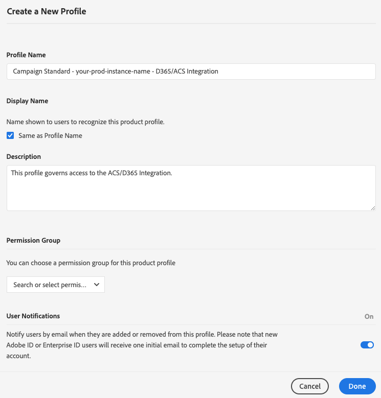

# Accesso all&#39; integrazione Adobe Campaign Standard con Microsoft Dynamics 365 Self-Service App

Questa configurazione richiede l’utilizzo di un amministratore di Experience Cloud (CE)  per l’organizzazione. Questi sono i passaggi iniziali necessari per consentire l&#39;accesso all&#39;interfaccia dell&#39;applicazione di integrazione self-service. Una volta ottenuto l&#39;accesso allo strumento, si configurano le connessioni ai dati e si configura il flusso di dati tra  Adobe Campaign e Microsoft Dynamics 365.

>[!NOTE]
>
>Devi contattare il tuo rappresentante  Adobe e fornire i nomi  dell&#39;organizzazione e dell&#39;istanza di Adobe Campaign Standard. Un ticket verrà registrato per richiedere che l&#39;app di integrazione sia abilitata per l&#39;organizzazione.

## Aggiungere un profilo di prodotto

In questa sezione verrà illustrato come concedere l&#39;accesso all&#39;integrazione Adobe Campaign Standard  con l&#39;app self-service Microsoft Dynamics 365. Gli utenti che hanno accesso alla tua organizzazione in Adobe Experience Cloud non avranno accesso all&#39;app self-service di integrazione, a meno che tu non segua i passaggi indicati di seguito per concedergli l&#39;accesso.

>[!IMPORTANT]
>
> Questi passaggi richiedono il ruolo di **Amministratore** nel Experience Cloud  per l&#39;organizzazione.

1. Accedete a https://experience.adobe.com/ ed effettuate l&#39;accesso all&#39;Adobe Experience Cloud.
1. Accedere al Admin Console ****.

   

1. Fate clic su **[!UICONTROL Products]** per accedere alle soluzioni  Experience Cloud.

   

   >[!IMPORTANT]
   >
   >I passaggi rimanenti in questa sezione saranno eseguiti per ciascuna delle istanze Campaign (dev, text, production).

1. Fare clic sulla prima istanza per configurare.

   

   La pagina dell&#39;istanza deve essere simile alla seguente:

   

1. Fate clic sul pulsante **[!UICONTROL New Profile]** e aggiungete una nuova voce denominata: **Campaign Standard - il tuo prod-instance-name - D365/ACS Integration**

   * Se viene visualizzata questa voce nell&#39;elenco, non è necessario procedere. Fate clic su **Adobe Campaign Standard** nel menu a sinistra e verificate le altre istanze di Campaign.

   * Sostituite &quot;your-prod-instance-name&quot; con il nome effettivo dell’istanza.

1. È possibile lasciare il menu a discesa **[!UICONTROL Permission Group]** con il valore predefinito.

1. Se le voci sono simili alle seguenti, fare clic sul pulsante **[!UICONTROL Done]**.

   

   È stato aggiunto il nuovo profilo di prodotto.

   

## Concedere l&#39;accesso agli utenti {#add-users-to-profile}

Dalla pagina **[!UICONTROL Products]**, seleziona l&#39;istanza Campaign e procedi come segue:

1. Fai clic sul nuovo profilo creato in precedenza:  **Campaign Standard - Your-prod-instance-name - D365/ACS Integration**

   

1. Fare clic sulla scheda **[!UICONTROL Developers]**.

   

1. Fare clic sul pulsante **[!UICONTROL Add Developer]**

1. Inserite il nome o l’indirizzo e-mail dell’utente da aggiungere.  Selezionate il risultato che corrisponde all’utente.

   Se si tratta della prima volta che l’utente viene aggiunto all’organizzazione, immettete i dettagli.

1. Fare clic su **[!UICONTROL Save]** per confermare.
