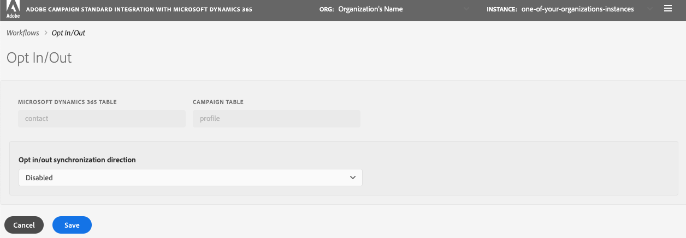

# Sincronizza dati

Puoi sincronizzare le tabelle da Microsoft Dynamics 365 a metriche di marketing Campaign e Campaign con Microsoft Dynamics 365. La sincronizzazione viene eseguita tramite tre flussi di lavoro tecnici dedicati: **[!UICONTROL Microsoft Dynamics 365 to Campaign]**, **[!UICONTROL Campaign to Microsoft Dynamics 365]**, **[!UICONTROL Opt-In/Out]**. Fai riferimento a questa sezione per [ulteriori informazioni](../../integrating/using/d365-acs-self-service-app-workflows.md).

>[!IMPORTANT]
>Per tenere conto delle modifiche, devi arrestare/avviare il flusso di lavoro **[!UICONTROL Microsoft Dynamics 365 to Campaign]** . [Ulteriori informazioni](../../integrating/using/d365-acs-self-service-app-workflows.md)

## Mappare tabelle da Microsoft Dynamics 365 a Campaign

La pagina **[!UICONTROL Microsoft Dynamics 365 to Campaign]** mostra un elenco di entità in Microsoft Dynamics 365 e le risorse personalizzate in Adobe Campaign con cui verranno sincronizzate. Puoi aggiungere nuove mappature, modificare o eliminare mappature esistenti.

Segue una descrizione di ciascuna colonna di questa tabella:

* **[!UICONTROL MICROSOFT DYNAMICS 365 TABLE]**: in questa colonna è indicato quale entità in Microsoft Dynamics 365 sarà l’origine dei dati per la mappatura.

* **[!UICONTROL CAMPAIGN TABLE]**: questa colonna identifica la risorsa in Adobe Campaign che sarà la destinazione dei dati per la mappatura.

* **[!UICONTROL ACTIONS]**: di seguito sono elencate le possibili azioni:

   * Fai clic sull&#39;icona **[!UICONTROL Edit]** per modificare la mappatura.

   * Utilizza l’icona **[!UICONTROL Delete]** per eliminare una mappatura tabella.

   * Fai clic sull’icona **[!UICONTROL Replay Data]** per sincronizzare nuovamente tutti i dati nella tabella Microsoft Dynamics 365. Normalmente l’applicazione di integrazione sincronizza solo i dati in Microsoft Dynamics 365 che sono stati modificati di recente.  Tuttavia, in alcuni casi (ad esempio, se hai apportato una modifica o hai commesso un errore) potresti voler risincronizzare tutti i dati.  In questi casi, fai clic su questo pulsante e, alla successiva interruzione/avvio del flusso di lavoro **[!UICONTROL Microsoft Dynamics 365 to Campaign]**, i tuoi dati inizieranno a sincronizzarsi.

      Se fai clic sul pulsante **[!UICONTROL Replay Data]** e i controlli hanno esito positivo, l’icona verrà disabilitata: indica che i dati per questa coppia di mappatura tabella verranno risincronizzati con la successiva esecuzione del flusso di lavoro **[!UICONTROL Microsoft Dynamics 365 to Campaign]**.

      Non è possibile selezionare di riprodurre nuovamente i dati quando sono soddisfatte le seguenti condizioni:

      * Se ci sono 2.000.000 (o più) elementi nella metrica Backlog associata al flusso di lavoro **[!UICONTROL Microsoft Dynamics 365 to Campaign]** (visualizzato nella pagina **[!UICONTROL Workflows]**)
      * Se nella tabella di Microsoft Dynamics 365 sono presenti almeno 2.000.000 record

      Il numero di record da risincronizzare varia. Se disponi di un numero elevato di record, può essere necessario un po&#39; di tempo per completare il processo di sincronizzazione. Fai riferimento alla metrica **[!UICONTROL Backlog]** nella pagina **[!UICONTROL Workflows]** quando l’applicazione di integrazione funziona per completare il processo di sincronizzazione.

      >[!IMPORTANT]
      >
      > Si consiglia vivamente di interrompere il flusso di lavoro di integrazione quando si pubblicano le modifiche ad Adobe Campaign Standard o Microsoft Dynamics 365. Le modifiche applicabili includono: aggiornamenti a risorse/entità (e relativi campi associati), collegamenti, colonne di identificatore, ecc. che sono attualmente in uso dall’integrazione.

## Crea una nuova mappatura {#add-a-new-mapping}

Per creare una nuova mappatura, effettua le seguenti operazioni:

1. nella pagina **[!UICONTROL Microsoft Dynamics 365 to Campaign]**, fai clic sul pulsante **[!UICONTROL Add New Mapping]** .

1. Utilizzare gli elenchi a discesa per selezionare le tabelle di Microsoft Dynamics 365 e Campaign da mappare.
La maggior parte degli altri input sulla pagina dipenderà dalle tabelle selezionate.

   

   >[!NOTE]
   >Non è possibile mappare ogni tabella più di una volta. Pertanto, noterai che le selezioni del menu a discesa non includeranno tabelle già mappate.

1. Fai clic su **[!UICONTROL OK]** per confermare: l&#39;applicazione avrà bisogno di un breve momento per leggere le informazioni sul campo associate alle tabelle selezionate.

Puoi quindi procedere con la configurazione della mappatura. [Ulteriori informazioni](#new-mapping-settings)

>[!IMPORTANT]
>
>Puoi scegliere le tabelle in questa pagina solo quando aggiungi la mappatura per la prima volta. Assicurati di aver selezionato le tabelle corrette prima di fare clic sul pulsante **[!UICONTROL Save]** : una volta salvati, i campi di selezione della tabella saranno **di sola lettura**.

### Modificare una mappatura esistente

Se modifichi una mappatura esistente, noterai che le selezioni della tabella non sono modificabili.

Questo avviene in base alla progettazione, in quanto gli input più giù nella pagina sono basati sui campi associati a queste tabelle. La modifica delle tabelle renderebbe non validi tutti i campi associati a queste tabelle.  Se desideri modificare la tabella per la mappatura, dovrai tornare alla pagina precedente, eliminare la mappatura da modificare e aggiungere una nuova mappatura.

### Configurare una mappatura tabella singola {#new-mapping-settings}

In questa sezione viene illustrato come configurare una mappatura **singola** di una tabella di Microsoft Dynamics 365 su un’unica tabella di Adobe Campaign.

Puoi definire le seguenti impostazioni:

* **[!UICONTROL Tables]**: in questa sezione sono elencati il nome della tabella di Microsoft Dynamics 365 e la tabella di Campaign a cui verrà mappata.
* **[!UICONTROL Field Mappings]**: ulteriori informazioni in  [questa sezione](#field-mappings)
* **[!UICONTROL Field Replacements]**: ulteriori informazioni in  [questa sezione](#field-replacements)
* **[!UICONTROL Filters]**: ulteriori informazioni in  [questa sezione](#filters)
* **[!UICONTROL Advanced Settings]**: ulteriori informazioni in  [questa sezione](#advanced-settings)

### Mappature dei campi {#field-mappings}

#### Chiavi principali

Quando si aggiunge una nuova mappatura tabella di Microsoft Dynamics 365 a Campaign, è necessario identificare il campo ID.

La chiave primaria di Microsoft Dynamics 365 è di sola lettura perché verrà rilevata dall’applicazione.

Per Campaign, devi selezionare quale campo sarà la chiave univoca. Deve essere configurato come [risorsa personalizzata ID CRM](../../developing/using/uc-calling-resource-id-key.md) e non deve contenere duplicati.

>[!NOTE]
>
>Puoi scegliere il campo ID sulla tabella solo se hai selezionato **[!UICONTROL Add New Mapping]**. Se fai clic sul pulsante Modifica per modificare una mappatura tabella esistente, il campo ID sarà di sola lettura.

Le chiavi primarie saranno sempre i nomi dei campi elencati nella sezione **[!UICONTROL Field Mappings]** . Come promemoria, la seguente icona è elencata a destra per ricordarti che sono le chiavi principali.

#### Aggiungi altre mappature campo

La sezione **[!UICONTROL Field Mappings]** ti consente di aggiungere mappature di campo diverse dalle chiavi primarie. Per aggiungere una nuova mappatura di un campo da Microsoft Dynamics 365 ad Adobe Campaign, fai clic sul pulsante **[!UICONTROL Add new field mapping]** .

Seleziona i campi Microsoft Dynamics 365 e Campaign negli elenchi:

Questi elenchi contengono i nomi dei campi associati alle tabelle di Microsoft Dynamics 365 e Campaign selezionate nella parte superiore della pagina.

Il commutatore **[!UICONTROL Apply updates]** ti consente di controllare se gli aggiornamenti a questo campo verranno propagati da Microsoft Dynamics 365 a Campaign:
* Se è attivato , gli aggiornamenti ai valori in Microsoft Dynamics 365 verranno propagati ad Adobe Campaign man mano che si verificano gli aggiornamenti.

* Se si disattiva , il valore verrà propagato quando i dati vengono inizialmente caricati (o riprodotti), ma gli aggiornamenti incrementali al campo in Microsoft Dynamics 365 non verranno propagati.

>[!NOTE]
>
>Fare clic sull&#39;intestazione della colonna **[!UICONTROL Apply updates]** per aggiornare **all** degli switch per attivarli o disattivarli.

Quando si selezionano i valori dei campi, il tipo di dati viene visualizzato sotto i menu a discesa.   Questo è un aspetto da tenere presente durante la mappatura dei valori da un campo all’altro.

>[!NOTE]
>
> Non è possibile mappare più campi di Microsoft Dynamics 365 su un singolo campo Campaign.

### Sostituzioni di campi {#field-replacements}

Utilizza il pulsante **[!UICONTROL Add New Field Replacement]** per definire una nuova sostituzione del campo.

Le sostituzioni dei campi consentono di identificare:

* un nome di campo di Microsoft Dynamics 365 (aggiunto sopra nella sezione mappature campi),
* un valore esistente (presente in Microsoft Dynamics 365), e
* un nuovo valore da scrivere in Adobe Campaign

Verrà fornito un elenco a discesa per i valori picklist, enumeration e booleani. Per altri tipi di stringa e numerici viene utilizzata una casella di testo.

### Filtri {#filters}

Utilizza il pulsante **[!UICONTROL Add New Filter]** per selezionare quali record di Microsoft Dynamics 365 verranno propagati a Campaign. Puoi scegliere qualsiasi campo associato a un record da aggiungere ai filtri (il nome del campo non deve essere aggiunto alle mappature dei campi).

Per specificare un filtro, compila le seguenti informazioni:

* Nome campo di Microsoft Dynamics 365
* un valore di confronto, e
* un valore (da Microsoft Dynamics 365)
Se il nome, il confronto e il valore del campo risultano true per un dato record, il record verrà propagato ad Adobe Campaign.

Puoi scegliere come valutare questi filtri impostando l’input con etichetta **[!UICONTROL Choose the filter comparison operator]**.  Se scegli **E**, tutti i filtri devono essere true affinché un record venga propagato a Campaign. Se scegli **O**, il record viene propagato se uno di essi restituisce true.

L’opzione **[!UICONTROL Do you want to delete records in Adobe Campaign Standard that will be filtered out from Microsoft Dynamics 365?]** controlla se desideri eliminare i record filtrati da Campaign. Se selezioni **No**, i record rimarranno in Adobe Campaign. Selezionare **Sì** per eliminarli dalla logica di integrazione.

>[!NOTE]
>
> Se non vengono aggiunti filtri, tutti i record modificati verranno propagati ad Adobe Campaign.

### Impostazioni avanzate {#advanced-settings}

Puoi impostare le seguenti opzioni aggiuntive durante la configurazione di una mappatura:

* Imposta l’opzione **[!UICONTROL Apply deletes in Microsoft Dynamics 365 to Campaign?]** su **Sì**, se desideri propagare le eliminazioni che si verificano in Microsoft Dynamics 365 al campo corrispondente in Adobe Campaign (in base al mapping dei nomi dei campi). Selezionare **No** per ignorare le eliminazioni in Microsoft Dynamics 365.

* Imposta l’opzione **[!UICONTROL Use technical values in Microsoft Dynamics 365 picklists?]** su **No** se desideri propagare a Campaign il valore di visualizzazione associato a un elenco di selezione di Microsoft Dynamics 365. Selezionare **Sì** per propagare il valore tecnico.

## Sincronizzazione degli eventi di marketing di Campaign con Microsoft Dynamics 365

La pagina **[!UICONTROL Campaign to Microsoft Dynamics 365]** ti consente di identificare gli eventi di e-mail marketing che verranno mappati da Adobe Campaign a Microsoft Dynamics 365.

Le quattro metriche che puoi controllare sono: **Invia**, **Clic**, **Aperture** e **Rimbalzi**.

Selezionare **Sì** per confermare che si desidera che gli eventi di quel tipo passino a Microsoft Dynamics 365.

Fai clic [qui](../../integrating/using/d365-acs-self-service-app-workflows.md) per ulteriori informazioni su questi flussi di eventi e-mail.

## Flusso di lavoro di Opt-in/out {#opt-in-out-wf}

Il flusso di lavoro **Opt-In/Out** consente di identificare il flusso di informazioni di consenso/rinuncia tra Microsoft Dynamics 365 e Adobe Campaign. Ciò presuppone che i dati siano associati all’entità &quot;contact&quot; di Microsoft Dynamics 365 e al &quot;profile&quot; della risorsa Adobe Campaign.

Ulteriori informazioni sulla gestione delle rinunce sono disponibili in [questa sezione](../../integrating/using/d365-acs-notices-and-recommendations.md#opt-out).

Ricordare che è necessario fare clic su &quot;Salva&quot; per salvare le selezioni. Per incorporare le modifiche, è inoltre necessario arrestare il flusso di lavoro **Campaign to Microsoft Dynamics 365** , quindi fare clic su play for the integration (Riproduci per l’integrazione).

### Direzione di sincronizzazione in/out Opt

Di seguito è riportato l’elenco delle opzioni disponibili per la sincronizzazione dei dati:

* **[!UICONTROL Disabled]**: quando questa opzione è selezionata, tra Adobe Campaign e Microsoft Dynamics 365 non verranno spostate informazioni di consenso/rinuncia.

* **[!UICONTROL Unidirectional (Microsoft Dynamics 365 to Campaign)]**: questa opzione viene utilizzata solo per lo scorrimento della funzionalità opt-in/out da Microsoft Dynamics 365 ad Adobe Campaign. L&#39;applicazione di integrazione non ti consentirà di configurare il flusso in questa schermata; fai clic su **[!UICONTROL Save button]** e passa al flusso di lavoro **[!UICONTROL Microsoft Dynamics 365 to Campaign]** . In questo flusso di lavoro, puoi modificare la mappatura della tabella contatti/profili per identificare in che modo desideri eseguire la mappatura dei campi di consenso/rinuncia.

* **[!UICONTROL Unidirectional (Campaign to Microsoft Dynamics 365)]**: questa opzione renderà visibile la sezione  **** Mappingssection. Questi input consentono di definire quali campi di Adobe Campaign mappano i dati in base ai campi di Microsoft Dynamics 365. Ciò significa che se si aggiorna manualmente un valore in Microsoft Dynamics 365, in caso di modifica il valore Adobe Campaign lo sovrascrive.

* **[!UICONTROL Bidirectional]**: questa opzione renderà visibile la sezione  **** Mappingssection. Queste coppie identificano i campi in Microsoft Dynamics 365 e Adobe Campaign da mappare tra loro. [Ulteriori informazioni](../../integrating/using/d365-acs-notices-and-recommendations.md).

### Mappature

Questa sezione si applica solo quando il campo della direzione di sincronizzazione Opt-in/out è impostato su **[!UICONTROL Unidirectional (Campaign to Microsoft Dynamics 365)]** o **[!UICONTROL Bidirectional]**. È possibile definire quali campi in Microsoft Dynamics 365 vengono mappati in base agli input in Adobe Campaign.

I nomi dei campi di Microsoft Dynamics 365 includono tutti quelli di tipo **booleano**.

I nomi dei campi Adobe Campaign sono un set fisso di valori specifici di opt-in/out. I nomi dei campi Adobe Campaign sono un set fisso di valori specifici di opt-in/out. **Impossibile modificare** l&#39;insieme di valori dell&#39;elenco.
