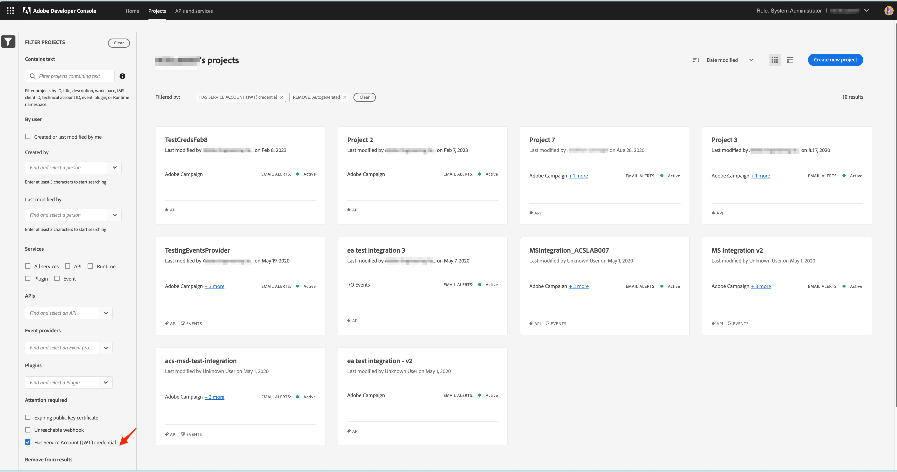

# Migrazione delle credenziali da JWT a OAuth server-to-server

Le credenziali dell’account di servizio (JWT) sono diventate obsolete e hanno sostituito le nuove credenziali server-to-server OAuth. Le nuove credenziali semplificano la gestione delle applicazioni Adobe. Elimina inoltre la necessità di ruotare periodicamente i certificati e funziona come strumento preconfigurato utilizzando le librerie OAuth2 standard.

Le credenziali dell’account di servizio (JWT) sono state contrassegnate come obsolete, ma continueranno a funzionare fino al 1° gennaio 2025. Pertanto, è necessario migrare l’integrazione per utilizzare le nuove credenziali server-to-server OAuth prima del 1° gennaio 2025. Controlla le [timeline obsolete](https://developer.adobe.com/developer-console/docs/guides/authentication/ServerToServerAuthentication/migration/#deperecation-timelines) per ulteriori informazioni

## Passaggi per migrare le credenziali da JWT a OAuth Server-to-Server

La migrazione alle credenziali server-to-server OAuth è un processo semplice che consente una migrazione senza tempi di inattività per l’applicazione. Puoi seguire i passaggi riportati di seguito per eseguire la migrazione delle credenziali.

1. Accedi a [Adobe Developer Console](https://developer.adobe.com/console)
2. Dal menu di filtraggio sul lato sinistro, seleziona l’opzione Con credenziali dell’account di servizio (JWT). In questo modo vengono visualizzati tutti i progetti con credenziali dell’account di servizio (JWT). Dall’elenco dei progetti, fai clic sul progetto di cui intendi eseguire la migrazione.

   

3. Apri la scheda delle credenziali dell’account di servizio (JWT) dal menu di navigazione a sinistra e visualizza la scheda di migrazione. Sulla scheda di migrazione fare clic sul pulsante **Aggiungi nuove credenziali** per aggiungere credenziali server-to-server OAuth equivalenti. L&#39;aggiunta di una credenziale da server a server OAuth al progetto avvierà la migrazione.
   
4. Le nuove credenziali **OAuth Server-to-Server** verranno aggiunte al pannello di navigazione a sinistra.
   * Per annullare la migrazione, fai clic su Annulla migrazione.
   * Non fare clic sul pulsante Review and Delete (Rivedi ed elimina) fino a quando non si verifica se la nuova credenziale OAuth Server-to-Server funziona.
     

5. Aggiornare le credenziali in Microsoft Dynamics 365 all’app Adobe Campaign Standard
   * Accedi all’app di integrazione e passa alla pagina Impostazioni.
   * Selezionate OAuth come tipo di autenticazione.
   * Poiché la nuova credenziale da server a server OAuth utilizza le stesse credenziali della precedente credenziale dell’account di servizio (JWT), la maggior parte dei campi sarà già compilata.
   * Immetti l’ID client e il segreto client. Questi si trovano nel progetto in Adobe Developer Console.
   * Fai clic su Salva per salvare le impostazioni.
     

6. Verifica se le nuove credenziali funzionano
   * Accedi all’app di integrazione e passa alla pagina Flussi di lavoro.
   * Arresta i flussi di lavoro attivi. Attendi l’interruzione dei flussi di lavoro.
   * Avvia i flussi di lavoro. Attendi che i flussi di lavoro siano in stato RUNNING.
   * Monitora i flussi di lavoro per alcuni minuti per assicurarti che funzionino correttamente. Puoi anche controllare i dati in Adobe Campaign Standard e Microsoft Dynamics 365 per verificare che vengano sincronizzati correttamente.

7. Elimina le credenziali JWT per completare la migrazione
   * Accedi a [Adobe Developer Console](https://developer.adobe.com/console)
   * Fai clic sui progetti e seleziona il progetto di cui hai eseguito la migrazione.
   * Dalla navigazione a sinistra, fai clic sulla scheda delle credenziali dell’account di servizio (JWT).
   * Fai clic sul pulsante Review and Delete (Rivedi ed elimina).
     
   * Controlla la marca temporale dell’ultimo accesso o menu utilizzato per verificare se l’app di integrazione genera token di accesso utilizzando la nuova credenziale OAuth o ancora utilizzando la vecchia credenziale JWT.
     
   * Una volta verificato che l&#39;applicazione di integrazione sta utilizzando la nuova credenziale OAuth e non utilizza più la credenziale JWT, procedi all&#39;eliminazione della vecchia credenziale facendo clic sul pulsante **Conferma e continua**, completando in tal modo la migrazione.
     
